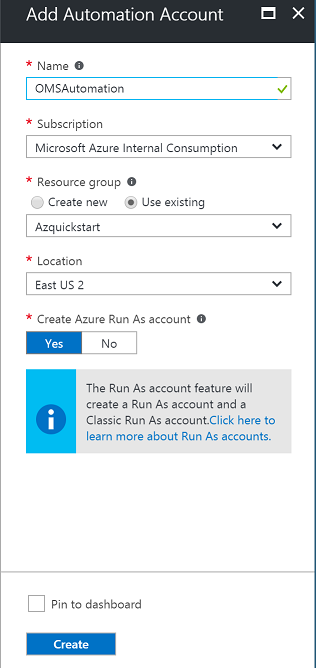
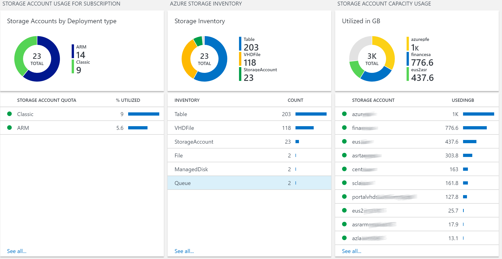

# Azure Storage Analytics 

>[AZURE.NOTE]This is preliminary documentation for Azure Storage Analytics, a management solution you can deploy into OMS that will provide insights, analytics and auditing for your storage accounts. This Community resource manager template is not supported under any Microsoft support program or service and is made available AS IS without warranty of any kind! 

 Microsoft Azure Storage is the cloud storage solution for modern applications that rely on durability, availability, and scalability to meet the needs of their customers. Azure storage provides Blob storage, Table storage, Queue storage, and File storage services.
Azure Storage Analytics Solution collects and visualizes inventory information, capacity metrics, transaction metrics, storage errors and Audit logs for storage accounts in an Azure subscription. Users can easily create additional rules to monitor storage resources. This solution leverages Azure Automation, the Log Analytics Ingestion API, together with Log Analytics views to present data about all your storage accounts in a single workspace. 

 

## Pre-reqs

- **Automation Account with SPN**

Before you deploy this template, you must create an Automation Account in the Azure portal with the default settings so that the SPN account will be created. If you have an existing OMS Log Analytics Workspace you would like to use for this solution, it is important that the Automation account is created into the **same Resource Group where the OMS Log Analytics Workspace is located**. 

If you want to collect data from multiple subscriptions, the Automation Account SPN needs to have the required permission on all subscriptions. See Multiple Subscription support section for details. 

If you **dont** have an existing OMS Log Analytics Workspace, the template will create and deploy this for you.

## Deploying the Azure Storage Analytics Solution

### Follow these instructions to deploy the solution into an existing - or new Log Analytics Workspace

Log into Azure Portal (https://portal.azure.com) and ensure you are in the subscription containing the recovery vault you want to monitor

Locate your existing OMS Log Analytics Workspace and note the name of the workspace, the location of the workspace, and the Resource Group

 

Next, create a new Automation Account and click on *New* and search for 'Automation'

 
Select Automation and click *Create* 

Specify the name of the Automation Account and ensure you are selecting 'Use existing' and selects the Resource Group containing the OMS Log Analytics workspace. If possible, use the same Azure Region for the Automation Account. Ensure that 'Create Azure Run As account' is set to 'Yes' and click 'Create'

Once the deployment has completed, you should see the Automation account and the Log Analytics workspace in the same Resource Group

###You can now deploy the template   
 

This will send you to the Azure Portal with some default values for the template parameters. 
Ensure that the parameters reflect your setup so that you are deploying this into the *existing* Resource Group containing the Log Analytics Workspace and the Automation account.

#### Parameters

* Deployment Name Suffix 
Specify a unique name to be used as suffix to deployment name. This name will be used to create a guid needed for the automation jobs. You need to provide a unique suffix for the resource group every time you deploy the solution.

* OMS Log Analytics Workspace Name
Specify the name of the workspace you want to deploy this solution to

* OMS Log Analytics Region
Select the Azure Region where your existing workspace is located

* OMS Log Analytics SKU
Select the SKU for Log Analytics Workspace 

* OMS Automation Account Name
Specify the name of the automation account you created earlier

* OMS Automation Region
Select the Azure Region where your automation account is located

* OMS Workspace Type 
Specify if Log Analytics Workspace and Automation account is linked 

* Linked Workspace SKU
Specify the SKU to be used in linked workspace. Only used if OMS Workspace Type is set to Linked 

* Collect Audit Logs 
Select if you want to deploy additional Azure Storage Audit Log solution components

* Collection from All Subscriptions 
Select if you want to enable data collection from all subscriptions where Automation SPN has access

The ingestion will start 5-10 minutes post deployment. IF you have created a new log analytics workspace it might take up to 30 mins for all fields to populate.

## Exploring the views

Once the template has successfully been deployed, storage account inventory data ingestion should occur within 15 minutes post deployment. Metrics data requires storage analytics minute metrics, which will be automatically  enabled  after solution is deployed. As a result, initial metrics collection might take up to 60 mins to ingest into the workspace.  If you are deploying the solution to a new workspace, it can take approximately 30 minutes before the indexing has completed for the workspace in general. 

In the Resource Group where you deployed the template, you should see the solution resource.

* AzureStorageAnalytics[workspaceName]

### Azure Storage Analytics 

&nbsp;
&nbsp;

&nbsp;
&nbsp;

&nbsp;
&nbsp;

The views for Azure Storage Analytics will give you an overview of all the storage accounts within your Azure Subscription. 

 Solution collects and visualizes;

**Inventory Data**
    
*Storage accounts
* File Shares
* Queues
* Tables 
* VHD files 
* Managed disks for virtual machines. 

**Capacity Metrics**
* UtilizedGB
* Container Count
* Object Count

**Transaction Metrics** 
* Availability
* Total Requests, 
* Ingress KB
* Egress KB
* PercentSuccess
* PercentErrors 
* AverageE2E Latency
* Average Server Latency

**File Shares** 
*Quota 
*Usage 

**Subscription Level Storage Quota Usage**
* ARM based quota usage
* Classic quota usage 

Solution also includes 14 preconfigured alerts which can be used to notify for when certain thresholds are reached.  You can view the alerts and modify thresholds from Alerts under workspace settings.

### Azure Storage Audit Logs

The views for Azure Storage Analytics will give you an overview of all the storage accounts within your Azure Subscription. 

 Solution collects and visualizes Azure Storage Audit Logs every hour and visualize;

* Operation (PutBlob, Delete, Get Blob, InsertEntry etc. )
* Storage Account Info
* Authentication Type 
* Remote IP Address
* Storage Service details 

Audit Logs is not enabled by default and need to be enabled on the storage accounts where auditing is necessary. Logs for individual services can be enabled from Azure Portal / Storage Account / Monitoring / Diagnostic as seen below

Alternatively, you can enable logging by using Set-AzureStorageServiceLoggingProperty PowerShell cmdlet. 

### Multiple Subscription Support

Ingestion data from multiple subscriptions uses Azure RBAC and only supported on ARM based storage accounts. 
To access additional subscriptions Azure Automation SPN needs to have access on the additional subscriptions. 
ApplicationId for the Automation Account SPN can be found under Automation Account / Connections / AzureRunAsConnection

You need to add this ApplicationId to additional Subscriptions / Access Control / Add

Under Roles you can create a custom role for the ApplicationID to Read Storage accounts and List Storage Account Keys or select Read and Storage Account Key Operator roles. 

### Troubleshooting 

Solution relies on Automation Account with Runas Accounts configured. Both SPN and Classic Certificate is used by the Storage REST API calls.  

General Troubleshooting steps;

* Check the employment deployment status from Azure Portal / <ResourceGroup> / Deployments. If deployment failed delete the AzureStorageAnalytics[....] AzureStorageAuditLogs[.....] and redeploy the solution using a new  deployment name suffix. This suffix needs to unique for the deployment in that specific resource group. 
* Check if automation account can start the runbooks
* Check if Runas Accounts configured properly and has permission to query subscription details and can access storage keys  
* Check if AzureSAIngestionMetrics-MS-Mgmt-SA and AzureSAIngestionLogs-MS-Mgmt-SA has enabled schedules. If not, you can run AzureSACreateSchedules-MS-Mgmt-SA to re-create the schedules. 

When solution is deployed first Minute Metrics will be enabled on all storage accounts. Transaction and capacity metrics will be logged after these metrics are first enabled. Based on the number of the storage accounts these runbook job can take long time to finish. If you want to speed up the process you can enable metrics by running the following cmdlet;

Set-AzureStorageServiceMetricsProperty -MetricsType Minute -ServiceType (Blob,Table,Queue,File)  -MetricsLevel ServiceAndApi -RetentionDays 1 -Context (storageaccountcontext)

Sample script to get all storage accounts and enable metrics can be found under /Scripts/EnableMetrics.ps1

Unlike metrics Storage Logs are not enabled by the solution and needs to be enabled by the admin.

