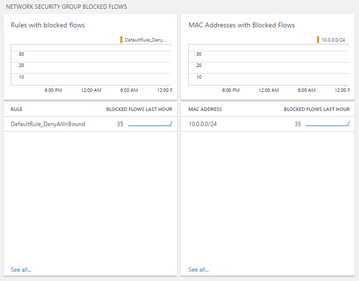
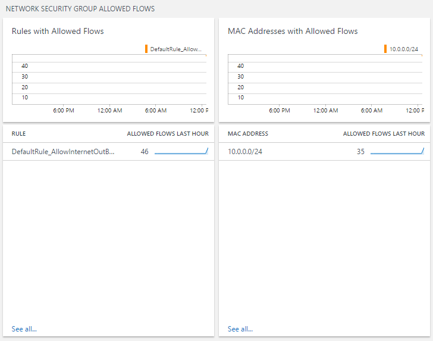

# Azure Network Security Group Analytics

This template deploys **Azure Network Security Group analytics solution** on an Azure Log Analytics workspace. 

Note: The Microsoft recommended solution for Network Analytics is [Traffic Analytics](https://docs.microsoft.com/azure/networking/network-monitoring-overview#traffic-analytics) 

`Tags: Azure Network Security Group, OMS Log Analytics, Monitoring`

The Azure Network Security Group analytics solution provides visualizations and insights into your Azure NSG Logs:
* NetworkSecurityGroupEvent
* NetworkSecurityGroupRuleCounter

## Configuration

Perform the following steps to configure the Azure Network Security Group analytics solution for your workspaces.

1. Enable the Azure Network Security Group analytics solution from    

 
2. Follow steps to Enable diagnostics logging for the Network Security Group:
(https://docs.microsoft.com/en-us/azure/virtual-network/virtual-network-nsg-manage-log) 

After you configure the solution, data should start flowing to your workspace within 15 minutes.

## Using the solution

After you click the **Azure Network Security Group analytics** tile on the Overview, you can view summaries of your logs and then drill in to details for the following categories:

* Network security group blocked flows
  * Network security group rules with blocked flows
  * MAC addresses with blocked flows
* Network security group allowed flows
  * Network security group rules with allowed flows
  * MAC addresses with allowed flows

On the **Azure Network Security Group analytics** dashboard, review the summary information in one of the blades, and then click one to view detailed information on the log search page.

On any of the log search pages, you can view results by time, detailed results, and your log search history. You can also filter by facets to narrow the results.

