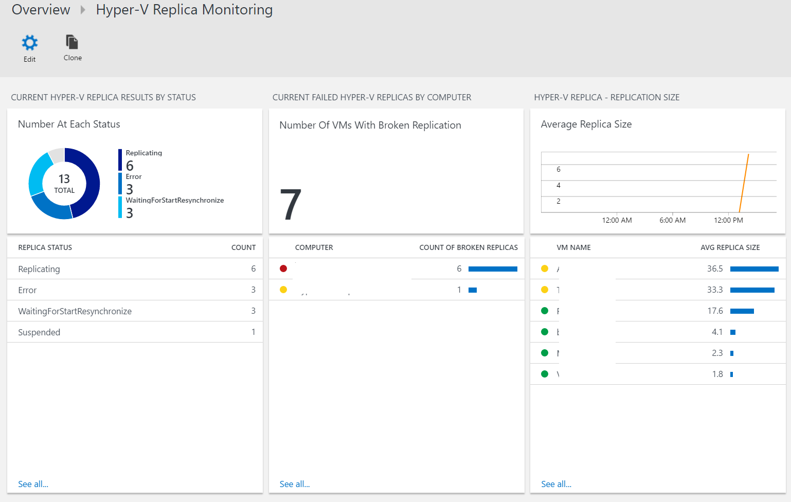
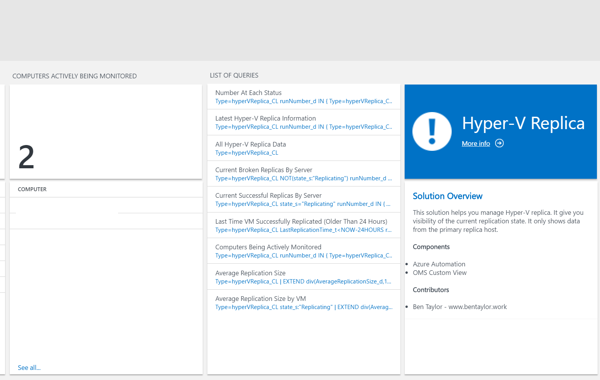
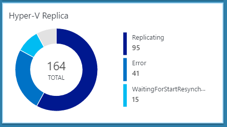
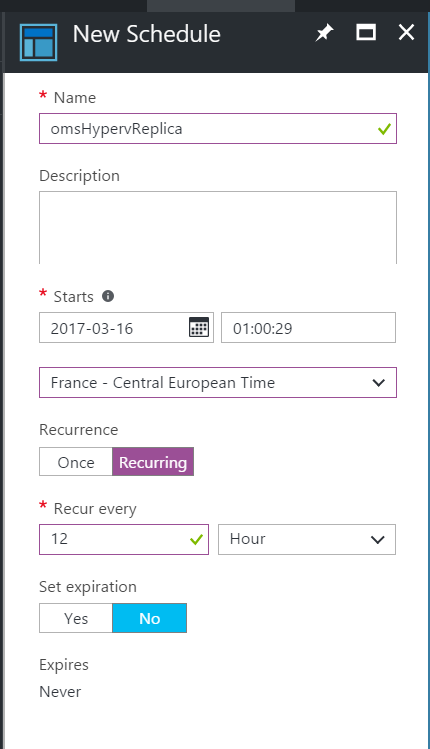
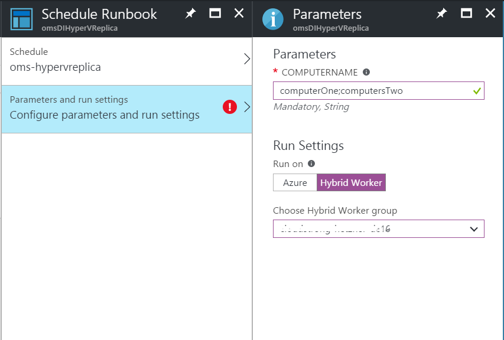

# Hyper-V Replica Solution for OMS


[](https://portal.azure.com/#create/Microsoft.Template/uri/https%3A%2F%2Fraw.githubusercontent.com%2FAzure%2Fazure-quickstart-templates%2Fmaster%2Fdemos%2Foms-hyperv-replica-solution%2Fazuredeploy.json) 
[](https://portal.azure.us/#create/Microsoft.Template/uri/https%3A%2F%2Fraw.githubusercontent.com%2FAzure%2Fazure-quickstart-templates%2Fmaster%2Fdemos%2Foms-hyperv-replica-solution%2Fazuredeploy.json)
[](http://armviz.io/#/?load=https%3A%2F%2Fraw.githubusercontent.com%2FAzure%2Fazure-quickstart-templates%2Fmaster%2Fdemos%2Foms-hyperv-replica-solution%2Fazuredeploy.json)

## Overview

A community OMS Solution that helps you manage Hyper-V replica. It gives you visibility of the current replication state. It only shows data from the primary replica host.

**Overview Screen**





**Tile Screen**



## Prerequisites

- **Hyper-V Hosts With Hyper-V Replica**
- **OMS Workspace**
- **Automation Account**
- **Hybrid Workers with access to the Hyper-V Hosts**
- **OMSDataInjection PowerShell module installed on the Hybrid Workers**

## Installation

1) Install the OMSDataInjection PowerShell module on the Hybrid Workers.

	```powershell
	Install-Module -Name OMSDataInjection
	```
2) Install the Hyper-V replica OMS solution. 
	 
	This can be installed by any supported method.

3) Create an automation schedule specifying how often you want the information in the Hyper-V replica OMS Solution updating.



4) Link the schedule to the 'Publish-omsHyperVReplica.ps1' Run Book, also selecting the location the Run Book should run to your on premises Hybrid Runbook Worker group. You will be asked to fill in the computerName parameter, this is a list of the servers you want to monitor, each server is separated by a semi-colon - ';'.



## Versions

### 1.0.1.0
* Release adding the following support:
    * Hosts Being Monitored.
    * Average replication sizes.

### 1.0.0.0
* Initial release with the following support:
    * VMs at each status.
    * Amount of VMs with broken replicas on each host.
    * Run Number for only displaying the latest results.

## Limitations
* No support for latency
* No auto fixing of common replica errors

## Contributors
- Ben Taylor - ben@bentaylor.work

