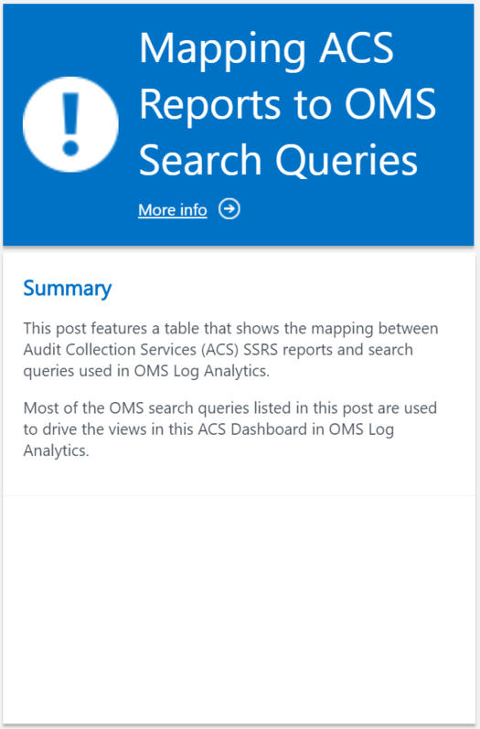
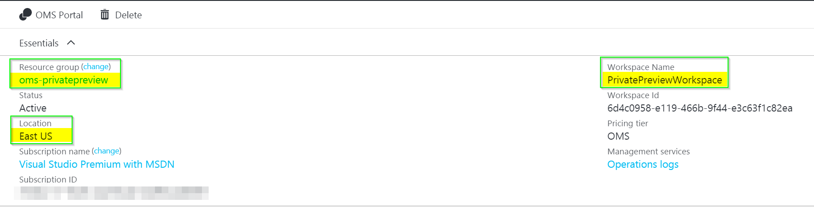
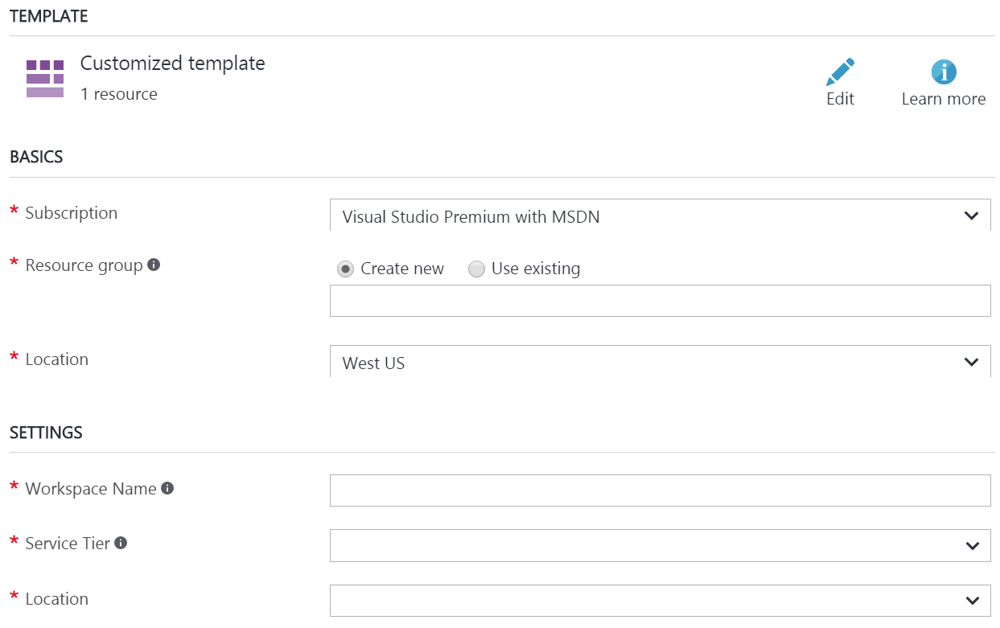
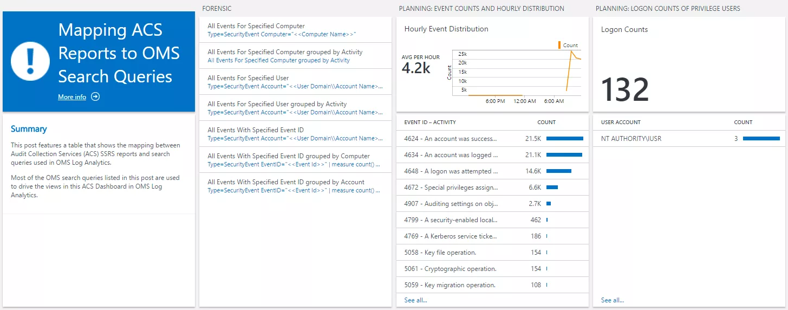

# SCOM ACS Dashboard in OMS

 

    

This is a PREVIEW Solution

This is a pre-built solution for Microsoft OMS <a href="http://www.microsoft.com/oms" target="_blank">http://www.microsoft.com/oms).

This solution was built from following Wei Ho Lim's 2 articles listed here:

<ul>
    <li><a href="https://blogs.msdn.microsoft.com/wei_out_there_with_system_center/2016/07/25/mapping-acs-reports-to-oms-search-queries/" target="_blank">Mapping ACS Reports to OMS Search Queries</li>
    <li><a href="https://blogs.msdn.microsoft.com/wei_out_there_with_system_center/2016/08/16/acs-dashboard-in-oms-your-audit-report-highlights-at-a-glance/" target="_blank">ACS Dashboard in OMS: Your Audit Report Highlights in a Glance</li>
</ul>

This solution requires the <a href="https://docs.microsoft.com/en-us/azure/operations-management-suite/oms-security-getting-started?toc=%2fazure%2flog-analytics%2ftoc.json" target="_blank">OMS Security and Audit solution to be enabled first, as it leverages this collected data. This template includes adding the Security and Audit solution to the OMS Workspace.

For additional information, check out Tao Yang's blog on <a href="http://blog.tyang.org/2016/12/17/powershell-script-to-create-oms-saved-searches-that-maps-opsmgr-acs-reports/" target="_blank">PowerShell Script to Create OMS Saved Searches that Maps OpsMgr ACS Reports.

Also, check out my original blog post about this solution: <a href="http://adinermie.com/scom-acs-dashboard-oms/" target="_blank">SCOM ACS Dashboard in OMS

## Pre-reqs

- **OMS Security and Audit Solution**

    The OMS SCOM ACS Solution utilizes the security event data collected by the Security and Audit solution. This solution must also be added to the OMS Workspace to collecte the requried data. 

    This ARM template will deploy the Security and Audit solution if it is not already present.

    Additional data charges may apply based on the number of systems forwarding data to OMS, data volume, and selected data retention period. 

If you **do not** have an existing OMS Log Analytics Workspace, the template will create and deploy this for you.

## Setup - Using an existing OMS Log Analytics Workspace

### Follow these instructions to deploy the OMS SCOM ACS Solution into an existing OMS Log Analytics Workspace:

<ol>
    <li>Log into the Azure Portal (<a href="https://portal.azure.com" target="_blank">https://portal.azure.com) and ensure you are in the subscription containing your OMS Workspace</li>
    <li>Locate your existing OMS Log Analytics Workspace and take note of the name of the Workspace, the location of the Workspace, and the Resource Group it is deployed in</li>
</ol>

 

###You can now deploy the template

This will send you to the Azure Portal with some default values for the template parameters. 
Ensure that the parameters reflects your setup so that you are deploying this into the *existing* Resource Group containing the Log Analytics Workspace.

*It is important that you type the exact values for your Workspace name and point to the region where these resources are deployed.* 

Once you have customized all the parameters, click *Purchase*

## Setup - Creating a new OMS Log Analytics Workspace

### Follow these instructions to deploy the OMS SCOM ACS Solution into a new OMS Log Analytics Workspace:

You don't need to pre-create any resources to deploy the solution into a new OMS Workspace. The template provides parameter fields which will create a new Resource Group, and Workspace if one does not already exist.

###You can now deploy the template   

This will send you to the Azure Portal with some default values for the template parameters. 
Ensure that the parameters reflects your setup so that you are deploying this into the *existing* Resource Group containing the Log Analytics Workspace. 

This template will create a new OMS Log Analytics Workspace in the specified region if one does not already exist.

Once you have customized all the parameters, click *Purchase*

Note: You will not see any data if you don't have the Security and Audit solution deployed. The template will add this solution to the OMS Workspace automatically.

Once the solution has been enabled, OMS will show an additional tile for "Audit Collection Services (ACS) Dashboard".

 Dashboard")

With the solution deployed, you can drill into the SCOM ACS Dashboard solution and explore the views.

