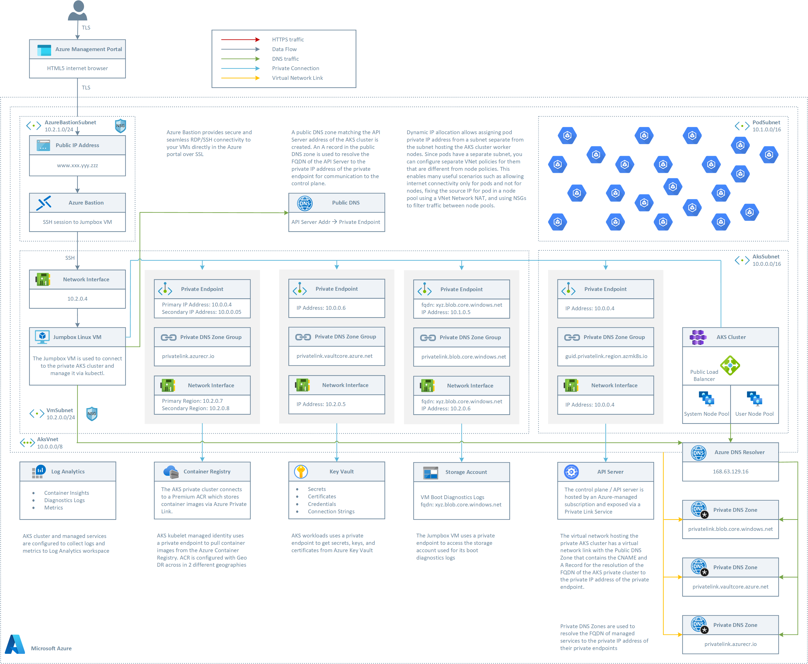

# Create a Private AKS Cluster with a Public DNS Zone


[](https://portal.azure.com/#create/Microsoft.Template/uri/https%3A%2F%2Fraw.githubusercontent.com%2FAzure%2Fazure-quickstart-templates%2Fmaster%2Fdemos%2Fprivate-aks-cluster-with-public-dns-zone%2Fazuredeploy.json)

[](http://armviz.io/#/?load=https%3A%2F%2Fraw.githubusercontent.com%2FAzure%2Fazure-quickstart-templates%2Fmaster%2Fdemos%2Fprivate-aks-cluster-with-public-dns-zone%2Fazuredeploy.json)

This project can be used to deploy a [private AKS cluster with a Public DNS address](https://docs.microsoft.com/azure/aks/private-clusters#create-a-private-aks-cluster-with-a-public-dns-address) with [Dynamic allocation of IPs and enhanced subnet support](https://docs.microsoft.com/azure/aks/configure-azure-cni#dynamic-allocation-of-ips-and-enhanced-subnet-support-preview), [Azure Active Directory Pod Identity](https://docs.microsoft.com/azure/aks/use-azure-ad-pod-identity), and more.

## Architecture ##

This sample provides an ARM templates to deploy the following topology two node pools.



The ARM template deploys:

- A private AKS cluster composed of a:
  - System node pool hosting only critical system pods and services. The worker nodes have node taint which prevents application pods from beings scheduled on this node pool.
  - User node pool hosting user workloads and artifacts.
- A new virtual network with four subnets:
  - AksSubnet: this subnet is used for the AKS cluster worker nodes. The VMSS of both the system and user node pools will be created in this subnet. You can change the ARM template to use a separate subnet for the two node pools.
  - PodSubnet: this subnet is used to allot private IP addresses to pods of both the system and user node pools. You can change the ARM template to use two separate subnets, respectively, for the pods of the system and user node pools.
  - A subnet for Azure Bastion
  - A subnet for the Jumpbox virtual machine used to connect to the private AKS cluster and for the private endpoints.
-  A user-defined managed identity used by the AKS cluster to create additional resources like load balancers and managed disks in Azure.
- A private endpoint to API server hosted by an AKS-managed Azure subscription. The cluster can communicate with the API server exposed via a Private Link Service using a private endpoint.
- An Azure Bastion resource that provides secure and seamless SSH connectivity to the Jumpbox virtual machine directly in the Azure portal over SSL
- An Azure Container Registry (ACR) to build, store, and manage container images and artifacts in a private registry for all types of container deployments.
- An Azure Key Vault used by workloads running on AKS to retrieve sensitive data such as secrets, keys, and certificates.
- A private endpoint to the Blob Storage Account
- A private endpoint to to Azure Container Registry (ACR)
- A private endpoint to Key Vault
- When the ACR sku is equal to Premium, a Private Endpoint is created to allow the private AKS cluster to access ACR via a private IP address. For more information, see [Connect privately to an Azure Container Registry using Azure Private Link](https://docs.microsoft.com/azure/container-registry/container-registry-private-link).
- A Private DNS Zone for the name resolution of the private endpoint to the Blob Storage Account
- A Private DNS Zone for the name resolution of the private endpoint to Azure Container Registry (ACR)
- A Private DNS Zone for the name resolution of the private endpoint to Key Vault
- A Virtual Network Link between the virtual network hosting the cluster and the Private DNS Zone to let the cluster to use the CNAME and A records defined by the Private DNS Zone for the name resolution of the API server of the cluster.
- A jumpbox virtual machine to manage the private AKS cluster.
- A Log Analytics workspace to collect the diagnostics logs and metrics from:
  - AKS cluster
  - Jumpbox virtual machine
  - Application Gateway
  - Key Vault
  - Network Security Group

## Private AKS Cluster

As a best practice, you should always consider using a [private AKS cluster](https://docs.microsoft.com/azure/aks/private-clusters) in your production environment, or at least secure access to the API server, by using [authorized IP address ranges](https://docs.microsoft.com/azure/aks/api-server-authorized-ip-ranges) in Azure Kubernetes Service. When using a private AKS cluster, the API Server is only accessible from your virtual network, any peered virtual network, or on-premises network connected via S2S VPN or ExpressRoute to the virtual network hosting your AKS cluster. Any request to the API Server goes over the virtual network and does not traverse the internet. The API server endpoint has no public IP address. To manage the API server, you'll need to use a virtual machine that has access to the AKS cluster's virtual network. There are several options for establishing network connectivity to the private cluster.

- Create a virtual machine in the same virtual network as the private AKS cluster.
- Use a virtual machine in a separate virtual network and set up virtual network peering.
- Use an Express Route or VPN connection to connect to the virtual network hosting the AKS cluster from your on-premises network.
- Use the AKS Run Command feature (see below)

Creating a virtual machine in the same virtual network as the AKS cluster is the easiest option. Express Route and VPNs add costs and require additional networking complexity. Virtual network peering requires you to plan your network CIDR ranges to ensure there are no overlapping ranges. For more information, see [Create a private Azure Kubernetes Service cluster](https://docs.microsoft.com/azure/aks/private-clusters). For more information on Azure Private Links, see [What is Azure Private Link?](https://docs.microsoft.com/azure/private-link/private-link-overview).

## AKS Run Command
Today when you need to access a private AKS cluster, for example to use the [kubectl](https://kubernetes.io/docs/tasks/tools/) command-line tool, you have to use a virtual machine located in the same virtual network of the AKS cluster or a peered network. Likewise, if you use Azure DevOps or GitHub Actions to deploy workloads to your private AKS cluster, you need to use an Azure DevOps [Linux](https://docs.microsoft.com/azure/devops/pipelines/agents/v2-linux?view=azure-devops) or [Windows](https://docs.microsoft.com/azure/devops/pipelines/agents/v2-windows?view=azure-devops) self-hosted agent or a [GitHub Actions self-hosted runner](https://docs.github.com/en/actions/hosting-your-own-runners/about-self-hosted-runners) located in the same virtual network of the AKS cluster or a peered network. This usually requires your virtual machine to be connected via VPN or Express Route to the cluster virtual network or a jumpbox virtual machine to be created in the cluster virtual network. AKS run command allows you to remotely invoke commands in an AKS cluster through the AKS API. This feature provides an API that allows you to, for example, execute just-in-time commands from a remote laptop for a private cluster. This can greatly assist with quick just-in-time access to a private cluster when the client machine is not on the cluster private network while still retaining and enforcing the same RBAC controls and private API server.

## Use AKS Run Command

Here are some samples that show how to use the [az aks command](https://docs.microsoft.com/cli/azure/aks/command?view=azure-cli-latest) to run commands to a private AKS cluster.

Simple command
```bash
az aks command invoke -g <resourceGroup> -n <clusterName> -c "kubectl get pods -n kube-system"
```

Deploy a manifest by attaching the specific file
```bash
az aks command invoke -g <resourceGroup> -n <clusterName> -c "kubectl apply -f deployment.yaml -n default" -f deployment.yaml
```

Deploy a manifest by attaching a whole folder
```bash
az aks command invoke -g <resourceGroup> -n <clusterName> -c "kubectl apply -f deployment.yaml -n default" -f .
```

Perform a Helm install and pass the specific values manifest
```bash
az aks command invoke -g <resourceGroup> -n <clusterName> \
-c "helm repo add bitnami https://charts.bitnami.com/bitnami && helm repo update && helm install my-release -f values.yaml bitnami/nginx" \
-f values.yaml
```

## Dynamic Public IP Allocation
A drawback with the traditional CNI is the exhaustion of pod IP addresses as the AKS cluster grows, resulting in the need to rebuild the entire cluster in a bigger subnet. The new [Dynamic IP Allocation](https://docs.microsoft.com/azure/aks/configure-azure-cni#dynamic-allocation-of-ips-and-enhanced-subnet-support-preview) capability in Azure CNI solves this problem by allotting pod IP addresses from a subnet separate from the subnet hosting the AKS cluster nodes. This feature offers the following benefits:

- `Better IP utilization`: private IP addresses are dynamically allocated to cluster Pods from the Pod subnet. This leads to better utilization of private IP addresses in the cluster compared to the traditional CNI solution, which statically allocate to each worker node the same number of private IP addresses from the subnet.
- `Scalable and flexible`: when using separate subnets for nodes and pods, the two subnets can be scaled independently. A single pod subnet can be shared across multiple node pools of a cluster or across multiple AKS clusters deployed in the same virtual network. You can also configure a separate pod subnet for a node pool. Likewise, you can deploy node pools in the same subnet or in separate node pools. You can  define the subnet for worker nodes and pods of a node pool at provisioning time.
- `High performance`: Since pod are assigned private IP addresses from a subnet, they have direct connectivity to other cluster pod and resources in the same virtual network or any peered virtual network. The solution supports very large clusters without any degradation in performance.
- `Separate VNet policies for pods`: Since pods have a separate subnet, you can configure separate virtual network policies for them that are different from node policies. This enables many useful scenarios such as allowing internet connectivity only for pods and not for nodes, fixing the source IP for pod in a node pool using a NAT Gateway associated to the subnet hosting pods, and using NSGs to filter traffic between node pools.

## Deployment ##

You can use the `deploy.sh` Bash script to deploy the topology. Make sure to change the name of the AKS cluster in the `deploy.sh` Bash script and substitute the placeholders in the `azuredeploy.parameters.json` file with meaningful values. Also, make sure to enable the following public preview features before deploying the ARM template:

- [PodSecurityPolicyPreview](https://docs.microsoft.com/azure/aks/use-pod-security-policies)
- [RunCommandPreview](https://docs.microsoft.com/azure/aks/private-clusters#options-for-connecting-to-the-private-cluster)
- [EnablePodIdentityPreview](https://docs.microsoft.com/azure/aks/use-azure-ad-pod-identity)
- [EnablePrivateClusterPublicFQDN](https://docs.microsoft.com/azure/aks/private-clusters#create-a-private-aks-cluster-with-a-public-dns-address)
- [PodSubnetPreview"](https://docs.microsoft.com/azure/aks/configure-azure-cni#dynamic-allocation-of-ips-and-enhanced-subnet-support-preview)
- [AutoUpgradePreview](https://docs.microsoft.com/azure/aks/upgrade-cluster#set-auto-upgrade-channel)

You can run the following script to register the above preview features and wait for the registration process to complete:

```bash
#!/bin/bash

# Registering AKS feature extensions
aksExtensions=("AutoUpgradePreview" "PodSecurityPolicyPreview" "RunCommandPreview" "EnablePodIdentityPreview " "EnablePrivateClusterPublicFQDN" "PodSubnetPreview")
registeringExtensions=()
for aksExtension in ${aksExtensions[@]}; do
  echo "Checking if [$aksExtension] extension is already registered..."
  extension=$(az feature list -o table --query "[?contains(name, 'Microsoft.ContainerService/$aksExtension') && @.properties.state == 'Registered'].{Name:name}" --output tsv)
  if [[ -z $extension ]]; then
    echo "[$aksExtension] extension is not registered."
    echo "Registering [$aksExtension] extension..."
    az feature register --name $aksExtension --namespace Microsoft.ContainerService
    registeringExtensions+=("$aksExtension")
  else
    echo "[$aksExtension] extension is already registered."
  fi
done
echo $registeringExtensions
delay=1
for aksExtension in ${registeringExtensions[@]}; do
  echo -n "Checking if [$aksExtension] extension is already registered..."
  while true; do
    extension=$(az feature list -o table --query "[?contains(name, 'Microsoft.ContainerService/$aksExtension') && @.properties.state == 'Registered'].{Name:name}" --output tsv)
    if [[ -z $extension ]]; then
      echo -n "."
      sleep $delay
    else
      echo "."
      break
    fi
  done
done

echo "Refreshing the registration of the Microsoft.ContainerService resource provider..."
az provider register --namespace Microsoft.ContainerService
echo "Microsoft.ContainerService resource provider registration successfully refreshed"
```

The following picture shows the resources deployed by the ARM template to your resource group:


The following picture shows the resources deployed by the ARM template in the node resource group associated to the AKS cluster:


## Testing ##

If you open an ssh session to the Linux virtual machine and manually run the nslookup command using the FQND of the API server as a parameter, you should see an output like the the following:


In order to connect the AKS cluster, you can run th following Bash script on the Jumpbox virtual machine:

```bash
#!/bin/bash
name="<name of the AKS cluster>"
resourceGroup="<name of the AKS resource group>"

# Install Azure CLI on Ubuntu
curl -sL https://aka.ms/InstallAzureCLIDeb | sudo bash

# Login with your Azure account
az login

# Install Kubectl
sudo az aks install-cli

# Use the following command to configure kubectl to connect to the new Kubernetes cluster
echo "Getting access credentials configure kubectl to connect to the ["$aksName"] AKS cluster..."
az aks get-credentials --name $name --resource-group $resourceGroup
```

`Tags: Microsoft.Network/publicIPAddresses, Microsoft.Network/networkSecurityGroups, providers/diagnosticSettings, Microsoft.Network/bastionHosts, Microsoft.Storage/storageAccounts, Microsoft.Network/networkInterfaces, Microsoft.Compute/virtualMachines, Microsoft.Compute/virtualMachines/extensions, OmsAgentForLinux, DependencyAgentLinux, Microsoft.Network/virtualNetworks, Microsoft.ManagedIdentity/userAssignedIdentities, Microsoft.Authorization/roleAssignments, Microsoft.ContainerRegistry/registries, Microsoft.ContainerService/managedClusters, UserAssigned, [parameters('systemNodePoolType')], [parameters('userNodePoolType')], Microsoft.OperationalInsights/workspaces, Microsoft.OperationsManagement/solutions, Microsoft.Network/privateDnsZones, Microsoft.Network/privateDnsZones/virtualNetworkLinks, Microsoft.Network/privateEndpoints, privateDnsZoneGroups, microsoft.insights/activityLogAlerts, Microsoft.KeyVault/vaults`
