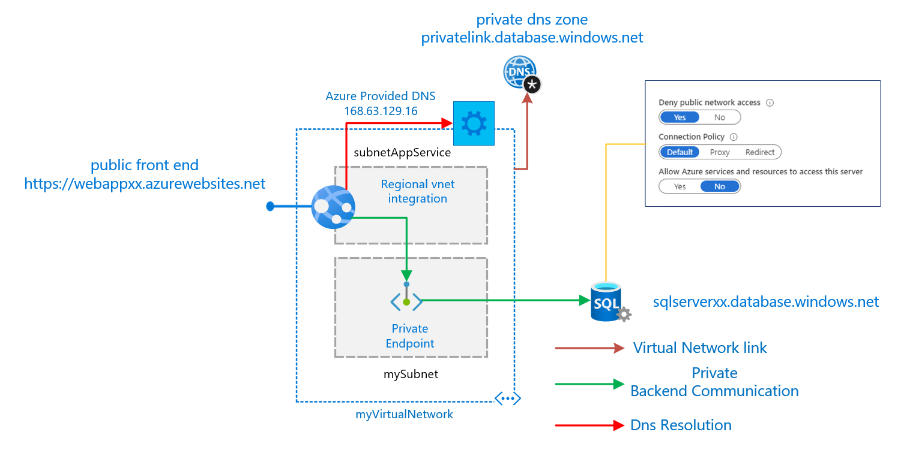

# Web app consuming an Azure SQL private endpoint

This is a starter template that shows how to consume an Azure SQL private endpoint from a web app  

## Architecture Diagram

## Notes

[Azure Private Link FAQ](https://docs.microsoft.com/en-us/azure/private-link/private-link-faq)

[Private link endpoints template format](https://docs.microsoft.com/en-us/azure/templates/microsoft.network/2020-04-01/privateendpoints)
