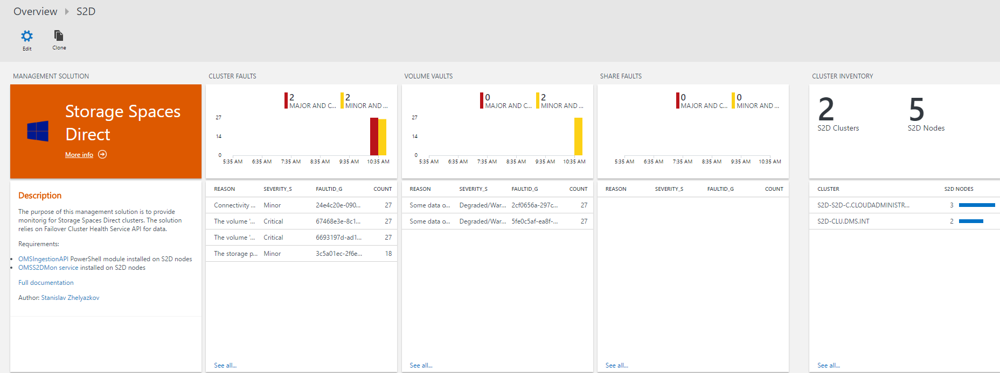
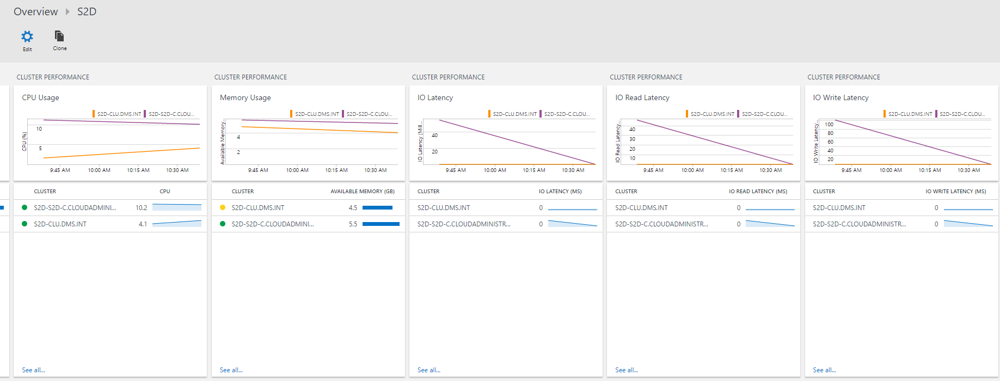

# S2D Management Solution for OMS


Version: 2.0.0.0

[](https://portal.azure.com/#create/Microsoft.Template/uri/https%3A%2F%2Fraw.githubusercontent.com%2FAzure%2Fazure-quickstart-templates%2Fmaster%2Fdemos%2Fs2d-oms-mgmt-solution%2Fazuredeploy.json)
[](http://armviz.io/#/?load=https%3A%2F%2Fraw.githubusercontent.com%2FAzure%2Fazure-quickstart-templates%2Fmaster%2Fdemos%2Fs2d-oms-mgmt-solution%2Fazuredeploy.json)

Check [Updates](#updates) section if you have applied previous version.

Do not forget to check [Known issues](#known-issues) section.

>**Note**: This version of the solution works only with upgraded Log Analytics workspace to the new query language. More info [here](https://docs.microsoft.com/en-us/azure/log-analytics/log-analytics-log-search-upgrade).

The purpose of this management solution is to provide monitoring for Storage Spaces Direct clusters.
The solution relies on [Failover Cluster Health Service API](https://technet.microsoft.com/en-us/windows-server-docs/failover-clustering/health-service-overview?f=255&MSPPError=-2147217396) for data.
Metrics and Faults are gathered from S2D clusters and send to OMS. The solution consists of 2 parts:

- S2DMon service that sends data to OMS Log Analytics Workspace. More info below.
- OMS Solution with visualization for the data in OMS Log Analytics. More info below.

When deployed the solution is viewable in both OMS portal and Azure.





## Prerequisites

- **S2D Cluster**
- **OMS Log Analytics Workspace**
- **OMSIngestionAPI module installed on S2D Nodes**
- **S2DMon service installed on S2D Nodes**
- **Cumulative Update September 2017 for Windows Server installed on all S2D nodes**

## S2DMon Service

The S2DMon service is basically a PowerShell script that runs as a service. The code for getting
data from S2D Cluster and sending it to OMS runs every 60 seconds. The engine for running that code
is forked version from [PSService.ps1](https://github.com/JFLarvoire/SysToolsLib/blob/master/PowerShell/PSService.ps1)
created by Jean-François Larvoire. Full article of the PSService.ps1 can be found [here](https://msdn.microsoft.com/en-us/magazine/mt703436.aspx?f=255&MSPPError=-2147217396).
The service sends the following information every 60 seconds:

- Metrics
  - StorageSubSystem
    - CPUUsageAverage
    - CapacityPhysicalPooledAvailable
    - CapacityPhysicalPooledTotal
    - CapacityPhysicalTotal
    - CapacityPhysicalUnpooled
    - CapacityVolumesAvailable
    - CapacityVolumesTotal
    - IOLatencyAverage
    - IOLatencyRead
    - IOLatencyWrite
    - IOPSRead
    - IOPSTotal
    - IOPSWrite
    - IOThroughputRead
    - IOThroughputTotal
    - IOThroughputWrite
    - MemoryAvailable
    - MemoryTotal
  - Node
    - CPUUsage
    - IOLatencyAverage
    - IOLatencyRead
    - IOLatencyWrite
    - IOPSRead
    - IOPSTotal
    - IOPSWrite
    - IOThroughputRead
    - IOThroughputTotal
    - IOThroughputWrite
    - MemoryAvailable
    - MemoryTotal
  - Volume
    - CapacityAvailable
    - CapacityTotal
    - IOLatencyAverage
    - IOLatencyRead
    - IOLatencyWrite
    - IOPSRead
    - IOPSTotal
    - IOPSWrite
    - IOThroughputRead
    - IOThroughputTotal
    - IOThroughputWrite
- Faults
  - StorageSubSystem
  - Volume
  - File Share

Data is taken from Failover Cluster Health Service. Documentation can be fond [here](https://technet.microsoft.com/en-us/windows-server-docs/failover-clustering/health-service-overview?f=255&MSPPError=-2147217396) and [here](https://msdn.microsoft.com/windowshealthservice/healthservice?f=255&MSPPError=-2147217396)

>**Note**: The code for sending data will run only on the node which is the owner of Cluster Name
resource. When the owner is changed the code will start running on the new owner. This approach
avoids sending the same data multiple times and making the service Highly Available.

For sending data to OMS the script uses [OMSIngestionAPI](https://www.powershellgallery.com/packages/OMSIngestionAPI/) PowerShell Module.
Install the module prior installing the S2DMon service. You can use the following command:

```powershell
Install-Module -Name OMSIngestionAPI
```

The S2DMon service can be installed with simple command. Place the s2dmon.ps1 script in a folder on
a S2D node and execute command for setup. Example

```powershell
C:\temp\s2dmon.ps1 -Setup -OMSWorkspaceCreds (Get-Credential)
```

When prompted for credentials for user name enter OMS Workspace ID and for password enter OMS
Workspace Primary Key.

The OMS workspace key is secured by encrypting it with key and saving it into file.

The following files will be created in C:\Windows\system32

- s2dmon.cred - File containing the encrypted OMS Workspace Primary Key
- s2dmon.exe - Wrapper for s2dmon.ps1
- s2dmon.id - File containing OMS Workspace ID
- s2dmon.key - Key for encrypting OMS Workspace primary Key
- s2dmon.ps1 - the s2dmon service setup and runtime

If needed you can setup additional permissions on these files so they can be access by specific set
of users. Remember to leave permission for Local System account as the service is using it for
accessing the files.

After the service is setup execute the following command to start the service:

```powershell
C:\temp\s2dmon.ps1 -Start
```

Management of the service is also possible with services.msc.

>**Note**: When you start to send data to OMS Log Analytics workspace it might take up to an hour until the data appears in OMS portal.

Create a scheduled tasks on each node to restart the service every hour.

```powershell
$action = New-ScheduledTaskAction -Execute 'Powershell.exe' `
                                  -Argument '-NoProfile -WindowStyle Hidden -command "& {Restart-Service s2dmon}"'
$trigger =  New-ScheduledTaskTrigger -RepetitionInterval (New-TimeSpan -Minutes 60) `
                                     -At (get-date) `
                                     -Once
$STPrin = New-ScheduledTaskPrincipal -UserId "NT AUTHORITY\SYSTEM" `
                                     -LogonType ServiceAccount `
                                     -RunLevel Highest
Register-ScheduledTask -Action $action `
                       -Trigger $trigger `
                       -TaskName "S2DMonRestart" `
                       -Description "Restart S2DMon service hourly" `
                       -Principal $STPrin
```

Logs for the service are available in c:\Windows\Logs\s2dmon.log". For more information check
PSService.ps1 documentation.

Once the service is setup for first time you should start seeing data in OMS after 15-20 minutes.
Restart your browser if you do not see data after that time. All the data is in `Type=S2D_CL` log.

If you need to remove the service use:

```powershell
C:\temp\s2dmon.ps1 -Stop
C:\temp\s2dmon.ps1 -Remove
```

## OMS Solution

The OMS solution can be setup by deploying it from Deploy to Azure button or using the template with
Azure Portal, Azure PowerShell or Azure CLI. Deploy it in the same resource group where your OMS Log
Analytics Workspace is located. After deployment the solution will be visible in Azure as resource.
The view for the solution will also be available in Overview of OMS Portal.

## S2D_CL Log Type

When S2D data appears in OMS it is located in S2D_CL table.

- ClusterName_s - FQDN of the S2D cluster. All upper case.
- FaultId_g - Fault ID
- FaultingObjectDescription_s - Faulting object description
- FaultingObjectLocation_s - Faulting object location
- FaultingObjectType_s - Faulting object type
- FaultingObjectUniqueId_s - Faulting object unique ID
- FaultLevel_s - What kind of Fault it is. Cluster, Volume or Share as possible values
- FaultType_s - Fault Type
- FileSystemType_s - What kind of File system type the volume is. Usually CSVFS_ReFS
- HealthStatus_s - Health status for volume
- MetricLevel_s - what kind of metric it is. Possible values are Cluster, Node or Volume.
- MetricName_s - name of the metric
- MetricValue_d - value for metric data
- OperationalStatus_s - Operational status for Volume
- Reason_s - reason for fault
- RecommendedActions_s - recommended actions for fault
- SecondTimeStamp_t - second time stamp used in faults data only
- ServerName_s - Full FQDN of the server when the metric is for Node. All upper case.
- Severity_s - Fault severity. Can be Unknown, Information, Degraded/Warning, Minor, Major, Critical or Fatal/NonRecoverable
- SeverityNumber_d - Severity value in number. From 0 to 7 with excluding 2. Matches the sequence above for Severity
- UnitType_s - What kind of until the metric is. Possible values are Bytes, BytesPerSecond, CountPerSecond, Seconds and Percentage
- VolumeLabel_s - Volume label

## Notes

Please report any issues to [GitHub](https://github.com/slavizh/s2d-oms-mgmt-solution).

## Known issues

### Issue 1

Currently the script may end in unhandled exception where the service is running but the script
itself is not. The error you will see in the log is `s2dmon.ps1 -Service # Error at line 3207: Not enough storage is available to complete this operation.`.
Additionally in Application log the following error can be seen as well:

```
Application: powershell.exe
Framework Version: v4.0.30319
Description: The process was terminated due to an unhandled exception.
Exception Info: System.OutOfMemoryException
   at System.Text.StringBuilder.ToString()
   at System.Management.Automation.Tracing.PSEtwLogProvider.LogPipelineExecutionDetailEvent(System.Management.Automation.LogContext, System.Collections.Generic.List`1<System.String>)
   at System.Management.Automation.MshLog.LogPipelineExecutionDetailEvent(System.Management.Automation.ExecutionContext, System.Collections.Generic.List`1<System.String>, System.Management.Automation.InvocationInfo)
   at System.Management.Automation.Internal.PipelineProcessor.LogToEventLog()
   at System.Management.Automation.Internal.PipelineProcessor.DisposeCommands()
   at System.Management.Automation.Internal.PipelineProcessor.SynchronousExecuteEnumerate(System.Object)
   at System.Management.Automation.Runspaces.LocalPipeline.InvokeHelper()
   at System.Management.Automation.Runspaces.LocalPipeline.InvokeThreadProc()
   at System.Management.Automation.Runspaces.PipelineThread.WorkerProc()
   at System.Threading.ExecutionContext.RunInternal(System.Threading.ExecutionContext, System.Threading.ContextCallback, System.Object, Boolean)
   at System.Threading.ExecutionContext.Run(System.Threading.ExecutionContext, System.Threading.ContextCallback, System.Object, Boolean)
   at System.Threading.ExecutionContext.Run(System.Threading.ExecutionContext, System.Threading.ContextCallback, System.Object)
   at System.Threading.ThreadHelper.ThreadStart()
```

I am investigating this to find a resolution.

Workaround: Create a scheduled tasks on each node to restart the service every hour.

```powershell
$action = New-ScheduledTaskAction -Execute 'Powershell.exe' `
                                  -Argument '-NoProfile -WindowStyle Hidden -command "& {Restart-Service s2dmon}"'
$trigger =  New-ScheduledTaskTrigger -RepetitionInterval (New-TimeSpan -Minutes 60) `
                                     -At (get-date) `
                                     -Once
$STPrin = New-ScheduledTaskPrincipal -UserId "NT AUTHORITY\SYSTEM" `
                                     -LogonType ServiceAccount `
                                     -RunLevel Highest
Register-ScheduledTask -Action $action `
                       -Trigger $trigger `
                       -TaskName "S2DMonRestart" `
                       -Description "Restart S2DMon service hourly" `
                       -Principal $STPrin
```

### Issue 2

As the S2DMon service is running as PowerShell script it is not well optimized on resource usage.
On the Cluster Name owner where the code is executed for gathering all the data the registered value
CPUUsage from Get-StorageHealthReport will be higher than what the actual usage is. Seems Update 2
fixed this issue and now CPUUsage metric for the active node is ok.

### Issue 3

If you do not have any Faults no Fault data will be send to OMS which will result in errors when
the S2D is opened because the Fault related custom fields will not be created.

## Updates

### Issue 3

If you do not have any Faults no Fault data will be send to OMS which will result in errors when
the S2D is opened because the Fault related custom fields will not be created.

## Updates

### Update 3

- You will need to update both the service and the views.
- Updated the view for the solution to use the new query language of Log Analytics. You can use this new version only with upgraded Log Analytics workspace. More info [here](https://docs.microsoft.com/en-us/azure/log-analytics/log-analytics-log-search-upgrade).
- Fixed bug in s2dmon.ps1 where incorrect value was pushed for field RecommendedActions_s.
- Implemented some more logic in s2dmon.ps1 for error handling.
- All metric values are now placed in MetricValue_d field instead of creating separate field for every different metric.

How to update to new version:

- Stop and remove service

```powershell
C:\temp\s2dmon.ps1 -Stop
C:\temp\s2dmon.ps1 -Remove
```

- Copy the new file (s2dmon.ps1) to the folder
- Setup and start the service again

```powershell
C:\temp\s2dmon.ps1 -Setup -OMSWorkspaceCreds (Get-Credential)
C:\temp\s2dmon.ps1 -Start
```

- Delete S2D solution from Azure portal


- Deploy S2D ARM template again.

>**Note**: As some fields are changed it may take some time until the new data is fully visible in the dashboards.

### Update 2

- In my env one the node where the service is gathering data I was getting metrics for that node
 twice. I think this is issue caued by Get-StorageNode cmdlet which returns the node on which you
 execute the command twice. I've implemented a logic for checking double records and removing
 duplicate records. This might be the cause for Issue 2.

To update to new version reinstall the service on all nodes:

```powershell
C:\temp\s2dmon.ps1 -Stop
C:\temp\s2dmon.ps1 -Remove
C:\temp\s2dmon.ps1 -Setup -OMSWorkspaceCreds (Get-Credential)
C:\temp\s2dmon.ps1 -Start
```

### Update 1

Changes:

- I've made a couple of changes to the S2DMon Service. Increased the time for the script running cycle
 from 10 seconds to 60. 10 seconds was too intensive and caused multiple PowerShell threads to run
 at the same time. The service just couldn't keep up. Hopefully that will fix known issue 1.
- Renamed the service to S2DMon in order to use that name in services.msc as well.
- When getting S2D metrics I've set count to 1

How to update to new version:

- Stop and remove service

```powershell
C:\temp\s2dmon.ps1 -Stop
C:\temp\s2dmon.ps1 -Remove
```

- Copy the new file (s2dmon.ps1) to the folder
- Setup and start the service again

```powershell
C:\temp\s2dmon.ps1 -Setup -OMSWorkspaceCreds (Get-Credential)
C:\temp\s2dmon.ps1 -Start
```


