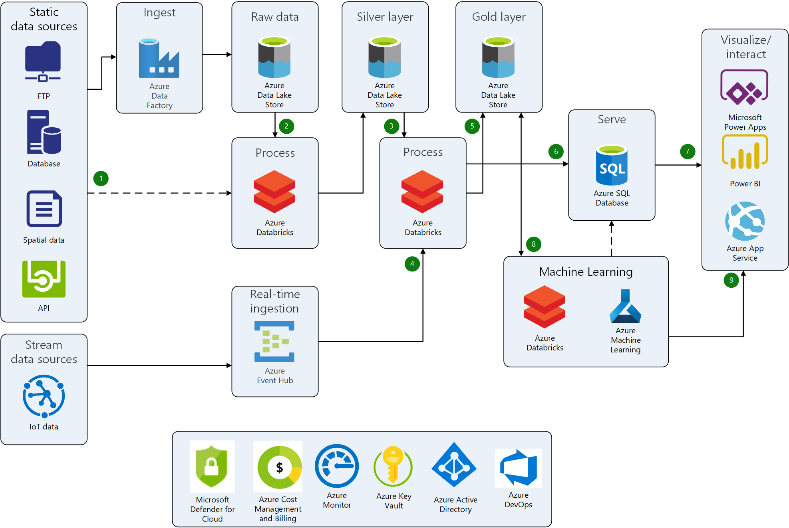

# Deploy the Sports Analytics on Azure Architecture


[](https://portal.azure.com/#create/Microsoft.Template/uri/https%3A%2F%2Fraw.githubusercontent.com%2FAzure%2Fazure-quickstart-templates%2Fmaster%2Fdemos%2Fsports-analytics-architecture%2Fazuredeploy.json)
[](http://armviz.io/#/?load=https%3A%2F%2Fraw.githubusercontent.com%2FAzure%2Fazure-quickstart-templates%2Fmaster%2Fdemos%2Fsports-analytics-architecture%2Fazuredeploy.json)


## Overview
This template deploys the services that are used in the **Sports Analytics Architecture on Azure**. This reference architecture is designed to provide individuals with a path to quickly build sports analytics solutions in Azure. More information about this reference architecture can be found at, [Build a sports analytics architecture on Azure](https://learn.microsoft.com/azure/architecture/example-scenario/analytics/sports-analytics-architecture-azure).

This template will deploy the following resources:
- **Azure Data Factory**: a fully managed, scalable, and serverless data integration service. It provides a data integration and transformation layer that works with various data stores.
- **Azure Data Lake Storage Gen2**: is a scalable and secure data lake for high-performance analytics workloads. You can use Data Lake Storage to manage petabytes of data with high throughput. It can accommodate multiple, heterogeneous sources and data that's in structured, semi-structured, or unstructured formats.
- **Azure Databricks**: a data analytics platform that uses Spark clusters. The clusters are optimized for the Azure platform.
- **Azure Key Vault (Optional)**: a cloud service for securely storing and accessing secrets.
- **Azure SQL Database (Optional)**: a fully managed platform as a service (PaaS) database engine that handles most of the database management functions like upgrading, patching, backups, and monitoring without user involvement. SQL Database is always running on the latest stable version of the SQL Server database engine and patched OS with high availability.
- **Azure Event Hub (Optional)**: a big-data streaming platform and event ingestion service. It can receive and process millions of events per second. Data sent to an event hub can be transformed and stored by using any real-time analytics provider or batching/storage adapters.

In addition to these services, the template will set up the necessary permissions for your Azure AD identity and each deployed service's managed identity. The template will also create Azure Data Factory Linked Services for the Azure Key Vault, Azure SQL Database, and Azure Data Lake Storage Gen2 instances.

## Architecture


## Prerequisites

- An Azure subscription.
- A user name and password for the Azure SQL server admin.
- You will need to know the object ID of your Azure AD user identity. Run the following PowerShell script in the Azure Command Shell in the Azure Portal or in a local PowerShell window to get the object ID:

```powershell
<# Uncomment and run the following code if you are running the script locally and the AzureAD PowerShell module is not installed:

Set-ExecutionPolicy -ExecutionPolicy RemoteSigned -Scope CurrentUser
Install-Module -Name Az -Scope CurrentUser -Repository PSGallery -Force

#>

# Enter your Azure AD username for the $name variable 
$name = "<AAD_Username>"

$null = Connect-AzureAD

$output = (Get-AzAdUser -UserPrincipalName $name).Id
Write-Host "Azure AD principal object ID is: $output"
```
Make a note of the object ID for later. You will use this value for the Azure AD Object ID parameter when you deploy the template.

## Deployment steps

You can click the "Deploy to Azure" button at the beginning of this document to deploy this template.

`Tags: Microsoft.Storage/storageAccounts, Microsoft.DataFactory/factories, SystemAssigned, Microsoft.DataFactory/factories/linkedservices, Microsoft.Databricks/workspaces, Microsoft.KeyVault/vaults, Microsoft.Sql/servers, Microsoft.Sql/servers/databases, Microsoft.Sql/servers/firewallRules, Microsoft.EventHub/namespaces, Microsoft.EventHub/namespaces/eventhubs, Sports Analytics, Microsoft Sports, Azure for Sports`
