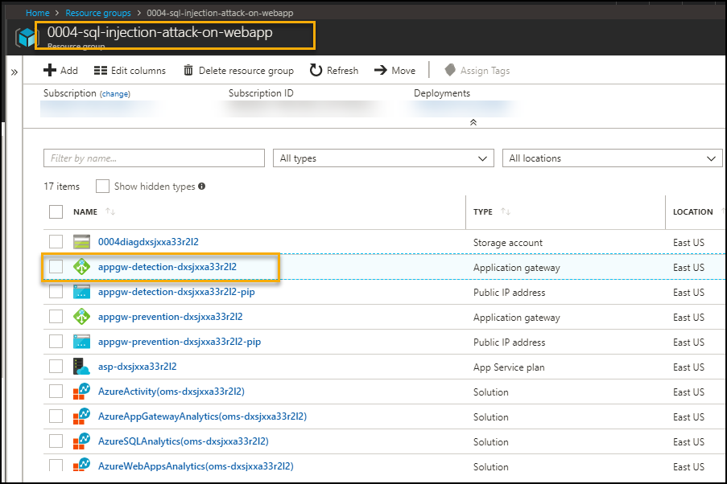
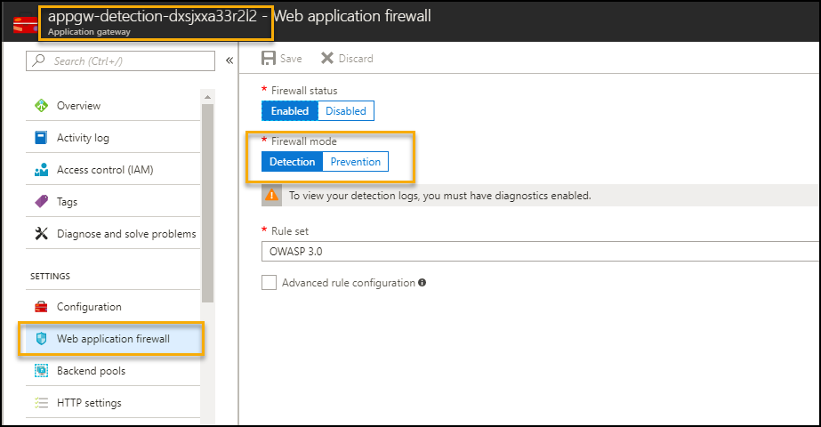
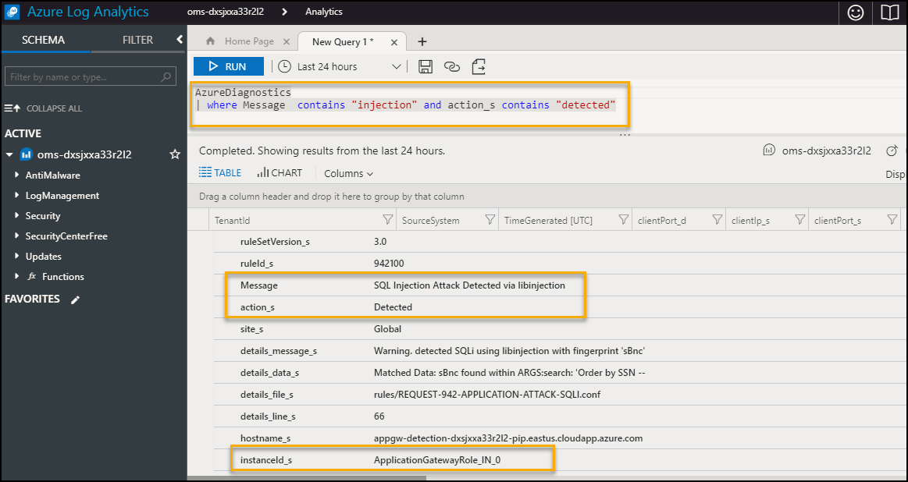
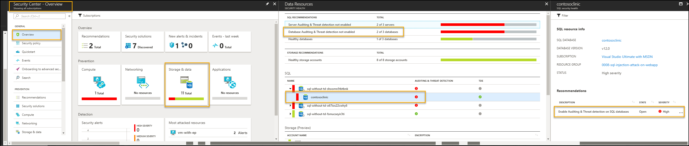
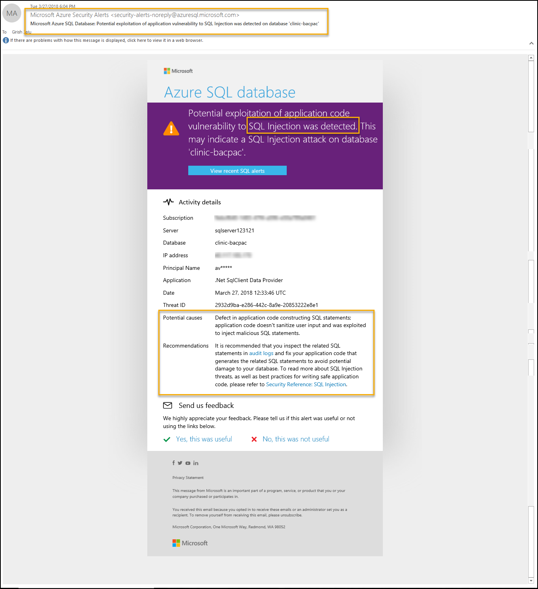
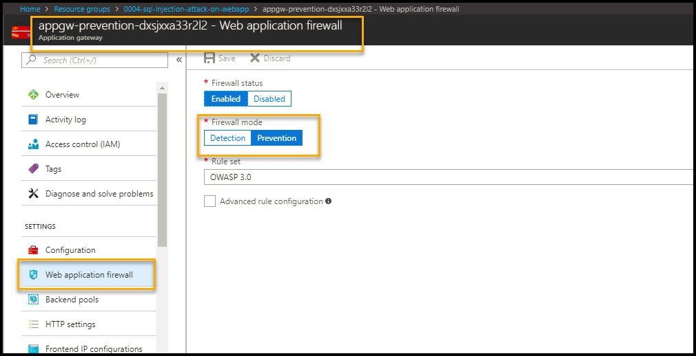
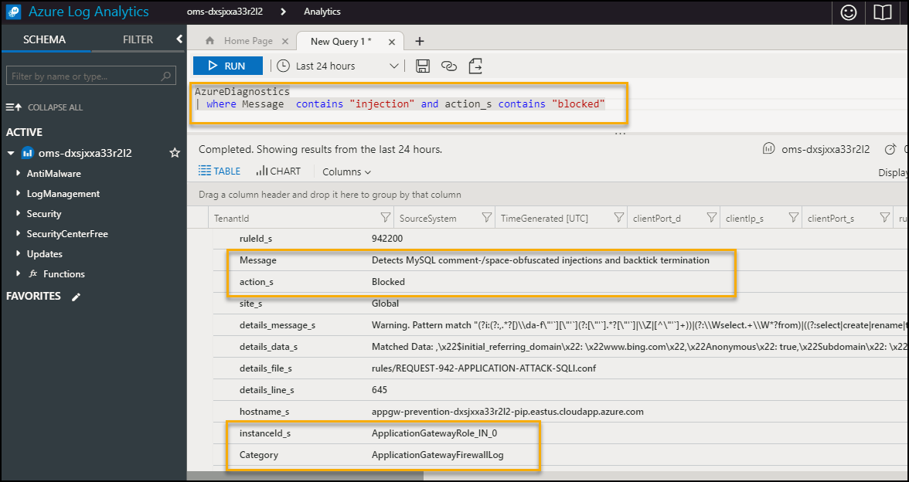

# SQL injection attack on a Web Application Scenario


[](https://portal.azure.com/#create/Microsoft.Template/uri/https%3A%2F%2Fraw.githubusercontent.com%2FAzure%2Fazure-quickstart-templates%2Fmaster%2Fdemos%2Fsql-injection-attack-prevention%2Fazuredeploy.json)
[](https://portal.azure.us/#create/Microsoft.Template/uri/https%3A%2F%2Fraw.githubusercontent.com%2FAzure%2Fazure-quickstart-templates%2Fmaster%2Fdemos%2Fsql-injection-attack-prevention%2Fazuredeploy.json)
[](http://armviz.io/#/?load=https%3A%2F%2Fraw.githubusercontent.com%2FAzure%2Fazure-quickstart-templates%2Fmaster%2Fdemos%2Fsql-injection-attack-prevention%2Fazuredeploy.json)  

## Table of Contents

1. [Objectives](#objectives_of_the_poc)
2. [Overview](#overview)
3. [Pre-requisites](#prerequisites)
4. [Perform Attack](#perform_attack)
5. [Detect Attack](#detect)
6. [Respond/Mitigate](#mitigate)
7. [Configuration validation](#Configuration_Validation)
8. [Teardown Deployment](#teardown_deployment)

## Objectives of the POC

This playbook demonstrates SQL injection attack against an unprotected sample web application.  After simulating an attack, harden the resources by applying protections to the web and SQL layers.  Re-attempt the attack against the protected application to see the defense in action.

## Overview

It showcases following use cases

1. Perform SQL injection attack on Web App with following configuration --> Application detects attack using application gateway
    * Application Gateway (WAF enabled-Detection mode)
    * SQL DB with Threat Detection disabled

1. Perform SQL injection attack on Web App with following configuration --> Application detects attack using application gateway and SQL database alert
    * Application Gateway (WAF enabled-Detection mode)
    * SQL DB with Threat Detection enabled and Send
 Alert To selected

1. Perform SQL injection attack on Web App with following configuration --> Application prevents attack
    * Application Gateway (WAF enabled-Prevention mode)
    * SQL DB with Threat Detection enabled and Send Alert To selected

## Important Notes

Although the deployment takes 10-15mins, the log aggregation by OMS take a few hours to get configured in the backend. You may not see attack/mitigation logs for detection and prevention events during the aggregation time window.
Subsequently logs will take 10-15 mins to reflect in OMS.

## Prerequisites

Access to Azure subscription to deploy following resources

1. Application gateway (WAF enabled)
2. App Service (Web App)
3. SQL Database
4. OMS (Monitoring)

## Perform Attack

Attack on web app with

* Application gateway - WAF - Detection mode
* SQL server and database with Threat Detection disabled.

1. Go to Azure Portal --> Select Resource Groups services --> Select Resource Group --> *ResourceGroupName* given during deployment

2. Select Application Gateway with name 'appgw-detection-' as prefix.
    

3. Application Gateway WAF enabled and Firewall in Detection mode as shown below.
    

4. On Overview Page --> Copy Frontend public IP address (DNS label) as
    

5. Open Internet Explorer with above details as shown below  
    

6. Click on Patient link it will display list of details
    

7. Perform SQL Injection attack by copying " **'order by SSN--** " in search box and click on "Search". Application will show sorted data based on SSN.

    

## Detect  

### Detection using OMS

To detect the attack, execute following query in Azure Log Analytics

**Note**: first time it takes few hours for OMS to pull logs for detection and prevention events. For subsequent requests it takes 10-15 mins to reflect in OMS, so if you don't get any search results, please try again after sometime.

1. Go to Azure Portal --> navigate to Log Analytics in same resource group


1. Go to Log analytics --> Click on Log Search --> Type query search

    ```AzureDiagnostics | where Message  contains "Injection" and action_s contains "detected"```

    

1. Following details gets logged
    

### Azure Security Center Recommendation

1. Azure Security Center gives  recommendations to enable Auditing and Threat Detection and allows you to perform  steps from the console itself.



1. Azure Portal > Security Center - Overview > Data Resources > contosoclinic > Enable Auditing & Threat detection on SQL databases >Auditing & Threat Detection


## Monitor / Detect

Once Auditing & Threat Detection is database is enabled for SQL database, Azure Security Center sends email alert mentioned in Send alert to field. Execute the step 7 to perform SQL Injection attack



## Mitigate

* Update Web application firewall mode to Prevention for application gateway. This will take 5-10 mins. Hence, we will connect the application using Application Gateway (WAF- Prevention mode)

    

## Detection after Mitigation

* Execute the step 4,5, 6 and 7 to perform SQL Injection attack with Application Gateway having WAF Enabled and Firewall in Prevention

  

* To detect the prevention of attack, execute following query in Azure Log Analytics

    ```AzureDiagnostics | where Message  contains "injection" and action_s contains "blocked"```

      

    You will notice events related to detection and prevention items. First time it takes few hours for OMS to pull logs for detection and prevention events. For subsequent requests it takes 10-15 mins to reflect in OMS, so if you don't get any search results, please try again after sometime.

## Configuration Validation

* The impact SQL injection can have on a business is far reaching. A successful attack may result in the unauthorized viewing of user lists, the deletion of entire tables and, in certain cases, the attacker gaining administrative rights to a database, all of which are highly detrimental to a business. Automatic detection and remediation procedure of such vulnerabilities can be easily done using the controls available in Cloudneeti.

* Cloudneeti is available on the Azure marketplace. Try out the free test drive here [https://aka.ms/Cloudneeti](https://aka.ms/Cloudneeti)

## Teardown Deployment

Run following command to clear all the resources deployed during the demo. Specify resource group name given during deployment

 ``` Remove-AzResourceGroup -Name <ResourceGroupName>  -Force ```

Verification steps -

1. Login to Azure Portal / Subscription
1. Check if resource group name given during deployment is cleared.

## References

[https://docs.microsoft.com/en-us/azure/application-gateway/application-gateway-introduction](https://docs.microsoft.com/en-us/azure/application-gateway/application-gateway-introduction)

[https://docs.microsoft.com/en-us/azure/application-gateway/application-gateway-web-application-firewall-overview](https://docs.microsoft.com/en-us/azure/application-gateway/application-gateway-web-application-firewall-overview)

[https://docs.microsoft.com/en-us/azure/sql-database](https://docs.microsoft.com/en-us/azure/sql-database/)

## Disclaimer & Acknowledgements

Avyan Consulting Corp conceptualized and developed the software in guidance and consultations with Microsoft Azure Security Engineering teams.

AVYAN MAKE NO WARRANTIES, EXPRESS, IMPLIED, OR STATUTORY, AS TO THE INFORMATION IN THIS DOCUMENT. This document is provided “as-is.” Information and views expressed in this document, including URL and other Internet website references, may change without notice. Customers reading this document bear the risk of using it. This document does not provide customers with any legal rights to any intellectual property in any AVYAN or MICROSOFT product or solutions. Customers may copy and use this document for internal reference purposes.

### Note

* Certain recommendations in this solution may result in increased data, network, or compute resource usage in Azure. The solution may increase a customer’s Azure license or subscription costs.
* The solution in this document is intended as reference samples and must not be used as-is for production purposes. Recommending that the customer’s consult with their internal SOC / Operations teams for using specific or all parts of the solutions.
* All customer names, transaction records, and any related data on this page are fictitious, created for the purpose of this architecture, and provided for illustration only. No real association or connection is intended, and none should be inferred.
