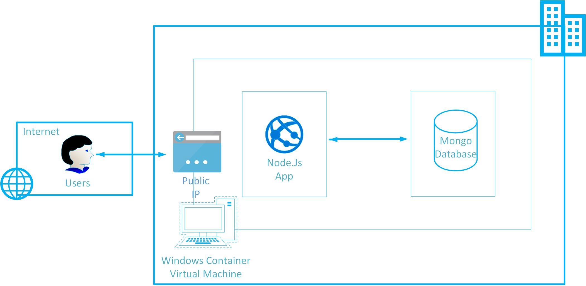
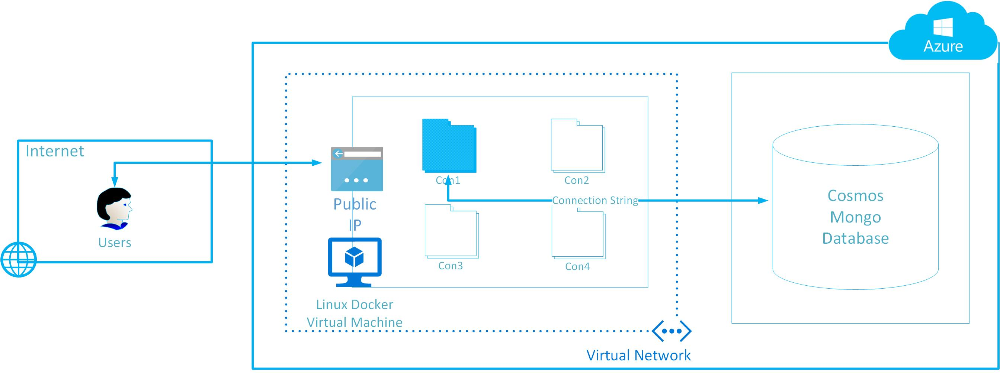

# Two-tier Nodejs app migration to Azure Container and PaaS DB

<!-- TOC -->

- [Two-tier Nodejs app migration to Azure Container and PaaS DB](#two-tier-nodejs-app-migration-to-azure-container-and-paas-db)
  - [Solution Overview](#solution-overview)
  - [Template Solution Architecture](#template-solution-architecture)
  - [Licenses and Costs](#licenses-and-costs)
  - [Prerequisites](#prerequisites)
  - [Deployment Steps](#deployment-steps)
  - [Deployment Time](#deployment-time)
  - [Support](#support)

<!-- /TOC -->

## Solution Overview
This Azure QuickStart template deploys the simulation infrastructure for on-premises two-tier Nodejs application and MongoDb on a single Ububtu server virtual machine.
Once deployment finishes, you can connect to deployed VM and verify the Mongo database as well as Nodejs application and test application by launching the same in browser.

## Template Solution Architecture
This template will deploy:
*	One storage account
*	One Virtual Network with one subnets
*	One Network Security Group
*	One Public IP
*	One Ubuntu Server VM
*   Installation and configuration of Mongo database and Nodejs application

 

Post migration of the app and db using the guide, your Azure environment will be as per the below diagram
 
## Licenses and Costs
This uses Ubuntu Linux image which is freely available and no license is required to deploy the same. User will be charged hourly for Azure’s Linux VM rates. Click [here](https://azuremarketplace.microsoft.com/en-us/marketplace/apps/Canonical.UbuntuServer?tab=PlansAndPrice) for pricing details.

## Prerequisites
*	Azure Subscription with specified payment method or Azure credits
## Deployment Steps
Build your Two-tier on-premises app simulation on Azure in a few simple steps:
*	Launch the Template by click on Deploy to Azure button.
*	Fill in all the required parameter values. Accept the terms and condition on click Purchase.
*	Access the deployment job once it is successful. In deployment job output, you will find the Public IP Address of VMs which can be used connect to the VMs.
*	Start the Nodejs (ToDo) application and launch the same in browser 
*	Populate the application by entering some records 
*	Open Mongo console and verify the database is successfully created.
*	Follow the post deployment configuration document [here](https://github.com/SpektraSystems/2-Tier-nodejsapp-migration-to-containers-on-Azure/raw/master/Two-tier%20Nodejs%20App%20migration%20on%20Azure%20Container%20v0.1.pdf) to learn about further configuration.

## Deployment Time
The deployment takes about 20 minutes to complete.
## Support
For any support related questions, issues or customization requirements, please contact info@spektrasystems.com  
****End****

