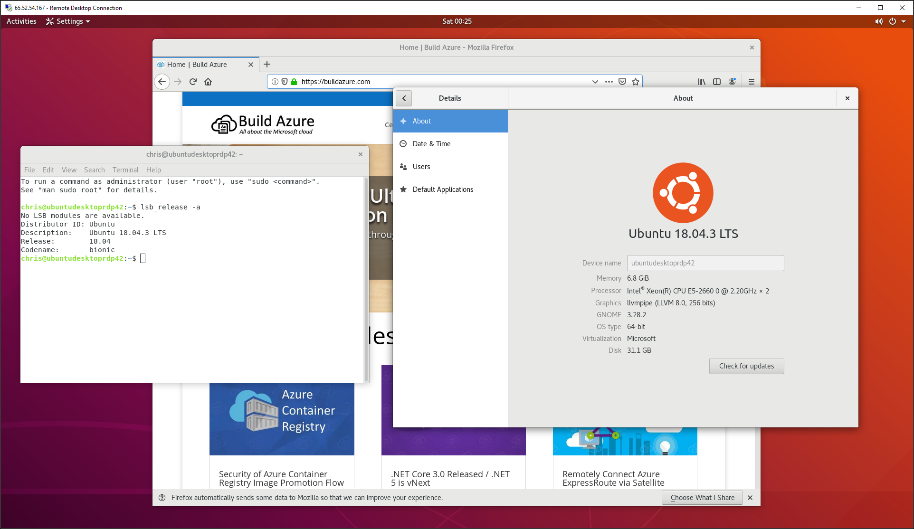

# Deploy Ubuntu Desktop VM with VSCode, Azure CLI and RDP support

  

This template deploys an Ubuntu Server VM, then uses the Linux CustomScript extension to install the Ubuntu Gnome Desktop and Remote Desktop support (via xrdp). The final provisioned Ubuntu VM support remote connections over RDP; just like you can with a Windows machine.

Once you connect remotely to the Ubuntu VM over RDP, you will see a similar experience as if you were sitting at an Ubuntu Desktop machine.

Here's a sample screenshot of an RDP session connecting to the Ubuntu VM:

When connected over RDP, the VM will prompt you a few times for the Password for the VM. If you wish to remove these prompts for future use of the VM, then follow the instructions at this link: <https://askubuntu.com/questions/675379/how-to-disable-the-password-prompts>

When connected over RDP to the VM the first time, it will prompt for password a couple times. If/when prompted for the Password for a user named `Ubuntu` this first time connecting, simply select "Cancel" and the prompt will go away. Once Ubuntu is configured and able to be used to run apps and other things, then the admin password for the VM will be the password for the `Ubuntu` user it will prompt for later.

# Running at terminal 

To open a terminal with Ctrl + Alt + t

# Running VSCode

### Manage IDE from the Command Line
The vscode IDE includes a command line tool called code which can use to manage the IDE directly from the Ubuntu terminal.

### To open a new file, Execute:
code file_name

### To open a folder with vscode, Type:
code dir_name

### You can also use command line to add new extensions.For example, Following command will add eslint JavaScript extension to the vscode:
code --install-extension dbaeumer.vscode-eslint

### To list installed extensions, Type:
code --list-extensions

### Getting Started with VS Code

Visual Studio Code is a lightweight but powerful source code editor which runs on your desktop and is available for Windows, macOS and Linux. It comes with built-in support for JavaScript, TypeScript and Node.js and has a rich ecosystem of extensions for other languages (such as C++, C#, Java, Python, PHP, Go) and runtimes (such as .NET and Unity). 

Begin your journey with VS Code with these [introductory videos](https://code.visualstudio.com/docs/introvideos/overview)

[Visual Studio Code - Getting Started documents](https://code.visualstudio.com/docs)

### Microsoft Learn - Learning Modules

[Visual Studio Code](https://docs.microsoft.com/en-us/learn/browse/?term=Visual%20Studio%20Code)
[Linux Virtual Machines on Azure](https://docs.microsoft.com/en-us/learn/browse/?term=Linux%20Virtual%20Machine)
[Azure CLI](https://docs.microsoft.com/en-us/learn/browse/?term=Azure%20CLI)

