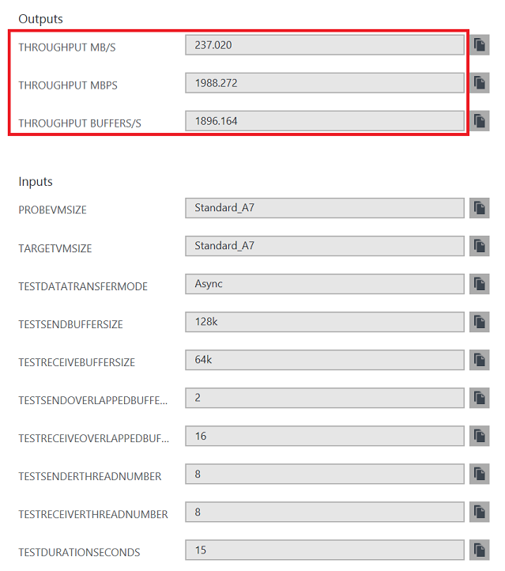

# Azure VM-to-VM multithreaded throughput meter


[](https://portal.azure.com/#create/Microsoft.Template/uri/https%3A%2F%2Fraw.githubusercontent.com%2FAzure%2Fazure-quickstart-templates%2Fmaster%2Fdemos%2Fvm-to-vm-throughput-meter-multithreaded%2Fazuredeploy.json)  
[](https://portal.azure.us/#create/Microsoft.Template/uri/https%3A%2F%2Fraw.githubusercontent.com%2FAzure%2Fazure-quickstart-templates%2Fmaster%2Fdemos%2Fvm-to-vm-throughput-meter-multithreaded%2Fazuredeploy.json)
[](http://armviz.io/#/?load=https%3A%2F%2Fraw.githubusercontent.com%2FAzure%2Fazure-quickstart-templates%2Fmaster%2Fdemos%2Fvm-to-vm-throughput-meter-multithreaded%2Fazuredeploy.json)

This template allows you to run a VM-to-VM network throughput test for the same VNet/subnet using NTttcp utility. [See licence agreement](https://gallery.technet.microsoft.com/NTttcp-Version-528-Now-f8b12769).

The VM sizes selected should be available in chosen region. Please check availability [here](https://azure.microsoft.com/en-us/regions/services/).
See VM series/sizes [description](https://azure.microsoft.com/en-us/documentation/articles/virtual-machines-windows-sizes/).

Upon template deployment you will have the network throughput between the VMs automatically measured. You can see the measurements:

```powershell
OutputsString           : 
                          Name             Type                       Value     
                          ===============  =========================  ==========
                          throughput MB/s  String                     229.453   
                          throughput mbps  String                     1924.787  
                          throughput buffers/s  String                     1835.620 
```



To re-measure the throughput you can login to the probe and target VMs with credentials you provided during deployment.

In case you don't need to re-measure, it is safe to delete the created resource group.


