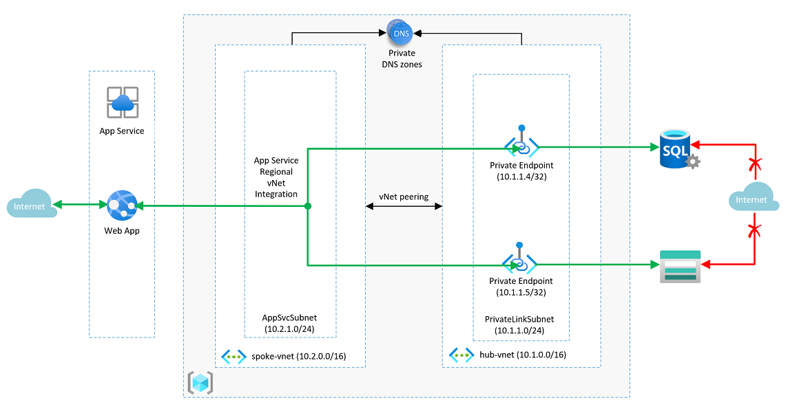

# Azure App service web app regional vNet integration, SQL DB and Azure Storage account Private endpoint scenario 

    

### Overview

This solution deploys a Windows Azure App Services web app into a subnet using regional virtual network integration. An Azure SQL DB and a storage account are also created, each with its own private link and private DNS resources to allow access from the web app over a private address space. Firewall rules are added to the storage account to prevent public access & the Azure SQL Server is configured to disallow public traffic. A dns record is created in each zone for the Azure SQL Server and storage account.

The following resources are deployed as part of this solution

- Hub Virtual Network (10.1.0.0/16)
  - PrivateLinkSubnet (10.1.1.0/24)
- Spoke Virtual Network(10.2.0.0/16)
  - AppSvcSubnet (10.2.1.0/24)
- Virtual Network peering between hub and spoke virtual networks
- Azure SQL Server
  - Azure SQL DB
  - Private link
  - Private DNS zone
- Storage account
  - Private link
  - Private DNS zone
- App Service Web app
  - Regional virtual network integration

  Note that for traffic to pass from the web app to the private endpoints, the following web app environment variables must be set in the app.json nested template.

  "siteConfig": {
                    "appSettings": [
                        {
                            "name": "WEBSITE_VNET_ROUTE_ALL",
                            "value": 1
                        },
                        {
                            "name": "WEBSITE_DNS_SERVER",
                            "value": "168.63.129.16"
                        }
                    ]
                }

### Scenario Deployment Validation

To validate that the web app can resolve the private endpoints for the Azure SQL DB and storage account follow the steps below. 
- Navigate to the Azure web app and select the 'KUDU' blade and select 'Advanced Tools' then click the 'Go ->' hyperlink
- A new web page will open displaying the web app's management environment
- Select 'Debug console' then 'PowerShell' in the drop-down menu
- In the PowerShell console, type the following commands to test that name resolution is working for both the Azure SQL DB and storage account. The private IP address for each resource should be returned.
  - `PS D:\home> nameresolver <storage account name>.<storage account private DNS zone name>`
  - `PS D:\home> nameresolver <Azure SQL DB name>.<Azure SQL DB private DNS zone name>`

### Architecture Diagram

