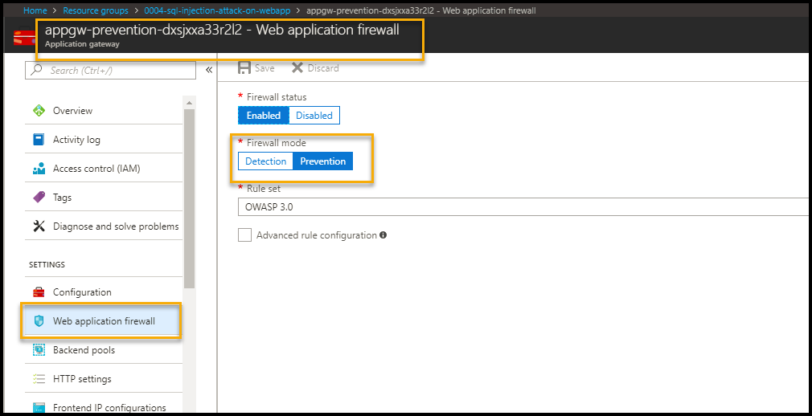

# XSS-Attack-Prevention


[](https://portal.azure.com/#create/Microsoft.Template/uri/https%3A%2F%2Fraw.githubusercontent.com%2FAzure%2Fazure-quickstart-templates%2Fmaster%2Fdemos%2Fxss-attack-prevention%2Fazuredeploy.json)
[](https://portal.azure.us/#create/Microsoft.Template/uri/https%3A%2F%2Fraw.githubusercontent.com%2FAzure%2Fazure-quickstart-templates%2Fmaster%2Fdemos%2Fxss-attack-prevention%2Fazuredeploy.json)
[](http://armviz.io/#/?load=https%3A%2F%2Fraw.githubusercontent.com%2FAzure%2Fazure-quickstart-templates%2Fmaster%2Fdemos%2Fxss-attack-prevention%2Fazuredeploy.json)
 
 
# Table of Contents
1. [Objectives](#objectives)
2. [Overview](#overview)
3. [Pre-requisites](#prerequisites)
4. [Perform Attack](#attack)
5. [Detect Attack](#detect)
6. [Respond/Mitigate](#mitigate)
7. [Configuration validation](#config)
8. [Teardown Deployment](#teardown)

<a name="objectives">
# Objective of the POC
This playbook demonstrates a Cross-site scripting (XSS) attack against an unprotected sample web application.  After simulating an attack, hardening the resource by applying protection to the network layer.  Re-attempt the attack against the protected web application to see the defense in action. 

<a name="overview">
# Overview
It showcases following use cases
1. Perform XSS (Cross Site Scripting) attack on Web App with following configuration --> Application detects attack using application gateway
    * Application Gateway (WAF enabled-Detection mode)
  

2. Perform XSS (Cross Site Scripting) attack on Web App with following configuration --> Application prevents attack using application gateway
    * Application Gateway (WAF enabled-Prevention mode)
  

# Important Notes <a name="notes">
First time it takes few hours for OMS to pull logs for detection and prevention events. For subsequent requests it takes 10-15 mins to reflect in OMS.

<a name="prerequisites">
# Prerequisites
Access to Azure subscription to deploy following resources 
1. Application gateway (WAF enabled)
2. App Service (Web App)
3. SQL Database 
4. OMS (Monitoring)

<a name="attack">
# Perform Attack 
Attack on web app with
* Application gateway - WAF - Detection mode 
 

1. Go to Azure Portal --> Select Resource Groups services --> Select Resource Group --> <ResourceGroupName> given during deployment

2. Select Application Gateway with name 'appgw-detection-' as prefix.

    

3. Application Gateway WAF enabled and Firewall in Detection mode as shown below.

    

4. On Overview Page --> Copy Frontend public IP address as
    

5. Open Internet Explorer with above details as shown below  
    

4. Click on Patient link and select Edit option 

    

4. Perform XSS attack by copying javascript code " **<script>alert('test script')</script>** " in MiddleName text box and click on "Save". 
  

5. Application will save data in database and display it on dashboard.

        
    
<a name="detect">    
# Detect
To detect the attack, execute following query in Azure Log Analytics
1. Go to Azure Portal --> navigate to Log Analytics in same resource group  

 

2. Go to Log analytics --> Click on Log Search --> Type query search 

    ```AzureDiagnostics | where Message  contains "xss" and action_s contains "detected"```

     
    
3. Following details gets logged. 

     
    
<a name="mitigate">
# Mitigate 

  * Update Web application firewall mode to Prevention for application gateway. This will take 5-10 mins. Hence, we will connect the application using Application Gateway (WAF- Prevention mode) 

        
    
  

## Detection after Mitigation 

* Execute the step 6 and 7  to perform XSS attack, Application Gateway will prevent access

      

 
* To detect the prevention of attack, execute following query in Azure Log Analytics

    AzureDiagnostics | where Message  contains "xss" and action_s contains "blocked"
    
      

You will notice events related to detection and prevention items. First time it takes few hours for OMS to pull logs for detection and prevention events. For subsequent requests it takes 10-15 mins to reflect in OMS, so if you don't get any search results, please try again after sometime.

<a name="config">
## Configuration Validation
* Cross site scripting (XSS) is a common attack vector that injects malicious code into a vulnerable web application. A successful cross site scripting attack can have devastating consequences for an online business’s reputation and its relationship with its clients. Detection and remediation can be easily done using advanced controls along with Audit and Remediation procedure in Cloudneeti.

* Cloudneeti is available on the Azure marketplace. Try out the free test drive here https://aka.ms/Cloudneeti 

<a name="teardown">
## Teardown Deployment 

Run following powershell command after login to subscription to clear all the resources deployed during the demo. Specify resource group name given during deployment
 
 `Remove-AzureRmResourceGroup -Name <ResourceGroupName>  -Force `
 
    
Verification steps -
1. Login to Azure Portal / Subscription
2. Check if resource group name given during deployment is cleared.
<p/>

**References** 

https://docs.microsoft.com/en-us/azure/application-gateway/application-gateway-introduction
 
https://docs.microsoft.com/en-us/azure/application-gateway/application-gateway-web-application-firewall-overview

## Disclaimer & Acknowledgements 

Avyan Consulting Corp conceptualized and developed the software in guidance and consultations with Microsoft Azure Security Engineering teams.
 
AVYAN MAKE NO WARRANTIES, EXPRESS, IMPLIED, OR STATUTORY, AS TO THE INFORMATION IN THIS DOCUMENT. This document is provided “as-is.” Information and views expressed in this document, including URL and other Internet website references, may change without notice. Customers reading this document bear the risk of using it. This document does not provide customers with any legal rights to any intellectual property in any AVYAN or MICROSOFT product or solutions. Customers may copy and use this document for internal reference purposes.
 
### Note:
*	Certain recommendations in this solution may result in increased data, network, or compute resource usage in Azure. The solution may increase a customer’s Azure license or subscription costs.
*	The solution in this document is intended as reference samples and must not be used as-is for production purposes. Recommending that the customer’s consult with their internal SOC / Operations teams for using specific or all parts of the solutions.
*	All customer names, transaction records, and any related data on this page are fictitious, created for the purpose of this architecture, and provided for illustration only. No real association or connection is intended, and none should be inferred. 


