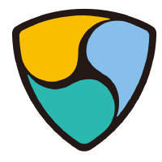

#  NEM Infrastructure Server (NIS)

This Microsoft Azure template deploys the NEM Infrastructure Server (NIS).

Once your deployment is complete you will be able to use NIS's API do accomplish various tasks on the NEM public blockchain and network.
To learn more about NEM read the technical reference here: http://nem.io/NEM_techRef.pdf

# Template Parameters
When you launch the installation of the VM, you need to specify the following parameters:
* `newStorageAccountNamePrefix`: make sure this is a unique identifier. Azure Storage's accounts are global so make sure you use a prefix that is unique to your account otherwise there is a good chance it will cause prolbems.
* `vmDnsName`: this is the public DNS name for the VM that you will use interact with your geth console. You just need to specify an unique name.
* `adminUsername`: self-explanatory. This is the account you will use for connecting to the node
* `adminPassword`: self-explanatory. Be aware that Azure requires passwords to have One upper case, one lower case, a special character, and a number
* `vmSize`: The type of VM that you want to use for the node. The default size is D1 (1 core 3.5GB RAM) but you can change that if you expect to run workloads that require more RAM or CPU resources.
* `location`: The region where the VM should be deployed to
* `nemnet`: The network you will be using i.e. test- or mainnet.

# NEM Deployment Steps
1. Get your node's IP
 1. browse to https://portal.azure.com

 2. then click browse all, followed by "resource groups", and choose your resource group

 3. then expand your resources, and public ip address of your node.

2. Connect to your NEM node and start using the API (default port is 7890)

3. On port 7777 you'll find a lightwallet that you can use to make transfers. 

4. You can also download NCC http://bob.nem.ninja/ (this will also include NIS but nevermind that, you already have that running :)) and point it at your node. 

Here's our API-documentation http://bob.nem.ninja/docs/
 
Please ask any questions you may have on http://forum.nem.io (it supports social logins including github so don't worry about signing-up). 
