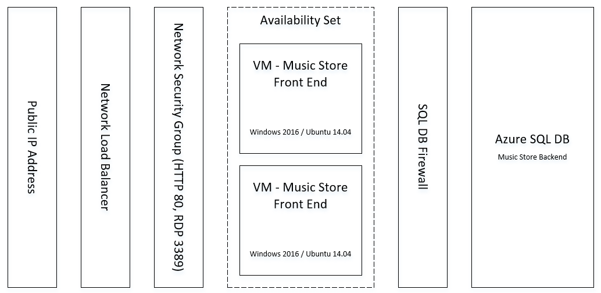

# Deploy Two Tier Application on Linux and Azure SQL DB

This template deploys a two tier demo application and all necessary infrastructural components. When deployed, the resulting resource group will contain a fully working, highly available, and secure application. Deploy the Azure resource group and application using the below button. Once completed, the application can be access on the Azure public IP address or or public DNS name. 

The application architecture is similar to this:

