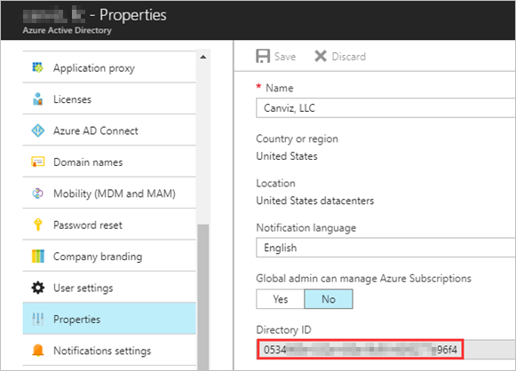
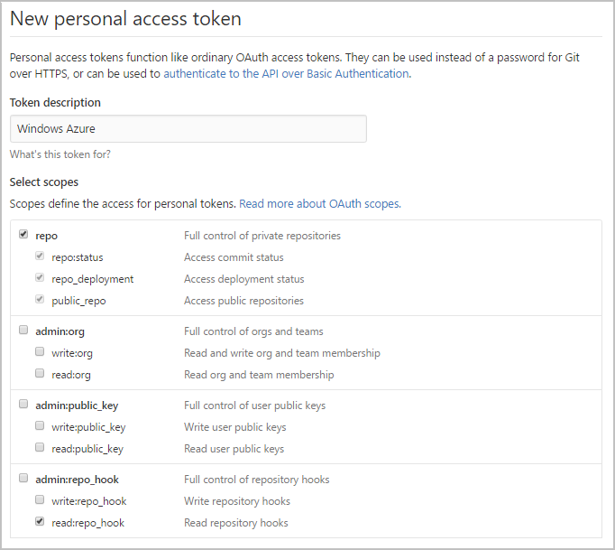
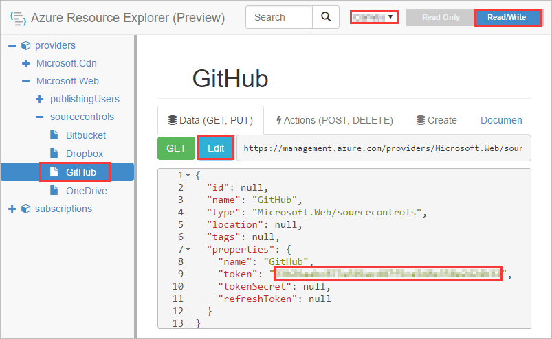
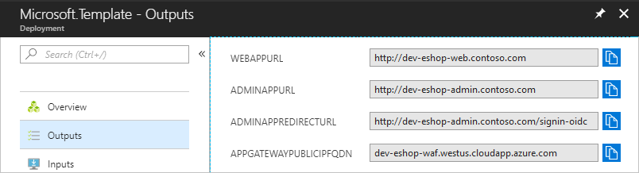
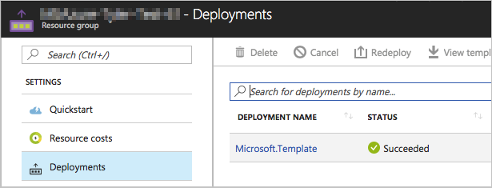
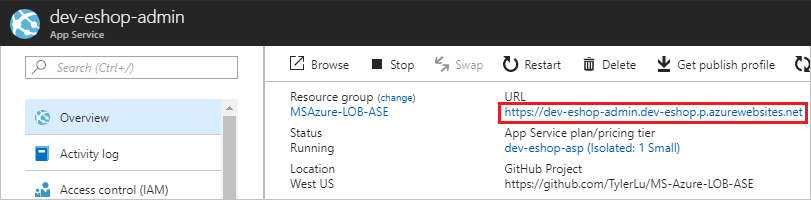
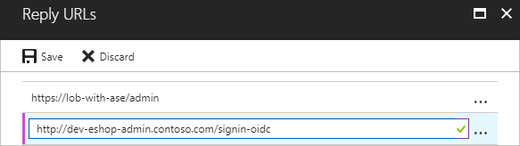
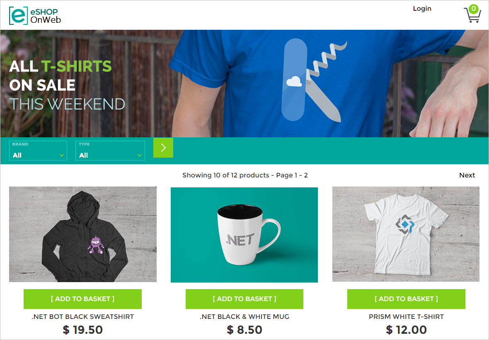
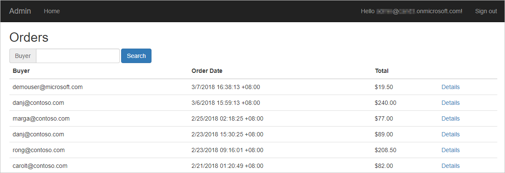

# eShop Website with ILB ASE

**Table of content**

[Create App Registrations in Azure Active Directory (AAD)](#create-app-registrations-in-azure-active-directory-aad)

* [Get Tenant Id](#get-tenant-id)
* [Create App Registration for the Admin Web App](#create-app-registration-for-the-admin-web-app)

[Deploy Azure Components with the ARM Template](#deploy-azure-components-with-the-arm-template)

* [GitHub Authorize](#github-authorize)
* [Deploy Azure Components](#deploy-azure-components)
* [Deployment output](#deployment-output)

* [Add Reply URL to the Admin Web App](#add-reply-url-to-the-admin-web-app)

[Access Deployed Resources](#access-deployed-resources)

## Architecture

Download the Visio diagram [here](/e-shop-website-with-ilb-ase/architecture.vsdx).

## Create App Registrations in Azure Active Directory (AAD) 

### Get Tenant Id

Open the AAD in the Azure portal, and copy get the **Directory ID**.

The **Directory ID** is used to set the value of the **Azure Ad Tenant Id** parameter in the ARM Template.

### Create App Registration for the Admin Web App

Create a new App Registration in AAD:

* Name: LoB with ASE - Admin

* Application Type: Web app/API

* Sign-on URL: https://lob-with-ase/admin

* Permissions:

   | API                            | Permission Type | Permissions                   |
   | ------------------------------ | --------------- | ----------------------------- |
   | Windows Azure Active Directory | Delegated       | Sign in and read user profile |

Copy the **Application Id** and save it in a text file. You will need it later to specify the values for the **Azure Ad Client Id** parameter in the ARM Template.

## Deploy Azure Components with the ARM Template

### GitHub Authorize

1. Generate Token

   - Open [https://github.com/settings/tokens](https://github.com/settings/tokens) in your web browser.

   - Sign into your GitHub account where you forked this repository.

   - Click **Generate Token**.

   - Enter a value in the **Token description** text box.

   - Select the followings (your selections should match the screenshot below):

     - repo (all) -> repo:status, repo_deployment, public_repo
     - admin:repo_hook -> read:repo_hook

     

   - Click **Generate token**.

   - Copy the token and save it in a text file.

2. Add the GitHub Token to Azure in the Azure Resource Explorer

   - Open [https://resources.azure.com/providers/Microsoft.Web/sourcecontrols/GitHub](https://resources.azure.com/providers/Microsoft.Web/sourcecontrols/GitHub) in your web browser.

   - Log in with your Azure account.

   - Select the correct Azure subscription.

   - Select **Read/Write** mode.

   - Click **Edit**.

   - Paste the token into the **token parameter**.

     

   - Click **PUT**.

### Deploy Azure Components

1. Fork this repository to your GitHub account.

2. Click the **Deploy to Azure** Button:

   

   

3. Fill in the values on the deployment page:

   **Basics**:

   * **Subscription**: choose one of your subscriptions
   * **Resource group**: create a new resource group
   * **Location**:  select a location

   **Settings**:

   * **Ase Name**: the name of the App Service Environment. 

     >**Note:** This value is also used to name other Azure resources created by the ARM template. To avoid naming conflicts, please choose a unique name, for example: **tyler-eshop-180308**.

   * **Ase Location**: choose the same location as the location of the resource group.

     >**Note:** This parameter was added because of this [issue](https://github.com/Azure/azure-quickstart-templates/issues/2828).

   * **Sql Server Administrator Login**:  please keep the default value.

     >**Note:** If you want to change it, please make sure your login name meets the following requirements - It's a SQL Identifier, and not a typical system name (like admin, administrator, sa, root, dbmanager, loginmanager, etc.), or a built-in database user or role (like dbo, guest, public, etc.). Make sure your name doesn't contain whitespaces, unicode characters, or nonalphabetic characters, and that it doesn't begin with numbers or symbols.

   * **Sql Server Administrator Login Password**: please do use a strong password.

     >**Note:**
     >
     > - Your password must be at least 8 characters in length.
     > - Your password must contain characters from three of the following categories – English uppercase letters, English lowercase letters, numbers (0-9), and non-alphanumeric characters (!, $, #, %, etc.)

   * **Azure Ad Tenant Id**/**Client Id**: use the values you got from the previous chapter.

     > Note: These values are used to authenticate the Admin Web App.

   * **Source Code Repository URL**: use the URL of the repository you just created -`https://github.com/<YourAccount>/azure-quickstart-templates`

   * **Source Code Branch**: master

   * **Source code Manual Integration**: false

   **Terms and conditions**:

   * Check **I agree to the terms and conditions stated above**.

4. Click **Purchase**.

   > **Note**: The deployment takes about 2 hours to complete.

### Deployment output

After the deployment finishes, you will see the URLs of the Web App and Admin App in the outputs tab.

> **Note**: the deployment window shown above can be re-opened by clicking the **Deployments** tab in the resource group.
>
> 

### Add Reply URL to the Admin Web App

1. Copy the URL of the Admin Web app, and change the protocol schema from http to http**s**. This creates the base URL.

    

    For example: `https://huddle-bot.azurewebsites.net`

2. Append `/signin-oidc` to the base URL, to create the replay URL. 

   For example: `https://dev-eshop-admin.dev-eshop.p.azurewebsites.net/signin-oidc`

3. Add the replay URL to the Bot App Registration and save it.

   

## Access Deployed Resources

### Web App

Open the Web App URL you got from the output section in a browser.

> **Note**:  The sample uses **Azure CDN from Verizon** profile and its propagation usually completes within 90 minutes. You may need to wait for a while then the page will look exactly like below.

### Admin App

Open the Admin App URL you got from the output section in a browser. Then sign in with a work account in the AAD where you registered the AAD application. 

**Copyright (c) 2018 Microsoft. All rights reserved.**