# Ethereum Consortium Network Deployments Made Easy

## NOTE: This quickstart template will be deprecated on Jan 1st 2018 in favor of our Azure Blockchain Marketplace solution. The Azure Blockchain Marketplace solution includes new features, Ethereum updates, bug fixes, and Microsoft technical support via our [forums](https://social.msdn.microsoft.com/Forums/en-US/home?forum=azureblockchain). The Azure Blockchain Marketplace solution can be found [here](https://azuremarketplace.microsoft.com/en-us/marketplace/apps/microsoft-azure-blockchain.azure-blockchain-service?tab=Overview). Click “GET IT NOW”, sign-in if needed and then select “Ethereum Consortium Blockchain” for the software plan. The Azure Marketplace template files are also available for download in the last step of the Azure portal deployment process.

    

## Overview
The next phase of our support of blockchain on Microsoft Azure is the release of the Ethereum Consortium Blockchain Network solution template in the Azure Quick Start Templates that simplifies the infrastructure and protocol substantially.  This template deploys and configures a private Ethereum network from the Azure Portal or cmdline with a single click.  While there are many valuable scenarios for the public Ethereum network, we expect in many enterprise scenarios, you will want to configure Ethereum to build out and deploy your own consortium network.

After reading this article, you will
* Obtain working knowledge of blockchain, Ethereum, and one consortium network architecture
* Learn how to deploy and configure a multi-node Ethereum consortium network with the published ARM template

## About blockchain
For those of you new to the blockchain community, this is a great opportunity to learn about the technology in an easy and configurable manner on Azure. Blockchain is the underlying technology behind Bitcoin; however, it is much more than just a virtual currency. It is a composite of existing database, distributed system, and cryptographic technologies that enables secure multi-party computation with guarantees around immutability, verifiability, auditability, and resiliency to attack. Different implementations employ different mechanisms to provide these attributes. Ethereum is one such protocol, with several different implementations.

While this article will not go into the details of the [Ethereum](https://www.ethereum.org/) protocol, implementations, architecture, or public network, it is still important to briefly describe a simplified application and network architecture to better understand the different deployment topology options now available. Ultimately, there is no single canonical network layout; it all depends on the use cases and stage within the development lifecycle.

Similar to applications interacting with databases today, decentralized applications will communicate and execute logic against the Ethereum blockchain. A private Ethereum network consists of a peer-to-peer decentralized network of nodes. These nodes maintain a copy of the data store (i.e. distributed ledger) and run a virtual machine to support arbitrary computation against the ledger, while maintaining consensus. Smart contracts are the mechanism that allows for this complicated computation on the network, similar to stored procedures on traditional databases.

Nodes are divided into mining and transaction nodes (non-mining nodes). Transaction nodes maintain a copy of the distributed ledger, but are used to submit or look up transactions from the network. Applications interact with these nodes using Ethereum’s web3 JavaScript object to execute and store important transactions within their application. A wallet is usually backed by a transaction node on the public network. Mining nodes process and commit transactions to the underlying distributed database (i.e. ledger) through a consensus process.

## Getting Started
To begin, you will need an Azure subscription that can support deploying several virtual machines and standard storage accounts. By default, most subscription types will support a small deployment topology without needing to increase quota.

Once you have a subscription, click the ‘Deploy to Azure’ button above to take you to the Template deployment wizard in the Azure Portal.  Note, you will be prompted to sign into your account and Azure subscription in the process if you are not already logged in.  

Once signed in, you land within the Template deployment wizard as shown below.

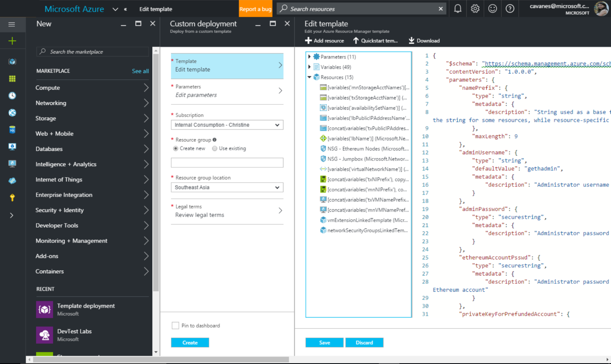

The template is pre-populated with the main azuredeploy.json ARM template file and can be displayed. If you are interested in understanding or modifying the ARM template itself, select Edit to open the editor in the Azure portal. For a more detailed inspection, you can also select the ‘Browse on Github’, instead of ‘Deploy To Azure’ button to take you to the Azure Github repository that contains the Ethereum Consortium Blockchain Network template.

The Template Deployment will prompt you for a set of simple inputs to configure the deployment properly. Under the Basics section, you will provide values for standard parameters for any deployment, while under the Settings section, you will provide values for parameters specific to this blockchain consortium template. The standard parameters include the subscription, resource group, and location to which to deploy resources. We recommend using a new separate resource group to avoid resource conflicts and for ease of management and deletion.

<TODO: ADD IMAGE FROM pdf>

Finally, acknowledge legal terms and click ‘Purchase’ to deploy. Depending on the number of VMs being provisioned, deployment time can vary from a few minutes to tens of minutes.

## Ethereum consortium network architecture on Azure
While there is no single canonical architecture for a consortium network, this template provides a sample architecture to use to get started quickly. Fundamentally, the network consists of a set of shared transaction nodes with which an application can interact to submit transactions and a set of mining nodes per consortium member to record transactions. All nodes are within the same virtual network, though each consortium member’s subnet can be easily pulled into individual VNets communicating through application gateways. The network is illustrated in the figure below.

## Mining Nodes
Each consortium member is given a separate, identical subnet containing one or more mining nodes, backed by a storage account. The first default VM in the subnet is configured as a boot node to support dynamic discoverability of the nodes in the network. Mining nodes communicate with other mining nodes to come to consensus on the state of the underlying distributed ledger. There is no need for your application to be aware of or communicate with these nodes. Since we are focused on private networks, these nodes are isolated from inbound public internet traffic adding a secondary level of protection. Outbound traffic is allowed, but not to the Ethereum discovery port. While each member’s VMs are in a separate subnet, the individual nodes are still connected and communicating with one another via Ethereum’s discovery protocol.

All nodes have the latest stable Go Ethereum (Geth) client software and are configured to be mining nodes. All nodes use the same Ethereum account (Ethereum address and key pair) that is protected by the Ethereum account password. The public private key pair generated from the Ethereum passphrase provided is stored on each of the Geth nodes. As mining nodes mine, they collect fees that are added to this account.

## Transaction Nodes
All consortium members share a set of load-balanced transaction nodes. These nodes are reachable from outside the virtual network so that applications can use these nodes to submit transactions or execute smart contracts within the blockchain networks. All nodes have the latest stable Go Ethereum (Geth) client software and are configured to maintain a complete copy of the distributed ledger. These nodes use the same Ethereum account, protected by the Ethereum account password provided.

We have explicitly separated the nodes that accept transactions from the nodes that mine transactions to ensure that the two actions are not competing for the same resources. We have also load-balanced the transaction nodes within an availability set to maintain high availability.

## Ethereum configuration
Besides the infrastructural footprint and configuration of nodes, the blockchain network itself is created. The genesis block is configured with the desired Ethereum network id, an appropriate mining difficulty, and a pre-configured account. The mining difficult varies depending on the number of mining nodes deployed to ensure mining time remains short even in the beginning. The pre-configured account contains 1 trillion Ether to seed the consortium network with enough gas (Ethereum’s fuel) to handle millions of transactions. Since the mining nodes use this account, their collected fees feed back into the account to ensure continual funds.  

## Administrator page
Once the deployment has completed successfully and all resources have been provisioned, you can go to the administrator page to get a simple view of your blockchain network.

The admin site URL is the DNS name of the load balancer; it is also the first output of the template deployment. To find the template output, select the resource group just deployed. Select the Overview tab, then Last Deployment. 

Finally, select Microsoft.Template and look for the outputs section.

You can get a high level overview of the topology you just deployed by reviewing the Ethereum Node Status section. This section includes all node hostnames and the participant to which the node belongs. It also displays node connectivity with the peer count. Peer count is the minimum of the number of mining nodes in the network and twenty-five where twenty-five is the configured maximum peer count, as in the public Ethereum network. Note, that peer count does not restrict the number of nodes that can be deployed within the network. Occasionally, you will see peer count fluctuate and be less for certain nodes. This is not always a sign that the nodes are unhealthy, since forks in the ledger can cause minor changes in peer count. Finally, you can inspect the latest block seen by each node in the network to determine forks or lags in the system.

The node status is refreshed every 10 seconds. Reload the page via the browser or "Reload" button to update the view.

## Create Ethereum Account
To create an additional account, you can use a variety of solutions.  One such solution is [MetaMask](https://metamask.io/), a Chrome extension that provides an “identity vault” and connection to an Ethereum network, public, test or custom.  MetaMask formulates a transaction to register the account in the network.  This transaction, like any other transaction, will go to one of the transaction nodes, and eventually be mined into a block as illustrated below.

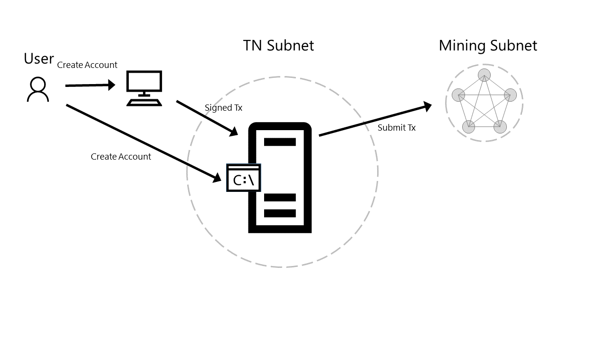

To install the extension in Chrome, go to Customize and control Google Chrome (Overflow button), More Tools, Extensions, Get More Extensions, and search for MetaMask.

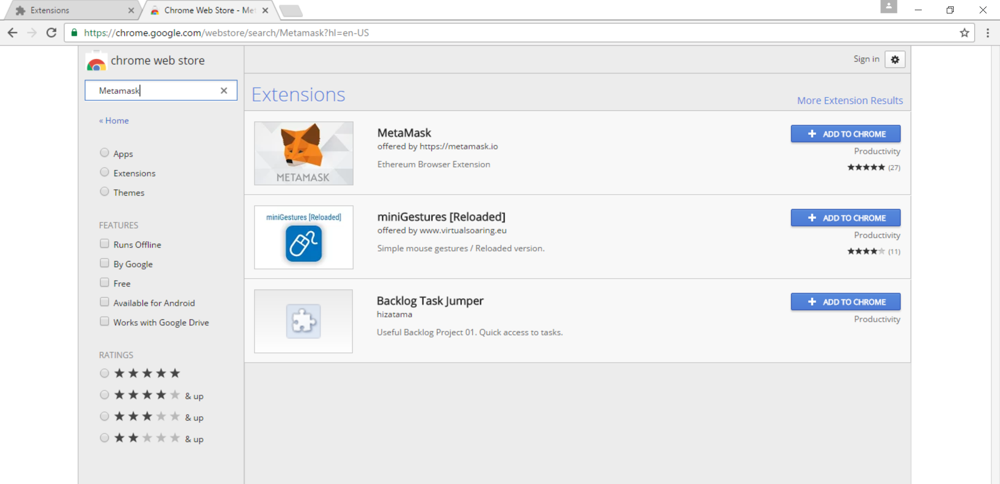

Once installed, open MetaMask and create a new vault. By default, the vault will be connected to the Morden Test Network. You will need to change this to connect to the deployed private consortium network, specifically to the load balancer in front of the transaction nodes. From the template output, retrieve the exposed Ethereum RPC endpoint at port 8545, the second template output, and enter it in custom RPC as shown below.

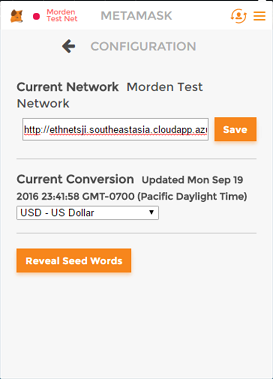

By creating the vault, you create a wallet containing an account. To create additional accounts, select Switch Accounts and then the ‘+’ button as shown below.

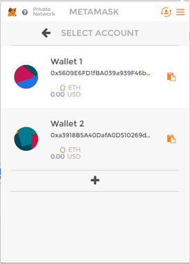

## Initiate Ether Allocation
Through the administrator page, you can formulate a transaction to transfer Ether from the pre-allocated account to another Ethereum account. This Ether transfer is a transaction that is sent to the transaction node and mined into a block as illustrated below.

Via the clipboard icon in the MetaMask wallet, copy the address of the Ethereum account to which you want to transfer ether and go back to the administrator page. Paste the copied account into the input field to transfer 1000 ether from the pre-allocated Ethereum account to your newly created account. Click submit and wait for the transaction to be mined into a block.

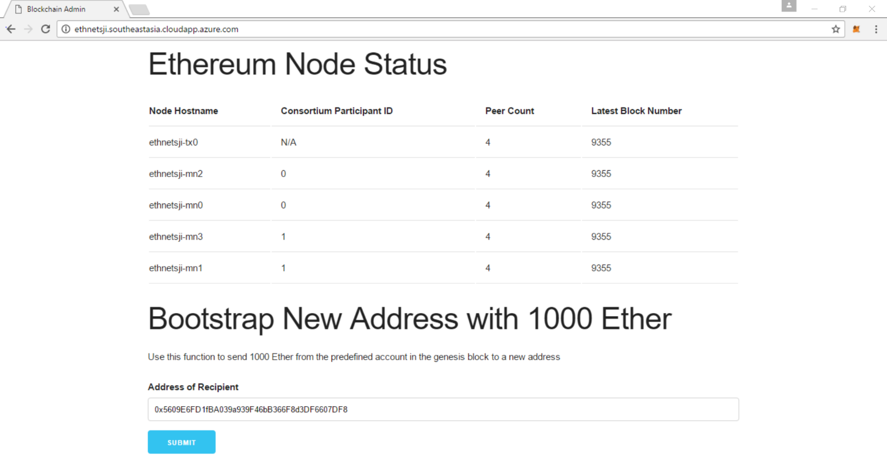

Once the transaction is committed into a mined block, the account balance in MetaMask for your account will reflect the transfer of 1000 Ether.

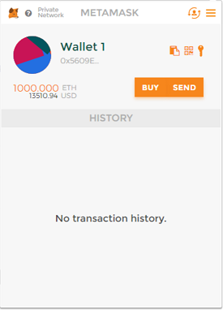

## Transfer of Ether Between Accounts
At this point, you are ready to execute transactions within your private consortium network. The simplest transaction is to transfer Ether from one account to another. To formulate such a transaction, you can use MetaMask once again, transferring money from the first account used above to a second account.

From Wallet 1 in MetaMask, click on send. Copy the address of the second wallet created into Recipient Address input field and amount of Ether to transfer in the Amount input field. Click send and accept the transaction.  

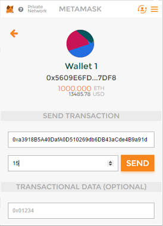

Once again, when the transaction is mined and committed into a block, the account balances will be reflected accordingly. Note, wallet 1’s balance is deducted a bit more than 15 Ether, since you had to pay a mining fee to process the transaction.

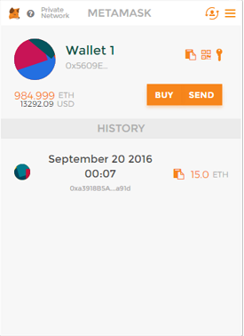 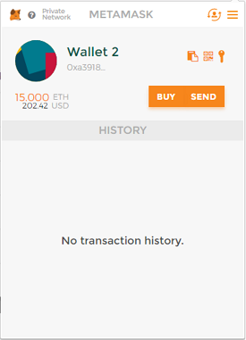

## Smart Contract Guide

Once you have an Ethereum account set up with some Ether, you can try deploying and interacting with smart contracts on your private blockchain. For this, we'll be using the Browser Solidity project, which integrates with Metamask and allows you to write smart contracts directly in your browser. Navigate [here](https://ethereum.github.io/browser-solidity/), and in the upper left click "New File".

The sample code for this exercise can be found in the "sample-contracts.sol" file [here](scripts/sample-contracts.sol). Copy and paste this code into the editor, and on the right you should see the compiled bytecode of your contracts, as well as buttons to create the contract on the blockchain or attach to an existing contract:

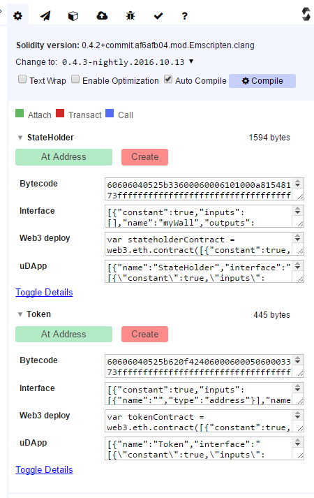

The first contract we'll be working with is the StateHolder contract. This is a simple contract that just stores some state on the blockchain - you can think of it as a very simplified database. There are three variables: a number that anyone can edit (openNumber), a string that anyone can edite (openString), and a string that only the contract owner can edit (myString). The owner of the contract is the person that first deploys the contract, as seen in the StateHolder() constructor function.

Click on the red "Create" button under the "StateHolder" contract section on the far right (Note: you may receive an error about Gas limit being exceeded, so make sure to increase the 'Transaction Gas Limit' to something greater if this occurs). Metamask will ask you to confirm the transaction - deploying a new contract to the blockchain costs gas, which is payable in Ether from your account:

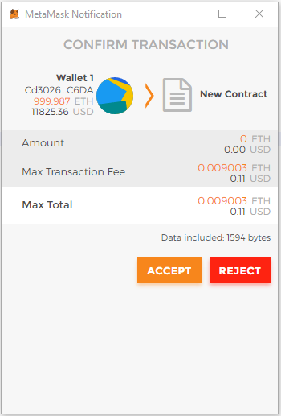

Accept the transaction. On the right, you will see "Waiting for transaction to be mined..." Once the contract creation transaction is mined and included in your blockchain, the interface will show you the address of your new contract and allow you to interact with it:

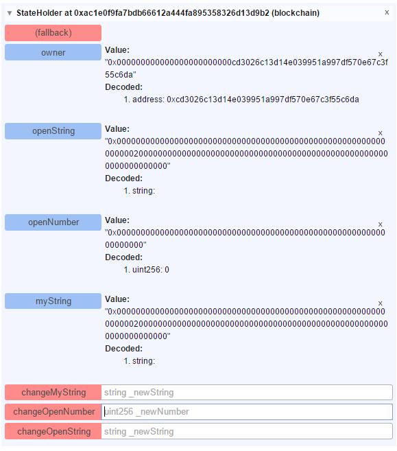

The "owner" value should be the Ethereum address that you created the contract from. The public varialbes openString, openNumber, and myString are initialized with zero values or empty strings. You can change the values of these variables by sending transactions to the contracts functions. For example, to change the openNumber variable, enter a sample value into the "uint256 \_newNumber" textbox and click the red "changeOpenNumber" button. Accept the transaction from Metamask and, after waiting for the transaction to be mined, you will get back data on the transaction. Clicking on the blue "openNumber" button should update the display with the latest value:

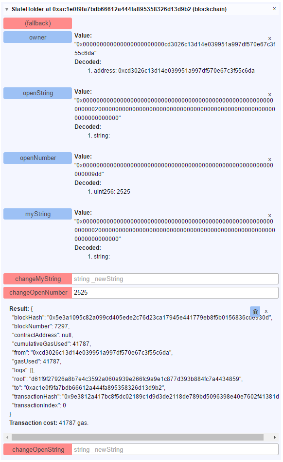

The strings can be edited in the same way - make sure to enclose your new string in double quotes to adhere to proper JSON formatting.

The "onlyOwner" modifier is designed to ensure that only the owner account will be able to use the "changeMyString" function. To test this, switch your active Ethereum account in Metamask to a different account than the one used to create the transaction. Ensure that this account has some Ether so we can send transactions from it:

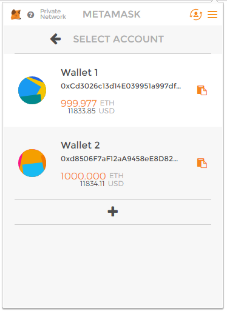

Next, copy the address of the contract from the interface on the right - for example, if the interface displays "StateHolder at 0xac1e0f9fa7bdb66612a444fa895358326d13d9b2 (blockchain)", you want to copy the "0xac1e0f9fa7bdb66612a444fa895358326d13d9b2". Refresh the browser-solidity window. Your smart contract code should still be in one of the editor tabs, but if not, you can click "New File" and paste the code from the GitHub file again.

Under the StateHolder section, click the "At Address" button, and enter the address you copied previously.

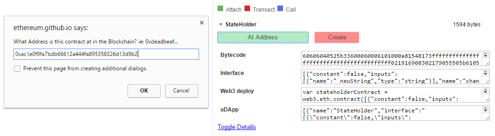

Your interface will change to reflect all the values that you modified before. This is an important point - by taking note of the contract address, you can allow other people to interact with the same contract on the blockchain, and they will see the same functions and values that you do.

Attempt to modify the "openString" variable. This should work fine - after the transaction is mined, clicking the blue openString button will reflect the new value in the interface. Now, attempt to modify the "myString" variable. The transaction will succeed however, when you view the contract again you will see that the "myString" variable remains unchanged (you can check this my refreshing the Solidity browser and adding the contract address again with 'At Address' Button.

Next, we'll look at a very simple token contract. In this contract, we have a mapping between Ethereum addresses and integers - think of this like a bank balance, showing that a particular address has a particular amount of money. The constructor function assigns a balance of one million to whoever deploys the contract, and the "transfer" function allows us to transfer from our balance to an arbitrary Ethereum address.

Close the "StateHolder" section, and under the "Token" section, click the red "Create" button. This will instantiate the Token contract on our blockchain. We can check our balance by copying our current Metamask wallet address:

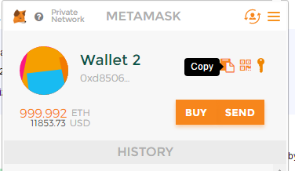

Placing this address in quotes and placing it in the "balances" dialog box, then clicking the blue "balances" button, will show the number of tokens currently associated with our account:

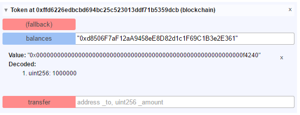

Since we deployed the contract from this address, we would expect our address to have a balance of one million tokens, and we can see that this is so.

We can transfer tokens to other addreses, as well. In Metamask, copy the address of your other account, without switching into it:

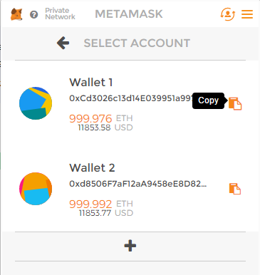

Enclose this address in quotes, put a comma, and then the amount of tokens you wish to transfer. Click the red "transfer" button to submit the transaction:

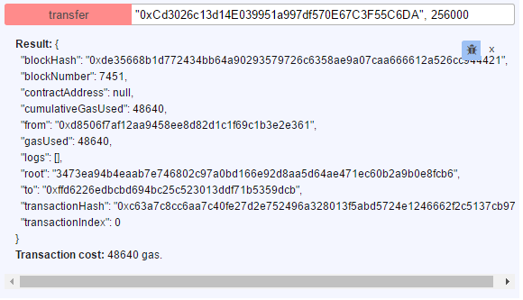

We can then check the updated balances to see if our transfer went through:

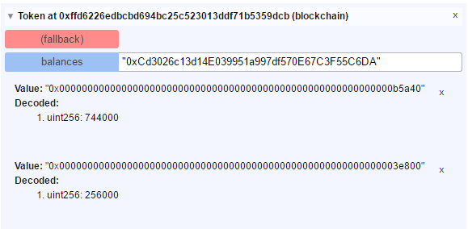

This concludes our smart contract sample. For additional information about the Solidity language, click [here](http://solidity.readthedocs.io/en/develop/).

## Accessing VMs running nodes
You can remotely connect to the virtual machines on which the nodes run via SSH with your provided admin username and password. Since the virtual machines on which the nodes run do not have their own public IP addresses, you will need to go through the load balancer and specify the port number. The SSH command to run to access the first transaction node is the third template output (e.g. for the sample deployment it is: ssh -p 3000 gethadmin@ethnet7tl.southeastasia.cloudapp.azure.com). To get to additional transaction nodes, increment the port number by one.  (e.g. for a network with two transaction nodes, the first transaction node is on port 3000, second is 3001).  To ssh to mining nodes, ssh to a transaction node first and then ssh to the mining node from there.

## Next Steps
You are now ready to focus on application and smart contract development against your private consortium blockchain network.  Happy coding!
