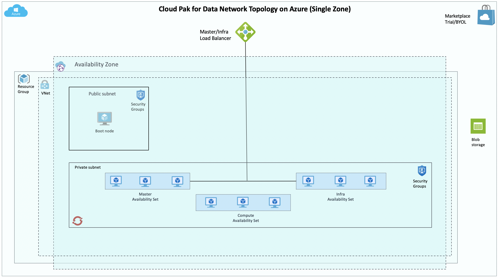
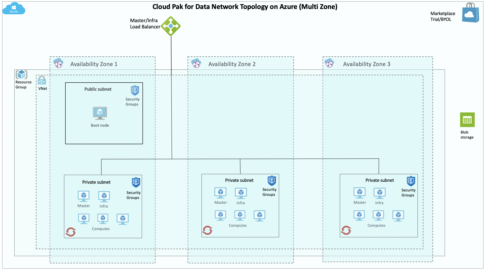

# Cloud Pak for Data on Azure


[](https://portal.azure.com/#create/Microsoft.Template/uri/https%3A%2F%2Fraw.githubusercontent.com%2FAzure%2Fazure-quickstart-templates%2Fmaster%2Fibm-cloud-pak-for-data%2Fazuredeploy.json)
[](https://portal.azure.us/#create/Microsoft.Template/uri/https%3A%2F%2Fraw.githubusercontent.com%2FAzure%2Fazure-quickstart-templates%2Fmaster%2Fibm-cloud-pak-for-data%2Fazuredeploy.json)
[](http://armviz.io/#/?load=https%3A%2F%2Fraw.githubusercontent.com%2FAzure%2Fazure-quickstart-templates%2Fmaster%2Fibm-cloud-pak-for-data%2Fazuredeploy.json)

Cloud Pak for Data is an analytics platform that helps you prepare your data for AI. It enables data engineers, data stewards, data scientists, and business analysts to collaborate using an integrated multiple-cloud platform.
Cloud Pak for Data uses IBM’s deep analytics portfolio to help organizations meet data and analytics challenges. The required building blocks (collect, organize, analyze, infuse) for information architecture are available using Cloud Pak for Data on Azure.

Cloud Pak for Data uses Azure services and features, including VNets, Availability Zones, Availability Sets, security groups, Managed Disks, and Azure Load Balancers to build a reliable and scalable cloud platform.

This deployment guide provides step-by-step instructions for deploying IBM Cloud Pak for Data on a Red Hat OpenShift Container Platform 3.11 cluster on Azure. With this Template, you can automatically deploy a multi-master, production instance of Cloud Pak for Data. See [Services](#cloud-pak-for-data-services) for the services that are enabled in this deployment.

## Cost and licenses
Cloud Pak for Data offers a try and buy experience.
The automated template deploys the Cloud Pak for Data environment by using Azure Resource Manager templates.
The deployment template includes configuration parameters that you can customize. Some of these settings, such as instance count, will affect the cost of the deployment. For cost estimates, see the pricing page for each Azure service you will be using. Prices are subject to change.

**TRIAL:**<br/>
This Template requires a Red Hat subscription. To procure a 60 day evaluation license for Openshift you can follow the instructions at [Evaluate Redhat Openshift Container Platform](https://www.redhat.com/en/technologies/cloud-computing/openshift/try-it). See [this section](#Evaluation-OpenShift-Subscription-License) for more details.

Additionally, to request a 60 day trial license of Cloud Pak for Data please use the following link - [IBM Cloud Pak for Data Trial](https://www.ibm.com/account/reg/us-en/signup?formid=urx-42212).
Instructions to use your trial license/key are provided in the section - [IBM Cloud Pak for Data Trial key](#IBM-Cloud-Pak-for-Data-Trial-key).
Beyond the 60 day period, you will need to purchase the Cloud Pak for Data by following the instructions in the 'Purchase' section below.

**PURCHASE:**<br/>
To get pricing information, or to use your existing Cloud Pak for Data entitlements, contact your IBM sales representative at 1-877-426-3774. If you already have the Cloud Pak for Data license file, you can follow the instructions in [Activating your IBM Cloud Pak for Data License to activate the license](#activating-your-ibm-cloud-pak-for-data-license).
Note: Cloud Pak for Data license will include entitlements to RHEL and Openshift.

## Architecture
Deploying this template builds the following Cloud Pak for Data cluster in single zone or multi zone.


The template sets up the following:
- A highly available architecture that spans up to three Availability Zones. *
- A Virtual network configured with public and private subnets.
-  In a public subnet, a bastion host to allow inbound Secure Shell (SSH) access to compute instances in private subnets.
-	In the private subnets:
    * OpenShift Container Platform master instances in an Availability Set.**
    * OpenShift Container Platform infra instances in an Availability Set.**
    * OpenShift worker nodes in an Availability Set that, combined, contain Cloud Pak for Data Collect, Organize and Analyze services
- An Azure Load Balancer spanning the public subnets for accessing Cloud Pak for Data from a web browser.
- Azure Managed Disk mounted on a node with NFS service. A Kubernetes dynamic storage provisioner is configured to use the NFS storage as part of the IBM Cloud Pak for Data deployment.

``*`` Single and Multi zone is supported
``**`` Availability Set in a single zone

`Tags: IBM Cloud Pak for Data, Azure, Openshift, CP4D Azure`

## Deployment on Azure

### Prerequisites

#### Azure Account
The following information about your Azure account needs to be handy to start your deployment
- Azure Client Id
- Azure Client secret
- Resource Group
- Secure Key vault

This can be obtained by running the azure CLI commands from any host where azure CLI is installed.

```bash
az login
```

* Retrieve Client ID and Secret:

```bash
az ad sp create-for-rbac --role="Contributor" --scopes="/subscriptions/<subscription_id>"
```
Here, appId is the Aad Client ID and password is the Aad Client Secret.

* Create Resource Group:
```bash
az group create -n <resource_group> -l 'East US'
```
* Create KeyVault:
```bash
az keyvault create -n <keyvault_name> -g <keyvault_resource_group> --enabled-for-template-deployment true
```
* Upload SSH private key to key vault in a secret:
```bash
az keyvault secret set --vault-name <keyvault_name> -n <keyvault_secret_name> --file ~/.ssh/id_rsa
```

#### Evaluation OpenShift Subscription License

Cloud Pak for Data offers a try and buy experience.
When you buy Cloud Pak for Data you will automatically get RHEL and OpenShift entitlements to run your workloads.

The following RedHat subscription details are required at the time of deployment:
- RedHat Account Username & Password
- OpenShift subscription pool ID

**TRIAL:**<br/>
To procure a 60 day trial license for OpenShift you can follow the instructions at [Evaluate Redhat Openshift Container Platform](https://www.redhat.com/en/technologies/cloud-computing/openshift/try-it)

**PURCHASE:**<br/>
You will get an automated email from Red Hat with the OpenShift subscription details when you buy Cloud Pak for Data.

#### IBM Cloud Pak for Data Trial key
For a 60 day trial key of IBM Cloud Pak for Data, you may sign up on the following link:
[IBM Cloud Pak for Data Trial](https://www.ibm.com/account/reg/us-en/signup?formid=urx-42212),
and use this Api key in the corresponding deployment parameter in the ARM template.
<br />
eg: the value for "apiKeyUsername" is "cp", and for "apiKey", use the trial key that is generated (or sent to your email) after signing up with the above link.
<br/><br/>

### Deployment via Azure Portal

* Click on [](https://portal.azure.com/#create/Microsoft.Template/uri/https%3A%2F%2Fraw.githubusercontent.com%2FAzure%2Fazure-quickstart-templates%2Fmaster%2Fibm-cloud-pak-for-data%2Fazuredeploy.json)  [](http://armviz.io/#/?load=https%3A%2F%2Fraw.githubusercontent.com%2FAzure%2Fazure-quickstart-templates%2Fmaster%2Fibm-cloud-pak-for-data%2Fazuredeploy.json)

* Log in to your Azure account if not already logged in.

* Now the parameters required for deployment are visible. Configure these parameters according to your requirements.
<br/><br/>


* Specify the resource group or create new using the given option

* Select the location

* Use the default values for artifacts location, SAS token and Location.

* Select 'new' network if you wish to deploy on a new network or you may deploy on an 'existing' network. In case of 'existing' network, make sure the new resources are also in the same region.

* Specify the VM sizes for Bastion, Master, Infra and Worker nodes

* Specify the cluster prefix

* Specify count of each VM in the cluster and disk size
<br/><br/>


* Specify Openshift cluster admin username and password.

* Specify ssh public key. Enabling Metrics and Logging is optional

* Specify the key vault resource group, key vault name, and key vault secret. (See [Pre-requisites](#prerequisites))

* Specify the Aad Client ID and Aad Client Secret. (See [Pre-requisites](#prerequisites))

* Specify RHEL Username, password and Pool ID. (A Red Hat subscription is required)

<br/><br/>


<br/><br/>
* Specify the zone - single or multi. If multi zone is selected, select the zone count.

* Specify Enable Backup to enable backup on the NFS storage disk.

* Specify Project Name

* Specify the add-ons needed- Watson Studio Library, Watson Machine Learning, Watson Knowledge Catalog, Data Virtualization and Watson Openscale (select 'yes' to install)

* Specify Api Key Username and Api Key. (See [Pre-requisites](#prerequisites))

* Cloud Pak License Agreement (select 'yes' to agree)

* Finally, go through and agree on the [Cloud Pak for Data terms and conditions](https://ibm.biz/BdqRuM) and click on Purchase to deploy
<br/><br/>


<br/><br/>

* The webconsole URL can be found in the `ResourceGroup`>`Deployments`>`azuredeploy`>`Outputs`.

* Access the respective console on a web browser.
* example:


<br/><br/>

Use the default credentials for Cloud Pak for Data admin / password to log in to CPD console. Ensure to change the password after your first login.

## Activating your IBM Cloud Pak for Data License

To activate your license, follow these steps
 - Copy the license file to your boot node at `/ibm/lite` location
 - Run this command from the `/ibm/lite` location:

 ```
./lutil-linux <cpd-url> <admin user> <admin password> <license file name>
 ```

## Cloud Pak for Data Services
You can browse the various services that are available for use by navigating to the services catalog page in Cloud Pak for Data


As part of the deployment, the following services can be enabled:
•	Watson Studio
•	Watson Knowledge Catalog
•	Watson Machine Learning
•	Data Virtualization
•	Watson Openscale

To get information on various other services that are available, you can visit [Cloud Pak for Data Service Catalog](https://www.ibm.com/support/producthub/icpdata/docs/content/SSQNUZ_current/cpd/svc/services.html)

## Scaling Up your Cluster
To increase the number of nodes (Master, Infra or Worker Nodes), as with the deployment, you can use the CLI or the Azure Portal.

Similar to the deployment, except using the `additionalnodes.json` and `additionalnodes.parameters.json` files.
```bash
az group deployment create --resource-group <resource_group> --template-file additionalnodes.json --parameters @additionalnodes.parameters.json --no-wait
```

Use the table below to fill the variables for both Azure CLI or Azure Portal. The input variables used for the existing cluster can be found at: `<ResourceGroup>`>`Deployments`>`azuredeploy`>`Inputs`.

| Variables             | Default       | Description          |
| --------------------- | :-----------: | -------------------- |
| Additional Instance Count | 1 | Number of new nodes to add. For infra and master increase in twos to retain an odd count |
| Node or Master | Node | Add Worker (node), Master or Infra node |
| VM Size | Standard_D16_v3 | Default has 16vcpus and 64gb RAM. Use [Azure VM sizing](https://docs.microsoft.com/en-us/azure/virtual-machines/linux/sizes) for more information. |
| Data Disk Size | 1024 | Attached data disk size |
| Openshift Cluster Prefix | - | The prefix used for the existing cluster you are trying to scale up |
| Openshift Master Public URL | - | The URL to the existing OCP cluster |
| New Nodes Prefix | - | A string to prefix the names of the nodes for this deployment |
| OC User | - | The username for the existing OCP Cluster |
| OC Password | - | The password for the existing OCP Cluster |
| Admin Username | - | Username for sudo user on new nodes |
| SSH Publickey | - | SSH public key used in the deployment of existing cluster |
| RHEL Username | - | RedHat account user name |
| RHEL Password | - | RedHat account password |
| RHEL PoolID | - | RedHat Pool ID |
| Single or Multi-Zone | single | Deploy nodes into Availability Sets or Availability Zones. NOTE: You should use what was used in the existing cluster |
| Zone | 1 | Set only if Availability Zones were used in existing deployment |
| Storage Type | NFS | Only NFS is currently supported |

<br/><br/>
* On Azure portal, follow the same workflow as Template deployment and select the `additionalnodes.json` to set the parameters. It should look like this:


<br/><br/>

## Cloud Pak for Data Control Plane

As a cluster administrator you can view the status of your cluster by using the OpenShift CLI.

SSH in to the Bastion node. Then ssh in to one of the master nodes. Perform the following steps:
```bash
oc login
```
Log into Openshift using the credentials created during deployment.

## Troubleshooting

* If NFS node is rebooted, the nfs client has to be recreated.
  * Delete the existing client: `oc delete deployment nfs-client-provisioner`
  * Recreate the provisioner: `oc create -f /home/<user>/nfs-template.yaml -p NFS_SERVER=<nfs-node-ip> -p NFS_PATH=/exports/home | oc create -n kube-system -f -`


