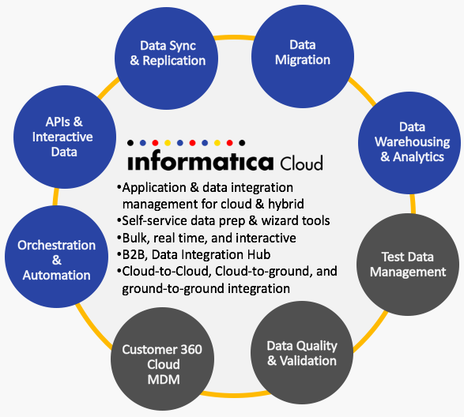
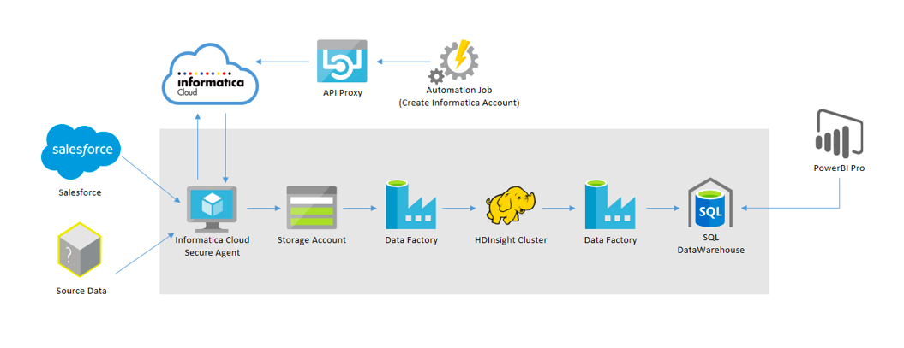
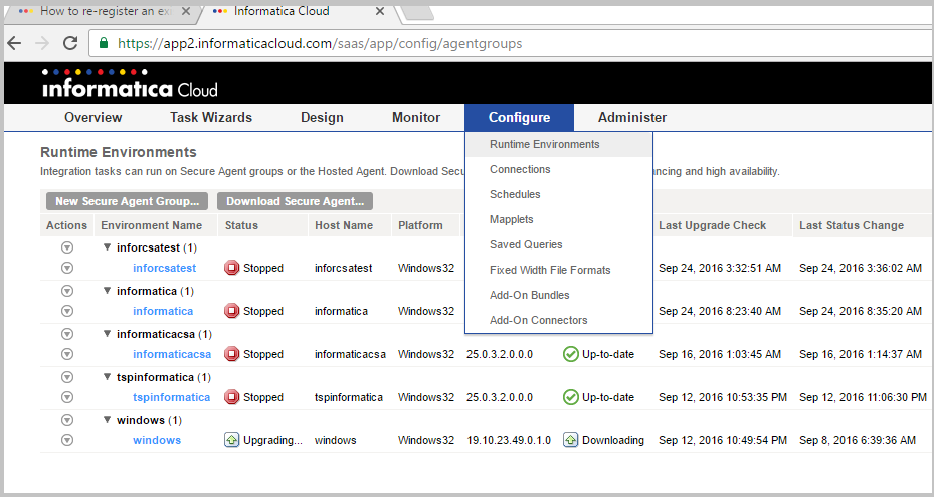
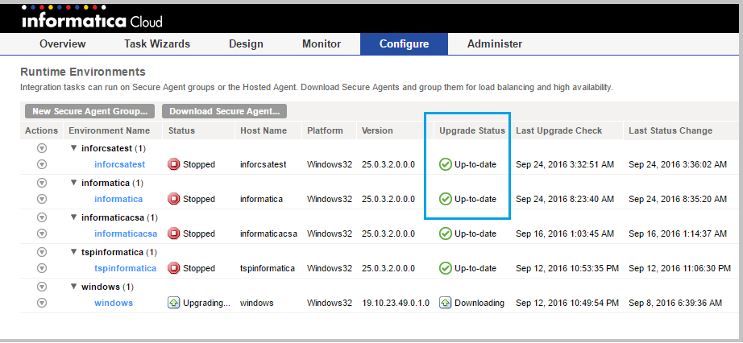

# Informatica - Informatica HDInsight Azure Partner Quickstart Template

## Azure Partner Quickstart Template Overview
***Azure Partner Quickstart Templates*** provide customers with a highly automated process to launch enterprise ready first and 3rd party ISV solution stacks on Azure in a pre-production environment. The **Azure Partner Quickstart Template** effort is complimentary to the [Azure Marketplace test drive program](https://azure.microsoft.com/en-us/marketplace/test-drives/). These fully baked stacks enable customers to quickly stand up a PoC or Piloting environments and also integrate it with their systems and customization.

Customers benefit greatly from solution templates because of the ease with which they can stand up enterprise-grade, fully integrated stacks on Azure. The extensive automation and testing of these solutions will allow them to spin up pre-production environments with minimal manual steps and customization.  Most importantly, customers now have the confidence to transition the solution into a fully production-ready environment with confidence.

**The Informatica HDInsight Azure Partner Quickstart Template** launches a big data solution stack that provides an automated provisioning, configuration, and integration of Informatica Cloud and [Informatica CSA](https://azure.microsoft.com/en-us/marketplace/partners/informatica-cloud/informatica-cloud/) products on Azure. Combination with Azure Data Factory, with on-demand HDInsight, and SQL Datawarehouse products makes this solution ready for pre-production environments. These are intended as pilot solutions and not production-ready.

Please [contact us](azuremarketplace@sysgain.com) if you need further info or support on this solution.

##Licenses & Costs
In its current state, licenses may be required to use the Infromatica products featured in this solution stack. The solution template will be deployed in the Customer’s Azure subscription, and the Customer will incur Azure usage charges associated with running the solution stack.

##Target Audience
The target audience for these solution templates are IT professionals who need to stand-up and/or deploy infrastructure stacks.

## Prerequisites
* Azure Subscription - if you want to test drive individual ISV products, please check out the [Azure Marketplace Test Drive Program](https://azure.microsoft.com/en-us/marketplace/test-drives/)
* Azure user account with Contributor/Admin Role
* Sufficient Quota - At least 14 Cores (with default VM Sizes)
 
##Solution Summary
The goal of this Azure Partner Quickstart Template is to build an automated big data solution stack ready for pre-production deployments. This allows customers to bring in their data using the Informatica Cloud and ingest them into a managed Hadoop cluster for processing through Azure Data Factory, and store the results in an Enterprise-grade data warehouse. This can be used for near real-time visualizations of data to gain actionable insights using Power BI.

The core component of this stack is Informatica Cloud, which is an application and data integration management product for the cloud. With Informatica Cloud portfolio you can:

1. Ensure the validity and integrity of your customer records with integrated data quality.
2. Consolidate data from multiple systems to provide a single view of your customer in either single or multiple Salesforce orgs.
3. Optimize Salesforce testing efforts through better sandbox management.
4. Power better business analytics by replicating your Workday data and aggregating with multiple enterprise data sources to build a reliable enterprise data warehouse.
5. Connect your SAP and Siebel data to the Salesforce1 Mobile App and run your business from your phone.
 
You can find more information here: https://www.informatica.com/products/cloud-integration.html

##Reference Architecture Diagram
We are going to create an environment from which demos the Informatica Cloud use case using Azure Datafactory, HDInsight, SQL Datawarehouse and PowerBI 
](images/reference-arch.png)

The diagram above provides the overall deployment architecture for this solution template.
As a part of deployment, the template launches and integrates the following:

1. Informatica Cloud Secure Agent (Standard_A2) from Azure marketplace image, Public IP, Storage Account (Standard_LRS), Virtual Network, Network Interface and Network Security Group.
2. Virtual network, Public IP and Network security group(NSG) are assigned to Network Interface (NIC) which is attached to Informatica CSA VM.
3. Deploys a custom script extension on Informatica CSA VM which connects Informatica Cloud Security Agent to Informatica Cloud.
4. Deploys SQL Data Warehouse with 100DWUs performance tier with collation “SQL_Latin1_General_CP1_CI_AS” and maximum size of 10 Terabytes.
5. Deploys Automation Job with an automation account which creates a table in the SQL Data Warehouse
6. Deploys Automation Job that creates cointainer in the destination storage account  (this data is used for processing)
7.  Deploys  Automation Job which uses a third party service to access the Informatica account that is created in previous steps to create connections, Mappings etc. 
7. Deploys Data Factory with three data sets, Four Linked Services( three Storage linked services and one HDInsight on demand service) and one Pipeline which contains two activities one for running Hive script and one for Copy the data from Azure Blob to Azure Data Warehouse.
8. Data can be visualized  on PowerBI using the [report](https://hivestorage45.blob.core.windows.net/powerbireport/reports/MachineData_09262016_latest.pbix) 

 
## Deployment Steps
You can click the "deploy to Azure" button at the beginning of this document or follow the instructions for command line deployment using the scripts in the root of this repo.

The deployment takes about 30-45 mins.
## Usage
#### Connect
After deploying the solution template we can verify the following:

We can verify the Informatica Signup process deployment by logging into the Informatica Cloud portal by using the credentials provided during the deployment for Informatica user name and password.

Please find the URL for the Informatica Cloud below:
https://app.informaticaondemand.com/ma/

You should be able to login successfully.

We can verify the Informatica Cloud Security Agent up-to-date status (upgraded to latest version) two ways:

1. Logging into the VM.

2. Verifying it from the Informatica Cloud portal.

##### Logging into the VM
 
We can connect to the VM using RDP/Remote Desktop Connection. Once we are inside the VM follow the below steps:

1.	From command prompt, navigate to the secure agent installation directory: 

    **cd  C:\Program Files (x86)\Informatica Cloud Secure Agent\main\agentcore**
  
2.	You can check the registration status of a Secure Agent using the following command in the same directory:

    **consoleAgentManager.bat isConfigured**

##### From the Informatica Cloud portal:

Log in to the portal (url: https://app.informaticaondemand.com/ma/) and use same Informatica credentials used during the deployment.  (Informatica user name and password)

After logging into the Informatica Cloud, navigate to the **Runtime Environments** from the **Configure** tab. We can see a table. In this table under Upgrade Status column we can see Up-to-date as shown below:

](images/ic1.png)

](images/ic2.png)

##Support
For any support-related issues or questions, please contact azuremarketplace@sysgain.com for assistance.

