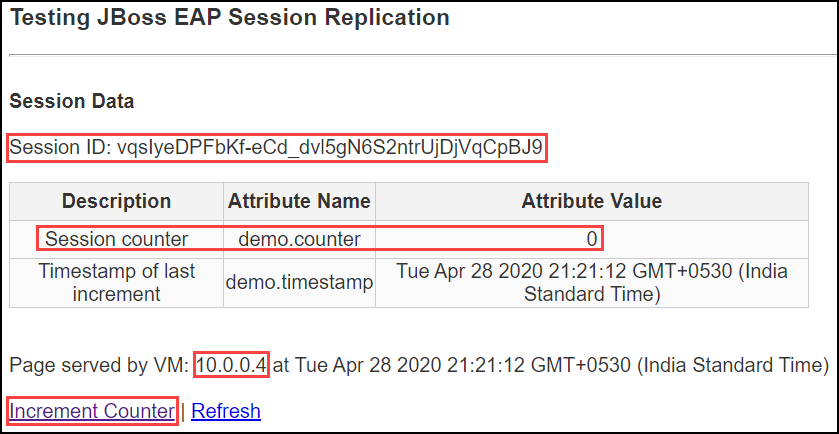

# JBoss EAP 7.2 on RHEL 8.0 on Azure (clustered, multi-VM)

`Tags: JBoss, Red Hat, EAP 7.2, CLUSTER, Load Balancer`

<!-- TOC -->

1. [Solution Overview ](#solution-overview)
2. [Template Solution Architecture ](#template-solution-architecture)
3. [Licenses and Costs ](#licenses-and-costs)
4. [Prerequisites](#prerequisites)
5. [Deployment Steps](#deployment-steps)
6. [Deployment Time](#deployment-time)
7. [Validation Steps](#validation-steps)
8. [Support](#support)

<!-- /TOC -->

## Solution Overview

JBoss EAP is an open source platform for highly transactional, web-scale Java applications. EAP combines the familiar and popular Jakarta EE specifications with the latest technologies, like Microprofile, to modernize your applications from traditional Java EE into the new world of DevOps, cloud, containers, and microservices. EAP includes everything needed to build, run, deploy, and manage enterprise Java applications in a variety of environments, including on-premise, virtual environments, and in private, public, and hybrid clouds.

Red Hat Subscription Management (RHSM) is a customer-driven, end-to-end solution that provides tools for subscription status and management and integrates with Red Hat's system management tools. To obtain an rhsm account go to: www.redhat.com and sign in.

This Azure quickstart template deploys a web application called eap-session-replication on JBoss EAP 7.2 cluster running on 2 RHEL 8.0 VMs which are added to the backend pool of a Load Balancer.

## Template Solution Architecture

This template creates all of the compute resources to run EAP 7.2 cluster on top of 2 RHEL 8.0 VMs which are added to the backend pool of a Load Balancer. Following are the resources deployed:

- 2 RHEL 8.0 VMs
- 1 Load balancer
- 3 Public IPs
- Virtual Network with 2 subnets
- EAP 7.2 on RHEL 8.0
- Sample application called eap-session-replication deployed on JBoss EAP 7.2
- Network Security Group
- Storage Account

Following is the Architecture :

To learn more about JBoss Enterprise Application Platform, check out:
https://access.redhat.com/documentation/en-us/red_hat_jboss_enterprise_application_platform/7.2/

## Licenses and Costs 

This RHEL 8.0 is Pay-As-You-Go image which carries a separate hourly charge that is in addition to Microsoft's Linux VM rates. Total price of the VM consists of the base Linux VM price plus RHEL VM image surcharge. See [Red Hat Enterprise Linux pricing](https://azure.microsoft.com/en-us/pricing/details/virtual-machines/red-hat/) for details. You also need to have a RedHat account to register to Red Hat Subscription Manager (RHSM) and install EAP. Click [here](https://access.redhat.com/products/red-hat-subscription-management) to know more about RHSM and pricing.

## Prerequisites

1. Azure Subscription with the specified payment method (RHEL 8 is an [Azure Marketplace](https://azuremarketplace.microsoft.com/en-us/marketplace/apps/RedHat.RedHatEnterpriseLinux80-ARM?tab=Overview) product and requires payment method to be specified in Azure Subscription)

2. To deploy the template, you will need to:

    - Choose an admin username and password/ssh key for your VM.  

    - Choose an EAP username and password to enable the EAP manager UI and deployment method.

    - Provide your RHSM Username and Password
    
## Deployment Steps

Build your environment with EAP 7.2 cluster on top of 2 RHEL 8.0 VMs which is added to the backend pool of the Load Balancer on Azure in a few simple steps:  
1. Launch the template by clicking the Deploy to Azure button.  
2. Fill in the following parameter values and accept the terms and conditions before clicking on Purchase.

    - **Subscription** - Choose the right subscription where you would like to deploy.

    - **Resource Group** - Create a new Resource group or you can select an existing one.

    - **Location** - Choose the right location for your deployment.

    - **Admin Username** - User account name for logging into your RHEL VM.
    
    - **Authentication Type** - Type of authentication to use on the Virtual Machine.

    - **Admin Password or Key** - User account password/ssh key for logging into your RHEL VM.

    - **EAP Username** - Username for EAP Console.

    - **EAP Password** - User account password for EAP Console.

    - **RHSM Username** - Username for the RedHat account.

    - **RHSM Password** - User account password for the RedHat account.
   
    - **RHSM Pool ID** - RedHat subscription Manager Pool ID.

    - Leave the rest of the parameter values as it is and proceed.
    
## Deployment Time 

The deployment takes approx. 10 minutes to complete.

## Validation Steps

- Once the deployment is successful, go to the outputs section of the deployment.

  

- Copy the Public IP of the VM(from VM details page) which is the Public IP of the Load Balancer, Open a web browser and go to http://<PUBLIC_HOSTNAME> and you should see the web page

  

- To access the administration console, copy the Admin Console link in the output page and paste it in a browser. Now click on the link Administration Console and enter EAP username and password to see the console of the respective VM

  

- To access the LB App UI console, copy the AppUI-LB and paste it in a browser. To access the VM App UI console, use the AppUI-1/AppUI-2. This fetches the VM private IP and updates the session counter upon clicking on the Increment counter. Note that the session ID of all the 3 App UI console is different.

  

- Note that in the EAP Session Replication page of Load Balancer, the private IP displayed is that of the VM1. When you stop VM1 and click on increment counter, the private IP displayed will be that of VM2.

  

## Support

For any support related questions, issues or customization requirements, please contact info@spektrasystems.com
