# Azure template for instantiating and deploying Red Hat Clustered JBoss EAP on OCP on Azure

**NOTE: This template creates an ephemeral instance of OpenShift Container Platform and Red Hat JBoss EAP. You are responsible for backing up any data that you want to save while using this instance**

1. Create a Single VM OpenShift deployment using the Azure Portal

------

This template deploys OpenShift Container Platform on Azure.

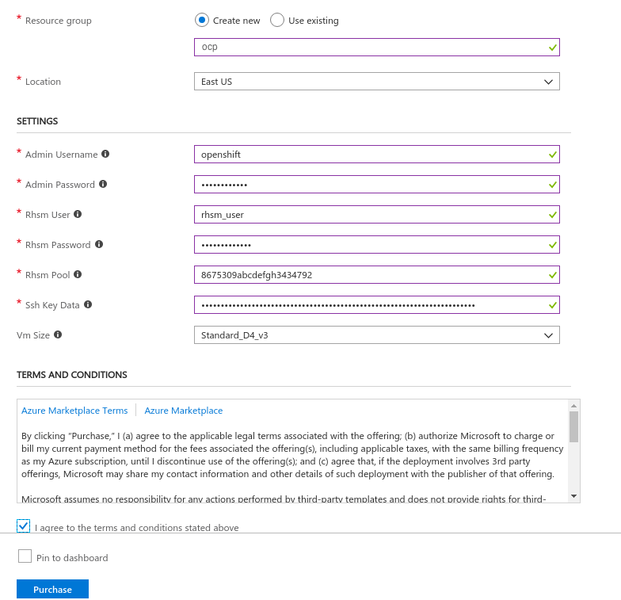

#### Subscription
Accept the default subscription ID value. Note: this field is not shown in the picture above.

#### Resource Group
Select "Create new" resource group if one does not currently exist. Enter "ocp" or a name of your choosing in the input field.

#### Location
The geographic location in which to deploy OpenShift Container Platform.

#### Admin User
Supply a username which will be used for SSH access, OpenShift Container Platform web console. For example, enter "openshift" for a username.

#### Admin Password
Supply a password which will be used for the Openshift Container Platform web console. For example, enter "r3dh4t1!" for a password.

#### Rhsm User
Your Red Hat Subscription Manager account username to be used for system registration.

#### Rhsm Password
Your Red Hat Subscription Manager account password to be used for system registration.

#### Rhsm Pool
Your Red Hat Subscription pool to be used for the installation. This apha-numeric value can be found under https://access.redhat.com/products

#### Ssh Key Data
You will need a SSH RSA public key for access if one currently does not exist on your system. Please supply your Public SSH key only. 
For example, in Linux the key can be located at ~/.ssh/id_rsa.pub. Make sure to copy and paste the **ENTIRE** contents of the file ~/.ssh/id_rsa.pub into this input field.

##### SSH Key Generation (Optional)

1. [Windows](ssh_windows.md)
2. [Linux](ssh_linux.md)
3. [Mac](ssh_mac.md)

#### Vm Size
Specify a VM size. A default value is provided. If another size or type of vm is required ensure that the Location contains that instance type.

Once all of these values are set, then check the box to "Agree to the terms and conditions" and then click the Purchase button.

2. Deploy OpenShift Openshift Container Platform template to Azure

A notification will pop up in the top right notifying you of the deployment:

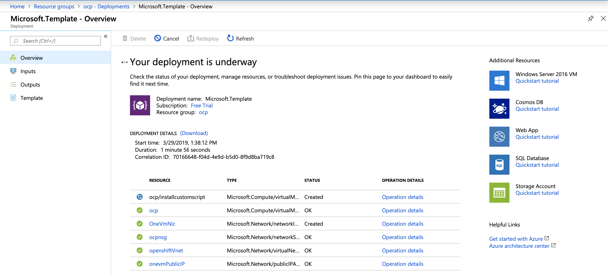

The deployment will take about 70 minutes. Once completed, the notification will display:

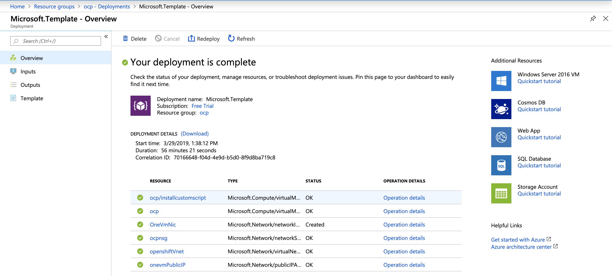

Click on "Go to resource group" button in the notification above to open up the window for the origin resource group (or you can also click on the "Resource groups" under "Favorites" on the leftmost vertical Azure portal menu, and then click on "ocp" to open the ocp resource group). You will see the following:

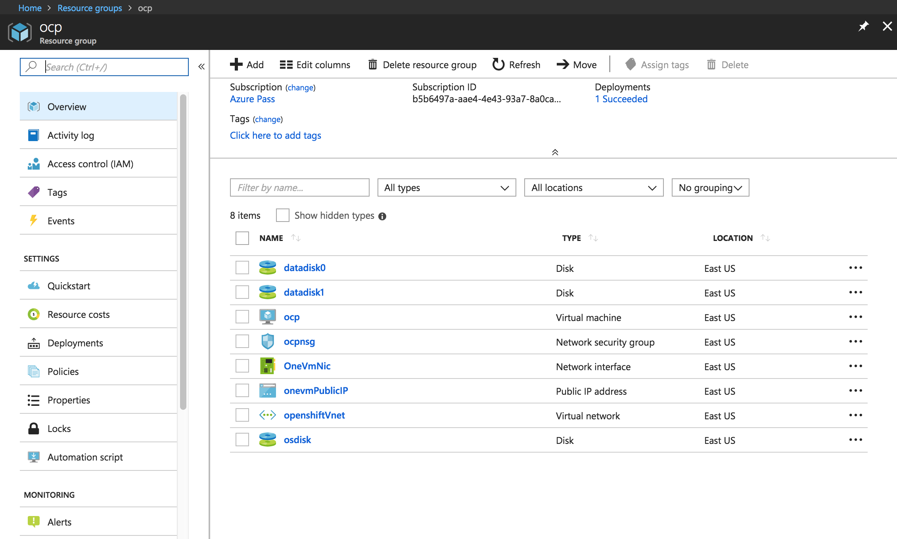

On the top right of the origin resource group window, you will see a heading "Deployments".  Click on "1 Succeeded" under this heading to see the deployments:

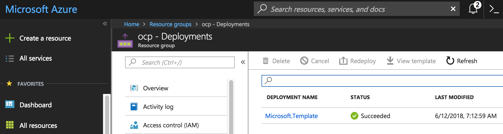

Now, click on the "Microsoft.Template" link to display the contents of the template.  Then click on the "Outputs" to see the URL of the OpenShift console:

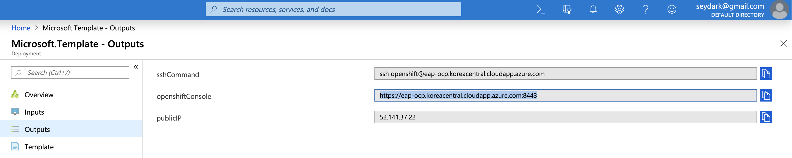

At this point, copy the string from the "OPENSHIFTCONSOLE" field, open a browser window and paste the string in the Address field. If your browser warns you about the site being insecure, go ahead and continue to the insecure site.  At this point, you should see the login prompt to log in to the all-in-one OpenShift cluster:

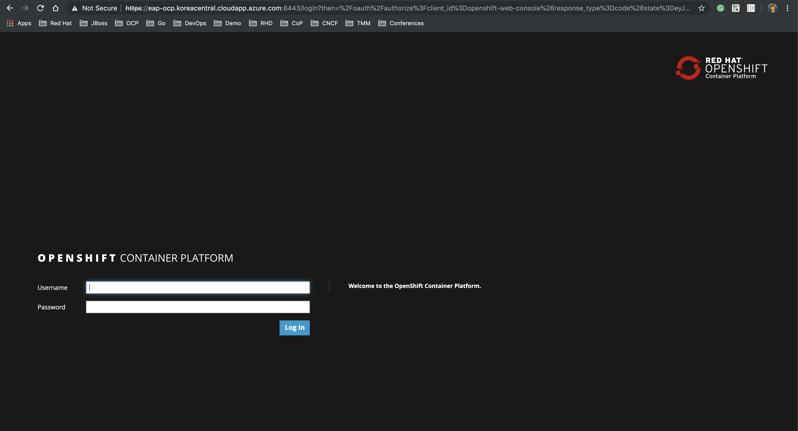

For Username and Password, the "Admin User" and "Admin Password" you supplied in the template above.
Once you login into the Openshift Console, you shoud have a preconfigured project listed on the right hand side of the console

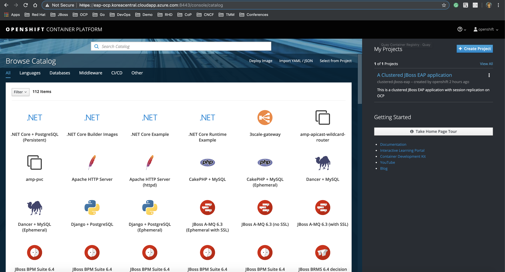

Click on a project, "A Clustered JBoss EAP Application", you will see running 2 JBoss EAP pods with more details such as containers, networking, builds, route, etc.

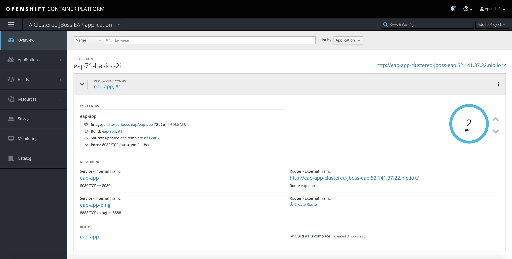

If you look at the running pod's logs, you should be able to identify the JGroups cluster members being added `Received new cluster view:`

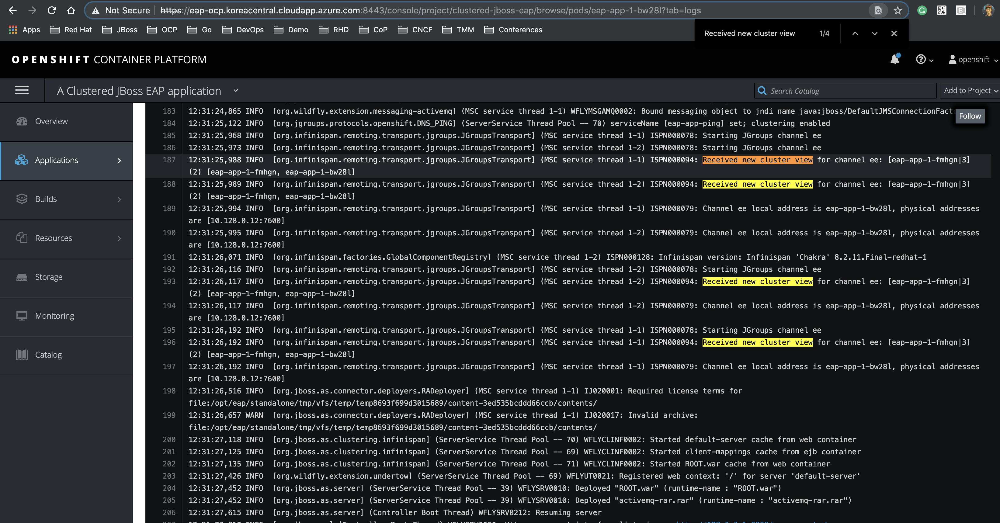

Click on the route URL ( i.e. http://eap-app-clustered-jboss-eap.52.141.37.22.nip.io ) and you need to append **/** to the route URL.
Then, You will see Testing OpenShift Session Replication web page.

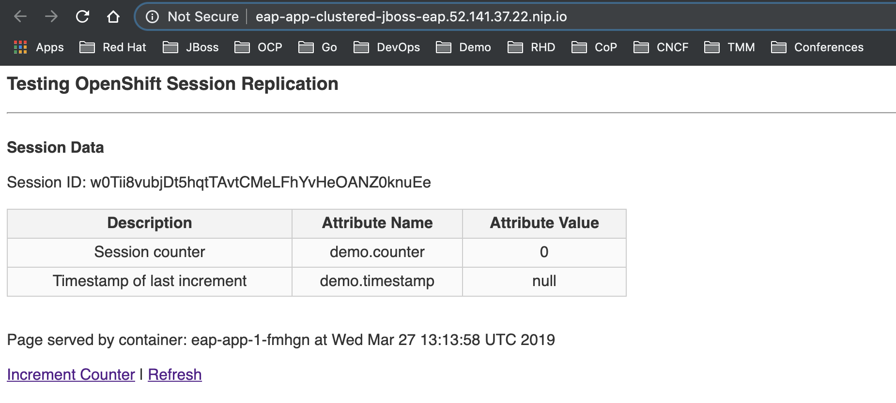

The web application displays the following information:

- Session ID
- Session `counter` and `timestamp` (these are variables stored in the session that are replicated)
- The container name that the web page and session is being hosted from

Now, select the **Increment Counter** link:

Now, select the **Increment Counter** link:

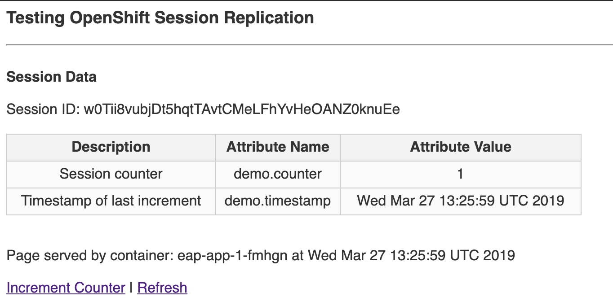

You should see the session variables being set.

To test that the session is being replicated OK, we are going to delete the running container e.g. in this example

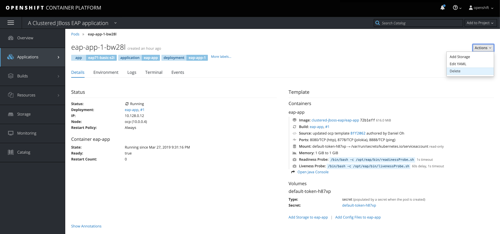

You should see on that the replication controller immediately starts another pod to keep the replica count at the desired level:

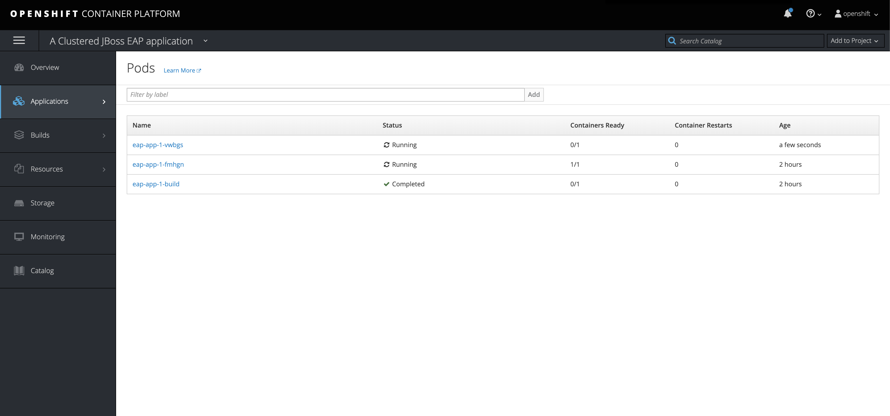

Now if you hit the **Refresh** link in the web page, you will see (after a short pause) the **same** web session being served
up from a new container

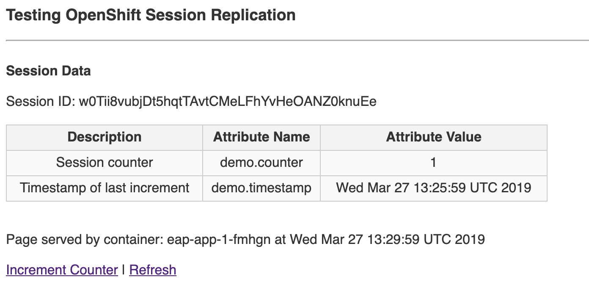

The `Session ID` and session attributes, values remain the same and the container serving the page has changed.

For further information on how to run JBoss EAP on OpenShift Container Platform and Azure, please refer to the "Getting Started with JBoss EAP for OpenShift Container Platform" and "Using JBoss EAP in Microsoft Azure" of the JBoss EAP [documentation](https://access.redhat.com/documentation/en-us/red_hat_jboss_enterprise_application_platform/).
