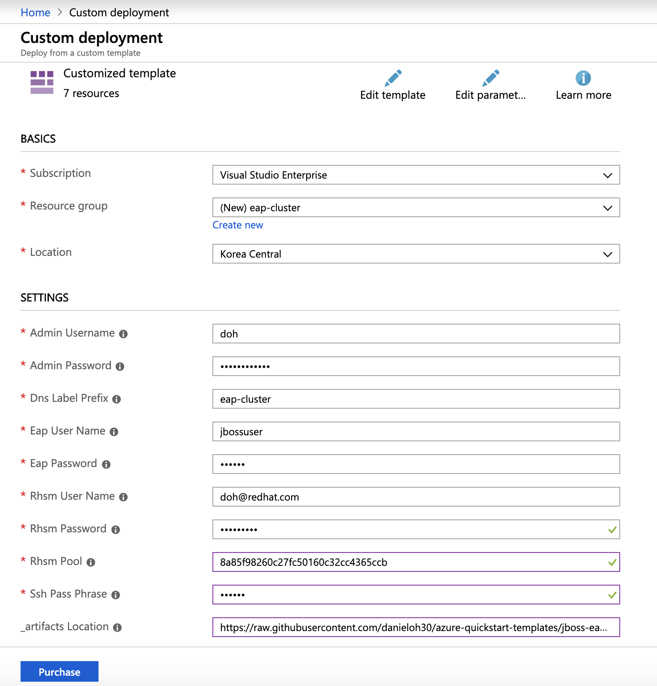
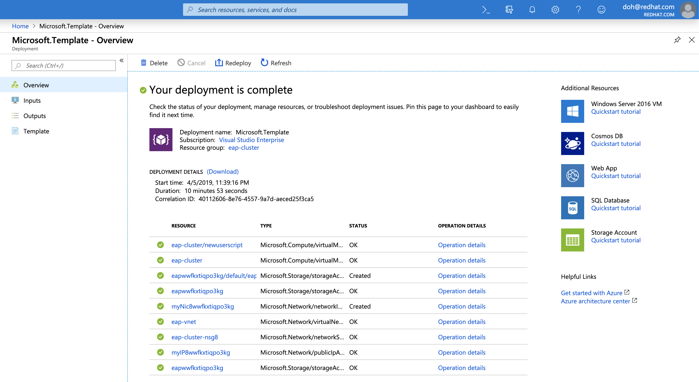
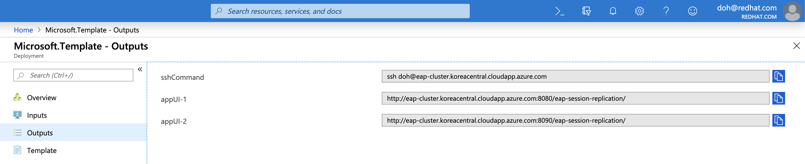
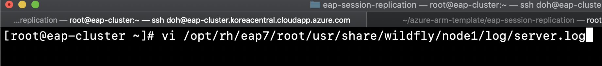
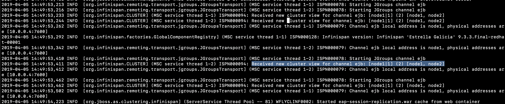
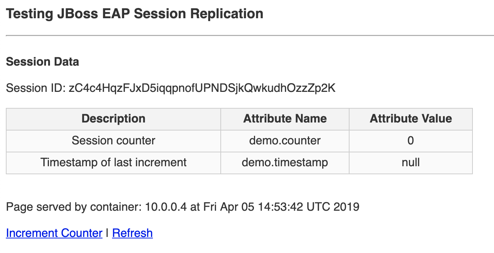
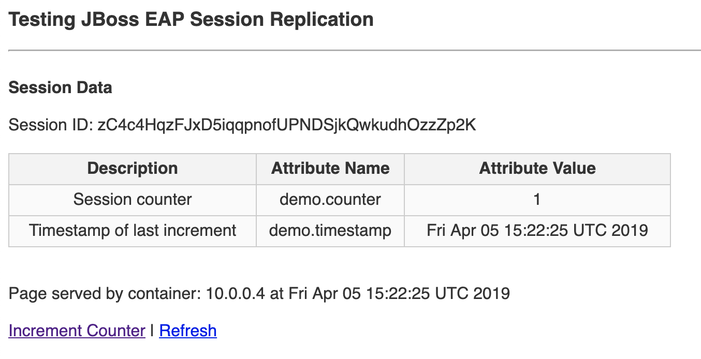

# VM-Redhat - JBoss EAP 7 cluster mode

This template deploys a web applicaton deployed on JBoss EAP 7 cluster running on RHEL 7.

`Tags: JBoss, EAP, Red Hat,EAP7, CLUSTER`

To obtain a rhsm account go to: www.redhat.com and sign in.

## Solution overview and deployed resources
This template creates all of the compute resources to run JBoss EAP 7 on top of RHEL 7.2, deploying the following components:
- RHEL 7.2 VM 
- Public DNS 
- Private Virtual Network 
- Security Configuration 
- JBoss EAP 7
- Sample application deployed to JBoss EAP 7

To learn more about JBoss Enterprise Application Platform, check out:
https://access.redhat.com/documentation/en-us/red_hat_jboss_enterprise_application_platform/

## Before you Deploy to Azure

To create the VM, you will need to:

1. Input an admin username and password for your VM.  

2. Input a name for your VM.

3. Input EAP username and password to enable the EAP manager UI and deployment method.

4. Input username and password to registry Red Hat Subscription for JBoss EAP Installation.

5. Input a passphrase to use with your SSH certificate.  This pass phrase will be used as the Team Services SSH endpoint passphrase.

6. Input the number of JBoss EAP instances to cluster across multiple VMs.

The deployment will take about 10 minutes. Once completed, the notification will display:

Then click on the "Outputs" to see the URL of the SSH Command, App WEB URLs:

At this point, copy the string from the "sshCommand" field ( i.e. ssh doh@eap-cluster.koreacentral.cloudapp.azure.com ).
Then, open a termial tool(or cmd window) and paste the string to access a VM on Azure cloud.

For Username and Password, the "Admin User" and "Admin Password" you supplied in the template above.
Once you login into the VM, you can go through a server.log on JBoss EAP how Jgroup discovery works for clustering:

When you look at one of server logs ( i.e. node1 or node2 ), you should be able to identify the JGroups cluster members being added `Received new cluster view:`

Click on one of APP URL ( i.e. http://eap-cluster.koreacentral.cloudapp.azure.com:8080/eap-session-replication/ ).
You will see Testing EAP Session Replication web page.

The web application displays the following information:

- Session ID
- Session `counter` and `timestamp` (these are variables stored in the session that are replicated)
- The container name that the web page and session is being hosted from

Now, select the **Increment Counter** link:

You should see the session variables being set.

## Notes