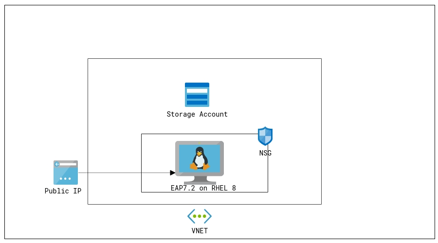

# VM-RedHat - JBoss EAP 7.2 cluster on RHEL 8.0 VM

`Tags: JBoss, Red Hat, EAP 7.2, CLUSTER`

<!-- TOC -->

1. [Solution Overview ](#solution-overview)
2. [Template Solution Architecture ](#template-solution-architecture)
3. [Licenses and Costs ](#licenses-and-costs)
4. [Prerequisites](#prerequisites)
5. [Deployment Steps](#deployment-steps)
6. [Deployment Time](#deployment-time)
7. [Validation Steps](#validation-steps)
8. [Support](#support)

<!-- /TOC -->

## Solution Overview

JBoss EAP is an open source platform for highly transactional, web-scale Java applications. EAP combines the familiar and popular Jakarta EE specifications with the latest technologies, like Microprofile, to modernize your applications from traditional Java EE into the new world of DevOps, cloud, containers, and microservices. EAP includes everything needed to build, run, deploy, and manage enterprise Java applications in a variety of environments, including on-premise, virtual environments, and in private, public, and hybrid clouds.

Red Hat Subscription Management (RHSM) is a customer-driven, end-to-end solution that provides tools for subscription status and management and integrates with Red Hat's system management tools. To obtain an rhsm account go to: www.redhat.com and sign in.

This Azure quickstart template deploys a web application called eap-session-replication on JBoss EAP 7.2 cluster running on RHEL 8.

## Template Solution Architecture
This template creates all of the compute resources to run JBoss EAP 7.2 on top of RHEL 8.0, deploying the following components:

- RHEL 8.0 VM 
- Public IP 
- Virtual Network 
- Network Security Group 
- JBoss EAP 7.2
- Sample application called eap-session-replication deployed on JBoss EAP 7.2
- Storage Account

Following is the Architecture :

To learn more about JBoss Enterprise Application Platform, check out:
https://access.redhat.com/documentation/en-us/red_hat_jboss_enterprise_application_platform/7.2/

## Licenses and Costs

This RHEL 8.0 is Pay-As-You-Go image which carries a separate hourly charge that is in addition to Microsoft's Linux VM rates. Total price of the VM consists of the base Linux VM price plus RHEL VM image surcharge. See [Red Hat Enterprise Linux pricing](https://azure.microsoft.com/en-us/pricing/details/virtual-machines/red-hat/) for details. You also need to have a RedHat account to register to Red Hat Subscription Manager (RHSM) and install EAP. Click [here](https://access.redhat.com/products/red-hat-subscription-management) to know more about RHSM and pricing.

## Prerequisites

1. Azure Subscription with the specified payment method (RHEL 8 is an [Azure Marketplace](https://azuremarketplace.microsoft.com/en-us/marketplace/apps/RedHat.RedHatEnterpriseLinux80-ARM?tab=Overview) product and requires the payment method to be specified in Azure Subscription)

2. To deploy the template, you will need to:

   - Choose an admin username and password for your VM.
    
   - Choose a name for your VM.

   - Choose an EAP username and password to enable the EAP manager UI and deployment method.
    
   - Provide your RHSM Username and Password

## Deployment Steps

Build your environment with EAP 7.2 on top of RHEL 8.0 on Azure by clicking the Deploy to Azure button and fill in the following parameter values:

   - **Subscription** - Choose the right subscription where you would like to deploy.

   - **Resource Group** - Create a new Resource group or you can select an existing one.

   - **Location** - Choose the right location for your deployment.

   - **Admin Username** - User account name for logging into your RHEL VM.

   - **Authentication Type** - Type of authentication to use on the Virtual Machine.

   - **Admin Password or Key** - User account password/ssh key for logging into your RHEL VM.
   
   - **DNS Label Prefix** - DNS Label for the Public IP and this is also the name of your VM. Must be lowercase. It should match with the following regular expression: ^[a-z][a-z0-9-]{1,61}[a-z0-9]$ or it will raise an error.

   - **EAP Username** - Username for EAP Console.

   - **EAP Password** - User account password for EAP Console.
    
   - **RHSM Username** - Username for the RedHat account.

   - **RHSM Password** - User account password for the RedHat account.
   
   - **RHSM Pool ID** - RedHat subscription Manager Pool ID.

   - **VM Size** - Choose the size of the VM from the options in the dropdown

   - Leave the rest of the parameter values as it is and accept the terms and conditions before clicking on Purchase.

## Deployment Time 

The deployment takes about 10 minutes to complete.

## Validation Steps

- Once the deployment is successful, click on the "Outputs" to see the URL of the SSH Command, App WEB URLs:

  

- Copy the string from the "sshCommand" field. Open a terminal tool(or cmd window) and paste the string to access a VM on Azure cloud.

- Enter the VM Username and Password, the "Admin User" and "Admin Password" you provided before you deployed the template.

- Once you login into the VM, you can go through a server.log on JBoss EAP how Jgroup discovery works for clustering:

  

- When you look at one of the server logs ( i.e. node1 or node2 ), you should be able to identify the JGroups cluster members being added `Received new cluster view:`

  

- Copy the App URL from the output section of the template. Open a web browser and paste the link, You will see Testing EAP Session Replication web page.

  

- The web application displays the Session ID, Session `counter` and `timestamp` (these are variables stored in the session that are replicated) and the container name that the web page and session is being hosted from.

- Now, select the **Increment Counter** link. The session variable will increase. Note that the session variable increases simultaneously on both App UIs.

  

## Support

For any support related questions, issues or customization requirements, please contact info@spektrasystems.com
