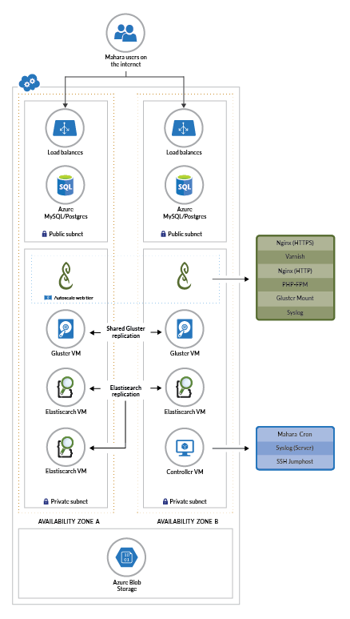

# Deploy and Manage a Scalable Mahara Cluster on Azure

This repo contains guides and [Azure Resource Manager](https://docs.microsoft.com/en-us/azure/azure-resource-manager/resource-group-overview) templates designed to help you deploy and manage a highly available and scalable
[Mahara](https://mahara.org) cluster on Azure. In addition, the repo contains other useful information relevant to running Mahara on Azure such as a listing of Azure-relevant Mahara plugins and information on how to offer Mahara as a Managed Application on the Azure Marketplace or on an IT Service Catalog. 

If you have Azure account you can deploy Mahara via the [Azure portal](https://portal.azure.com) using the button below, or you can [deploy Mahara via the
CLI](docs/Deploy.md). Please note that while you can use an [Azure free account](https://azure.microsoft.com/en-us/free/) to get started depending on which template configuration you choose you will likely be required to upgrade to a paid account.

## Fully configurable deployment

The following button will allow you to specify various configurations for your Mahara cluster
deployment. The number of configuration options might be overwhelming, and we'll add more
detailed sizing guidelines in the future. Some pre-defined/restricted deployment options for
typical scenarios follow this.

  

## Minimal deployment

Try the following button if you'd like to deploy our templates with minimal resources.
All configurations are fixed and you just need to pass your ssh public key to the template
for logging in to the deployed VMs. This deployment will use NFS, Microsoft SQL, and
smaller autoscale web frontend VM sku (1 core) that'll give faster deployment time (less than
30 minutes) and requires only 2 VM cores currently that'll fit even in a free trial Azure subscription. The cost of this deployment can be estimated at
[this Azure Pricing Calculator link](https://azure.com/e/5f9752c934ab41799ae3264dd2ee57d1). Note the displayed cost in
in the calculator is the minimum cost. The actual cost will be bigger with potentially
autoscaled VMs and network cost.

## Small-to-mid size deployment (without high availability)

Try the following button if you'd like to deploy our templates for small-to-mid-size workload (about up to 1000 concurrent users).
All configurations are fixed and you just need to pass your ssh public key to the template
for logging in to the deployed VMs. This deployment will use NFS (no high availability) and MySQL (8 vCores),
without other options like elastic search. The cost of this deployment can be estimated at
[this Azure Pricing Calculator link](https://azure.com/e/fd794268d0bf421aa17c626fb88f25bc). Note the displayed cost in
in the calculator is the minimum cost. The actual cost will be bigger with potentially
autoscaled VMs and network cost.

## Large size deployment (with high availability)

Try the following button if you'd like to deploy our templates for large workload (more than 2000 concurrent users).
All configurations are fixed and you just need to pass your ssh public key to the template
for logging in to the deployed VMs. This deployment will use Gluster (for high availability, requiring 2 VMs), MySQL (16 vCores),
without other options like elastic search. The cost of this deployment can be estimated at
[this Azure Pricing Calculator link](https://azure.com/e/078f7294ab6544e8911ddc2ee28850d7). Note the displayed cost in
in the calculator is the minimum cost. The actual cost will be bigger with potentially
autoscaled VMs and network cost.

## Maximal deployment

Try the following button if you'd like to deploy our templates with maximal resources
for best performance. Note that this deployment will incur significant cost.
All configurations are fixed and you just need to pass your ssh public key to the template
for logging in to the deployed VMs. This maximal deployment will use Gluster (for
high availability, adding 2 VMs for a Gluster cluster), MySQL with highest SKU,
elastic search (3 VMs), and pretty large storage sizes (both data
disks and DB). The cost of this deployment can be estimated
at [this Azure Pricing Calculator link](https://azure.com/e/e0f959b93ed84eb891dcc44f7883f5b5). Note the displayed cost in
in the calculator is the minimum cost of this deployment. The actual cost will be bigger with potentially
autoscaled VMs, backups, and network cost.

## Stack Architecture

This template set deploys the following infrastructure:
- Autoscaling web frontend layer (Nginx for https termination, Varnish for caching, Apache/php or nginx/php-fpm)
- Private virtual network for frontend instances
- Controller instance running cron and handling syslog for the autoscaled site
- Load balancer to balance across the autoscaled instances
- [Azure Database for MySQL](https://azure.microsoft.com/en-us/services/mysql/) or [Azure Database for PostgreSQL](https://azure.microsoft.com/en-us/services/postgresql/) or [Azure SQL Database](https://azure.microsoft.com/en-us/services/sql-database/) 
- Three Elasticsearch VMs for search indexing in Mahara (optional)
- Dual Gluster nodes for high availability access to Mahara files

The template also optionally installs a handful of useful plugins that allow Mahara to be integrated with select Azure services (see below for details) and optionally allows you to configure a backup using Azure.

## Useful Mahara plugins for integrating Mahara with Azure Services
There below is a listing of useful plugins allow Mahara to be integrated with select Azure services: 
- [Elasticsearch Extension*](http://manual.mahara.org/en/17.10/administration/extensions.html#search-elasticsearch)

At the current time this template allows the optional installation of all of the plugins above with an * next to them. Please note these plugins can be configured at any time post deployment, see Mahara's [plugin wiki](https://wiki.mahara.org/wiki/Plugins). 

## Mahara as a Managed Application
You can learn more about how you can offer Mahara as a Managed Application on the Azure Marketplace or on an IT Service Catalog [here](https://github.com/Azure/Mahara/tree/master/managedApplication). This is a great read if you are offering Mahara hosting services today for your customers. 

##  Observations about the current template
The following sections describe observations about the current template that you will likely want to review before deploying:

**Database.** Currently the best performance is achieved with [Azure Database for MySQL](https://azure.microsoft.com/en-us/services/mysql/) and [Azure SQL Database](https://azure.microsoft.com/en-us/services/sql-database/). With [Azure Database for PostgreSQL](https://azure.microsoft.com/en-us/services/postgresql/) we have hit database constraints which caused processes to load up on the frontends until they ran out of memory. It is possible some PostgreSQL tuning might help here.  At this stage Azure Database for MySQL and PostgreSQL do not support being moved to a vnet. As a workaround, we use a firewall-based IP restriction allow access only to the controller VM and VMSS load-balancer IPs. 

**Search.** Azure supports running an Elasticsearch cluster, however it does not offer a fully-managed Elasticsearch service, so for those looking for a fully-managed Search service [Azure Search](https://azure.microsoft.com/en-us/services/logic-apps/) is recommended. 

**Regions.** Note that not all resources types (such as databases) may be available in your region. You should check the list of [Azure Products by Region](https://azure.microsoft.com/en-us/global-infrastructure/services/) to for local availabiliy. 

## Common questions about this Template
1.  **Is this template Mahara as IaaS or PaaS?**  While the current template leverages PaaS services such as MySQL, Postgres, MS SQL etc. the current template offers Mahara as IaaS. Given limitations to Mahara our focus is IaaS for the time being however we would love to be informed of your experience running Mahara as PaaS on Azure (i.e. using [Azure Container Service](https://azure.microsoft.com/en-us/services/container-service/) or [Azure App Service](https://azure.microsoft.com/en-us/services/container-service/)). 

2.  **The current template uses Ubuntu. Will other Operating Systems such as CentOS or Windows Server be supported in the future?** Unfortunately we only have plans to support Ubuntu at this time. It is highly unlikely that this will change.

3.  **What configuration do you recommend for my Mahara site?** The answer is it depends.  We are still building out our load testing tools and methodologies and at this stage are not providing t-shirt sized deployment recommendations. With that being said this is an area we are investing heavily in this area and we would love your contributions (i.e. load testing scripts, tools, methodologies etc.). If you have an immediate need for guidance for a larger sized deployment, you might want to share some details around your deployment on our [issues page](https://github.com/Azure/Mahara/issues) and we will do our best to respond.

4. **Did Microsoft build this template alone or with the help of the Mahara community?** We did not build this template alone. We relied on the expertise and guidance of many capable Mahara partners around the world. The initial implementation of the template was done by [Catalyst IT](https://github.com/catalyst).

5. **How does this template relate to other Mahara offerings available on the Azure Marketplace?** It is generally not a good idea to run Mahara as a single VM in a production setting. This template is highly configurable and allows for high availability and redundancy. 

6. **How does this template relate to this [Azure Quickstart Template for Mahara](https://github.com/Azure/azure-quickstart-templates/tree/master/mahara-scalable-cluster-ubuntu)?** This repo is the working repo for the quickstart template. We will be pushing changes from this template to the quickstart template on a regular cadence.

7. **I am already running Mahara on Azure. How does this work benefit me?** We are looking for painpoints from you and the broader Mahara on Azure community that we can help solve. We are also looking to understand where our implementation of Mahara on Azure outperforms or underperforms other implementations such as yours that are out in the wild. If you have observations, performance benchmarks or just general feedback about your experience running Mahara on Azure that you'd like to share we're extremely interested! Load testing is a very big area of focus, so if you have scripts you wouldn't mind contributing please let us know. 

8.  **Has anyone run this template sucessfully in production?** Yes they have. With that being said we do not make any performance guarantees about this architecture.

9.  **What type of improvements have you succeeded in making** Since we first began this effort we have managed to make great gains, achieving a >2x performance boost from our original configuration by making tweaks to things like where PHP files were stored. Our work is nowhere near over.  

10.  **What other Azure services (i.e. [Azure CDN](https://azure.microsoft.com/en-us/services/cdn/), [Azure Media Services](https://azure.microsoft.com/en-us/services/media-services/), [Azure Bot Service](https://azure.microsoft.com/en-us/services/bot-service/) etc.) will you be integrating with when this effort is complete?** It's not clear yet. We'll need your [feedback](https://github.com/Azure/Mahara/issues) to decide.

11.  **Why the database on a public subnet?** At this stage Azure Database for MySQL and PostgreSQL do not support being moved to a vnet. As a workaround, we use a firewall-based IP restriction allow access only to the controller VM and VMSS load-balancer IPs.  

12.  **How can I help with this effort?** Please see below.

## Automated Testing (Travis CI)
This repository uses [Travis CI](https://travis-ci.org/) to deliver automated testing.

The following tests are carried out for every Pull Request and will also run in a Travis CI enabled forked repository:
* **JSON Linting** - All JSON files are linted to ensure they do not contain any syntax errors.
* **JSON Code Style** - All JSON files are tested to ensure they comply with project code style rules.

The following tests are carried out as part of the Pull Request merging prior to a contribution being accepted into the release branch:
* **Template Validation** - The template is subbmitted to Azure to ensure it is correclty formatted and contains valid logic.
* **Template Build** - The template is submitted to Azure and the stack described in the template is built to ensure a stack is correctly deployed.

### Setting Up Travis CI for Template Build
The following describes the process required if you want to run the template validation and build steps using your own Travis and Azure accounts.

To set up the build process, you will need:
* An Azure account or active subscription
* A fork of this repository linked to Travis CI
* Access to an installed instance of the Azure CLI
* A SSH keypair

The Travis CI process uses the *Azure CLI Service Principal* login method to authenticate against Azure. The documentation for logging in via a Service Principal can be found here: https://docs.microsoft.com/en-us/cli/azure/authenticate-azure-cli?view=azure-cli-latest#logging-in-with-a-service-principal

Before you can log in using the Service Principal process you need to create a *Service Principal*. The documentation to create a Service Principal login can be found here: https://docs.microsoft.com/en-us/cli/azure/create-an-azure-service-principal-azure-cli?view=azure-cli-latest

When a Service Principal is created using the Azure CLI a JSON response is returned containing:
* **name** - This is the Service Principal username.
* **password** - This is the Service Principal password.
* **tenantId** - This is the Service Principal tenant unique ID.

You will need these three above values to have Travis and Azure deploy and test your template.

The next step is to take the above values returned by the Service Principal creation and use them to define *environment variables* in Travis CI.

The following link shows how to set up per repository environment variables in Travis CI: https://docs.travis-ci.com/user/environment-variables/#Defining-Variables-in-Repository-Settings Using this documention set up the following three *hidden* environment variables in Travis CI for your fork of this repository.

* **SPNAME** - The value of the *name* parameter returned by the Service Principal create proccess.
* **SPPASSWORD** - The value of the *password* parameter returned by the Service Principal create proccess.
* **SPTENANT** - The value of the *tenant* parameter returned by the Service Principal create proccess.
* **SPSSHKEY** *(default: generate new)*- A public SSH key that you have the corresponding private key for. This is currently not used but is required for the build to be successful.
* **LOCATION** *(default: southcentralus)*- Location for the test resource group.
* **RESOURCEGROUP** *(default: azmdl-travis-XXX)*- Name to use for the resource group.
* **FULLCI_BRANCHES** *(default: master)*- Name of branches (separated by ':') to always run FULL CI (if credentials are provided). Full CI will run a deployment test which will create and use resources from your Azure account.

**NOTE:** You can trigger a full CI test by adding *[full ci]* or *[fullci]* anywhere in the commit message.  

**NOTE:** Make sure you set the environment variables to hidden otherwise they will be exposed publically at run time.
 
**NOTE:** As per the Travis CI documentation make sure you have correctly escaped the enviroment variable values when they are defined.

Once the environment variables are defined, Travis CI will run the template validate and build steps as part of the test process.

## Contributing

This project welcomes contributions and suggestions. Our goal is to
work on Azure specific tooling for deploying and managing the open
source [Mahara](http://mahara.org) portfolio  management system on
Azure. We do not work on Mahara itself here, instead we work upstream
as appropriate.

The short version of how to contribute to this project is "just do
it". Where "it" can be defined as any valuable contribution (and to be
clear, asking questions is a valuable contribution):

  * ask questions
  * provide feedback
  * write or update documentation
  * help new users
  * recommend the project to others
  * test the code and report bugs
  * fix bugs and issue pull requests
  * give us feedback on required features
  * write and update the software
  * create artwork
  * translate to different languages
  * anything you can see that needs doing

For a more detailed discussion of how to contribute see our [Contribution Guide](CONTRIBUTE.md).

## Code of Conduct

This project has adopted the [Microsoft Open Source Code of
Conduct](https://opensource.microsoft.com/codeofconduct/). For more
information see the [Code of Conduct
FAQ](https://opensource.microsoft.com/codeofconduct/faq/) or contact
[opencode@microsoft.com](mailto:opencode@microsoft.com) with any
additional questions or comments.

## Legal Notices

Microsoft and any contributors grant you a license to the Microsoft
documentation and other content in this repository under the [Creative
Commons Attribution 4.0 International Public
License](https://creativecommons.org/licenses/by/4.0/legalcode), see
the [LICENSE](LICENSE) file, and grant you a license to any code in
the repository under the [MIT
License](https://opensource.org/licenses/MIT), see the
[LICENSE-CODE](LICENSE-CODE) file.

Microsoft, Windows, Microsoft Azure and/or other Microsoft products
and services referenced in the documentation may be either trademarks
or registered trademarks of Microsoft in the United States and/or
other countries. The licenses for this project do not grant you rights
to use any Microsoft names, logos, or trademarks. Microsoft's general
trademark guidelines can be found at
http://go.microsoft.com/fwlink/?LinkID=254653.

Privacy information can be found at https://privacy.microsoft.com/en-us/

Microsoft and any contributors reserve all others rights, whether
under their respective copyrights, patents, or trademarks, whether by
implication, estoppel or otherwise.

## Next Steps

  1. [Deploy a Mahara Cluster](docs/Deploy.md)
  1. [Obtain Deployment Details about a Mahara Cluster](docs/Get-Install-Data.md)
  1. [Delete a Mahara Cluster](docs/Cleanup.md)

