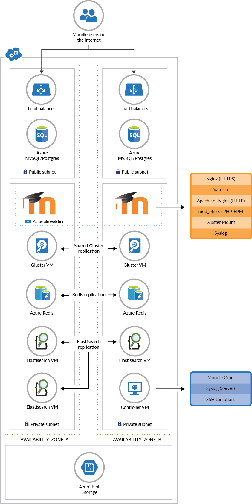

# Deploy and Manage a Scalable Mahara Cluster on Azure

This repo contains guides on how to deploy and manage a scalable
[Mahara](https://mahara.com) cluster on Azure. You can use an [Azure
free account](https://azure.microsoft.com/en-us/free/) to get started.

Once you have an Azure account you can deploy Mahara via the Azure
portal using the button below, or you can [deploy Mahara via the
CLI](docs/Deploy.md).

  

## What this stack will give you

This template set deploys the following infrastructure:
- Autoscaling web frontend layer (Nginx for https termination, Varnish for caching, Apache/php or nginx/php-fpm)
- Private virtual network for frontend instances
- Controller instance running cron and handling syslog for the autoscaled site
- Load balancer to balance across the autoscaled instances
- MS SQL, Postgres or MySQL database
- Azure Redis instance for Mahara caching
- ObjectFS in Azure blobs (Mahara sitedata)
- Three Elasticsearch VMs for search indexing in Mahara
- Dual gluster nodes for high availability access to Mahara files

## Quickstart

Why not get started with [deploying a Mahara cluster on
Azure](docs/Deploy.md) right now.

## Contributing

This project welcomes contributions and suggestions. Our goal is to
work on Azure specific tooling for deploying and managing the open
source [Mahara](http://mahara.org) learning management system on
Azure. We do not work on Mahara itself here, instead we work upstream
as appropriate.

The short version of how to contribute to this project is "just do
it". Where "it" can be defined as any valuable contribution (and to be
clear, asking questions is a valuable contribution):

  * ask questions
  * provide feedback
  * write or update documentation
  * help new users
  * recommend the project to others
  * test the code and report bugs
  * fix bugs and issue pull requests
  * give us feedback on required features
  * write and update the software
  * create artwork
  * translate to different languages
  * anything you can see that needs doing

For a more detailed discussion of how to contribute see our [Contribution Guide](CONTRIBUTE.md).

## Code of Conduct

This project has adopted the [Microsoft Open Source Code of
Conduct](https://opensource.microsoft.com/codeofconduct/). For more
information see the [Code of Conduct
FAQ](https://opensource.microsoft.com/codeofconduct/faq/) or contact
[opencode@microsoft.com](mailto:opencode@microsoft.com) with any
additional questions or comments.

## Legal Notices

Microsoft and any contributors grant you a license to the Microsoft
documentation and other content in this repository under the [Creative
Commons Attribution 4.0 International Public
License](https://creativecommons.org/licenses/by/4.0/legalcode), see
the [LICENSE](LICENSE) file, and grant you a license to any code in
the repository under the [MIT
License](https://opensource.org/licenses/MIT), see the
[LICENSE-CODE](LICENSE-CODE) file.

Microsoft, Windows, Microsoft Azure and/or other Microsoft products
and services referenced in the documentation may be either trademarks
or registered trademarks of Microsoft in the United States and/or
other countries. The licenses for this project do not grant you rights
to use any Microsoft names, logos, or trademarks. Microsoft's general
trademark guidelines can be found at
http://go.microsoft.com/fwlink/?LinkID=254653.

Privacy information can be found at https://privacy.microsoft.com/en-us/

Microsoft and any contributors reserve all others rights, whether
under their respective copyrights, patents, or trademarks, whether by
implication, estoppel or otherwise.

## Next Steps

  1. [Deploy a Mahara Cluster](docs/Deploy.md)
  1. [Obtain Deployment Details about a Mahara Cluster](docs/Get-Install-Data.md)
  1. [Delete a Mahara Cluster](docs/Delete.md)

