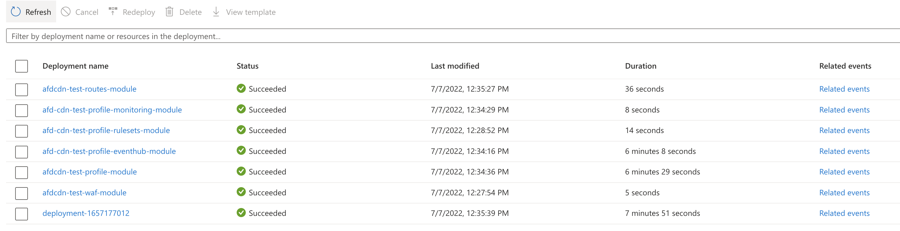

# Create a AFD CDN with WAF, Custom Domain and Diagnostic Settings


[](https://portal.azure.com/#create/Microsoft.Template/uri/https%3A%2F%2Fraw.githubusercontent.com%2FAzure%2Fazure-quickstart-templates%2Fmaster%2Fmodules%2Fazure-frontdoor-cdn-profile%2Fazuredeploy.json)

[](http://armviz.io/#/?load=https%3A%2F%2Fraw.githubusercontent.com%2FAzure%2Fazure-quickstart-templates%2Fmaster%2Fmodules%2Fazure-frontdoor-cdn-profile%2Fazuredeploy.json)   

A sample module to create Azure FrontDoor CDN profile. 

This module

1. create Azure FrontDoor Standard/Premium CDN Profile
2. create routes and associate them with domain, origin and ruleset(s).
3. create ruleSets. For example, with ModifyResponseHeader, RouteConfigurationOverride (Cache Override)
4. create waf with Custom rules in Block Mode. (In this example, blocking all method except GET, OPTIONS and HEAD)
5. create waf with managed rules in Log Mode.
6. attach waf as security policy to endpoint
7. dynamically create custom domain and their association
8. attach AFD provided managed certificate for TLS. 
9. dynamically create Origin and Origin Group using array and their attachment with Routes, WAF policy etc.
10. create event namespace and hub
10. create Diagnostic Settings using eventHub for sending Azure FrontDoor CDN logs to event Hub.


## Directory Structure

```bash
.
├── README.md
├── azuredeploy.parameters.json
├── images
│   └── deployment.png
├── main.bicep
├── metadata.json
└── modules
    ├── diagnosticSettings.bicep
    ├── profile.bicep
    ├── routes.bicep
    ├── rulesets.bicep
    └── waf.bicep
```

1. Directory `modules` contains base bicep files:
   1. `diagnosticSettings.bicep`: create diagnostic settings to send Azure cdn access logs to event hub. This can further be consumed to Azure Data Explorer.
   2. `profile.bicep`: invoke modules to create cdn profile, rulesets and diagnostic settings.
   2. `routes.bicep`: create cdn routes for profile.
   3. `rulesets.bicep`: create rule sets that are required by CDN Profile.
   4. `waf.bicep`: create WAF with Managed and Custom rules that needs to be attached to CDN Profile as Security Policy.
3. `main.bicep` provides an abstracted view to a user for creating CDN profile and waf attachment.

## Deployment

### Setting environment variable

```bash
export CDN_SUBS_ID="9xaxx10b-0xx2-xxxx-9xx2-d81a9xxxx921"
export CDN_RESOURCE_GROUP_NAME="afd-cdn-foss-rg"
export BICEP_FILE_NAME="main.bicep"

```

### Login and set subscription context

```bash
az login
az account set --subscription $CDN_SUBS_ID
```

### Building and linting Bicep code

```bash
az bicep build --file $BICEP_FILE_NAME --stdout
```

### Validate Deployment

```bash
az deployment group validate --resource-group $CDN_RESOURCE_GROUP_NAME --template-file $BICEP_FILE_NAME --parameters @azuredeploy.parameters.json
```

### Incremental Deployment

```bash
az deployment group create --resource-group $CDN_RESOURCE_GROUP_NAME --name deployment-`date +%s` --mode Incremental --template-file $BICEP_FILE_NAME --parameters @azuredeploy.parameters.json --confirm-with-what-if
```

Azure Portal Deployment Events:




## Test

## Get CDN Profile Name

Get environment name from parameter file

```bash
export DEPLOYED_ENV=$(cat azuredeploy.parameters.json | jq --raw-output '.parameters.envName.value')
```

Get CDN profile name from module output

```bash
export CDN_PROFILE_NAME=$(az deployment group show --resource-group $CDN_RESOURCE_GROUP_NAME --name afdcdn-$DEPLOYED_ENV-profile-module | jq --raw-output '.properties.outputs.cdnName.value')
```

### Get AFD Endpoint HostName

```bash
export AFD_ENDPOINT_NAME=$(az afd endpoint list --profile-name $CDN_PROFILE_NAME --resource-group $CDN_RESOURCE_GROUP_NAME | jq --raw-output '.[].hostName')
```

# Test 

## GET

```bash
$ curl -I -s https://$AFD_ENDPOINT_NAME/scds/concat/common/css?h=3pwwsn1udmwoy3iort8vgt

HTTP/2 200 
cache-control: max-age=31536000, immutable
content-type: text/css
expires: Fri, 07 Jul 2023 05:13:19 GMT
last-modified: Mon, 05 Nov 2012 04:00:51 GMT
vary: Accept-Encoding
server: Play
x-cache: TCP_HIT
access-control-allow-origin: *
x-azure-ref-originshield: 0bmvGYgAAAAA88eMD3cZAQ4EX2WqFZ0qVTUFBMjAxMDYwNTE4MDQ1ADc0ZjNjM2FmLTRjNDUtNDU3Ni05NGUzLWI1YWNkMzRjMGQ0ZQ==
x-cdn: AZUR
x-azure-ref: 0d2vGYgAAAAC0EMailo2NT64tKPcFzqDAQk9NMDJFREdFMDgwOQA3NGYzYzNhZi00YzQ1LTQ1NzYtOTRlMy1iNWFjZDM0YzBkNGU=
date: Thu, 07 Jul 2022 05:13:26 GMT
```

## Testing WAF Custom Rules

Any method other than GET, OPTIONS and HEAD should return 403.

```bash
$ curl -I --request POST -H 'Content-Length: 0' 'https://$AFD_ENDPOINT_NAME/scds/concat/common/css?h=3pwwsn1udmwoy3iort8vgt'
HTTP/2 403 
cache-control: no-store
content-length: 26
content-type: text/html
x-azure-ref: 0pG7GYgAAAACTULe+NYSzTbZa9N7xNkk/Qk9NMDJFREdFMDkwNwA3NGYzYzNhZi00YzQ1LTQ1NzYtOTRlMy1iNWFjZDM0YzBkNGU=
date: Thu, 07 Jul 2022 05:27:00 GMT
```