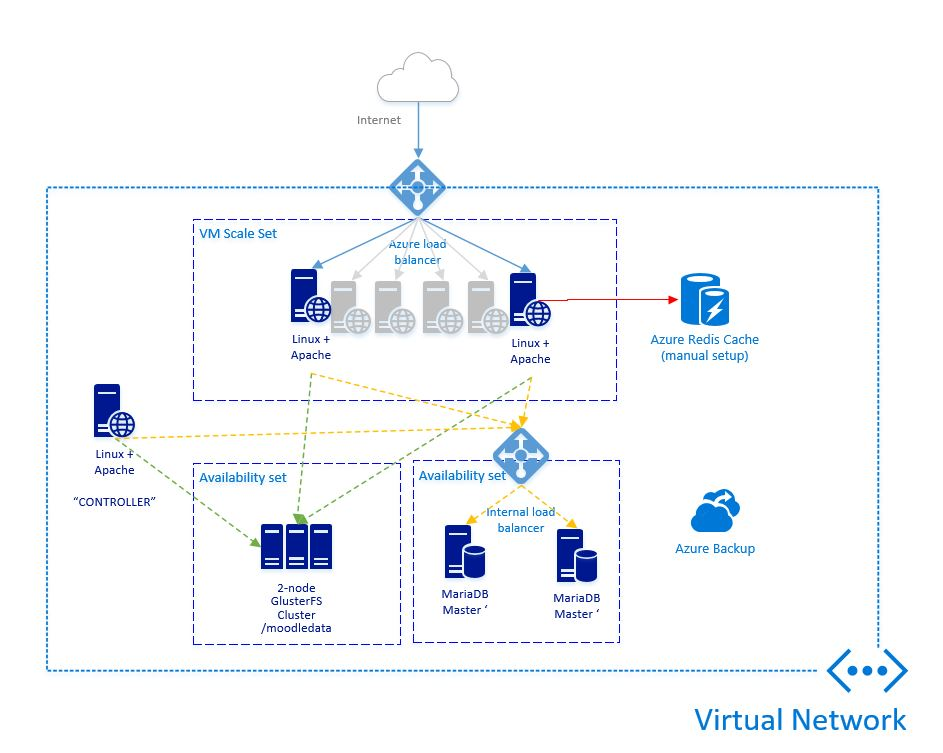

# MoodleAzure
High available, high scalable Moodle deployment using Azure Resource Manager Template

  

This Azure Resource Manager template creates a clustered, multi-layered moodle environment. 
With this template we have three main components being deployed: 
- a web application layer with VMSS and auto-scale enabled
- a database layer composed of a MariaDb Galera cluster 
- a shared filesystem layer, for the "moodledata" content.

Main differences from other existing Moodle templates:
- web layer uses a VMScale Set with auto-scale configured, allowing better usage of resources (02 to 10 web nodes possible)
- database layer was built using MariaDb Galera Cluster, in a high-available setup, providing 99.95% SLA
- filesystem layer (MoodleData) was built on top of VMs with Premium Disks, supporting very intensive IO scenarios; also built on top of GlusterFS, a high scalable storage solution from RedHat (see www.glusterfs.org for details), in a High Available setup (data replication accross cluster nodes, also providing a 99.95% SLA).
- Customer can define the size (small, medium, large) for database and filesystem layers 
- Azure Redis Cache is deployed in the solution, to be used as Moodle Session Cache backend (manual setup required in moodle)
- it was built for Moodle 3.x deployments 
- Azure Backup can be enabled for VMS hosting MariaDb Database and Moodledata content (very important for DR scenarios)
- Apache is configured with SSL support (using a self-signed certificate), allowing custom certificates with desired.

Summarizing, the following resources will be created during this process:

- a Virtual Machine Scale Set (up to 10 instances) for the web tier, with auto-scale configured
- 02 nodes Gluster Cluster  (2 Premium disks attached, raid0, a gluster brick in each virtual machine), data replicated accross nodes in a HA setup for the filesystem layer
- 02 nodes MariaDb 10 Active-Active Cluster (Galera Cluster), in a HA setup scenario for the database layer
- an Internal Load Balancer in front of the MariaDb cluster
- an public Load Balancer in front of the Virtual Machine Scale Set (web layer)
- a virtual machine used as a JumpBox for the environment, acessible via SSH
- a redis cache to be used for Moodle Session Cache (manual setup required in Moodle)
- a lot of underlying resources need for the environment (virtual network, storage accounts, etc)

## *Parameters for the deployment* 

- resourcesPrefix: Prefix for storage account name, network, virtual machines, and so on. Important: must be a unique value in the azure region; if you reach some error during the deployment, please confirm it's not being used by any other deployment (including from other people)
- vNetAddressSpace: Address range for the Moodle virtual network - presumed /16 - further subneting during vnet creation
- moodleVersion: The Moodle version you want to install.
- glusterTshirtSize: VM size for the gluster nodes (please check for more guidance below)
- mariaDbTshirtSize: VM size for the mariadb nodes (please check for more guidance below)
- adminUsername: ssh user name (do not use 'root' or 'administrator', using any of these will cause the deployment to fail)
- adminPassword: ssh password & moodle 'admin' password
- mySqlUserPassword: my sql regular user password
- mySqlRootPassword: my sql root user password (take note of this, would be necessary for database maintenance tasks)
- applyScriptsSwitch: Use '1' ALWAYS; Switch to process or bypass all scripts/extensions; if you use '0' (zero), this template will only create the machines;
- azureBackupSwitch: Switch to configure AzureBackup and enlist VM's; if you use '1', Azure Backup will be configured to backup MariaDb and GlusterFS nodes; highly recommended. The backup schedule can be adjusted later in the portal.
*Accessing Moodle administrative area*

In order to access Moodle admin console, please use the username 'admin' (without quotes) and the password you provided during the setup in Azure Portal.

## *Sizing the environment* 

### Gluster and MariaDb
The setup script will ask you about the 't-shirt size' for database & gluster layers.
Here's an explanation for each one of them: 

Gluster t-shirt sizes: 

tshirt | VM Size         | Disk Count | Disk Size | Total Size
-------|-----------------|------------|-----------|------------
Small  | Standard_DS2_v2 |  4         |  127 Gb   | 512 Gb
Medium | Standard_DS3_v2 |  2         |  512 Gb   | 1 Tb
Large  | Standard_DS4_v2 |  2         | 1023 Gb   | 2 Tb

MariaDb t-shirt sizes: 

tshirt | VM Size         | Disk Count | Disk Size | Total Size
-------|-----------------|------------|-----------|------------
Small  | Standard_DS2_v2 |  2         |  127 Gb   | 256 Gb
Medium | Standard_DS3_v2 |  2         |  512 Gb   | 1 Tb
Large  | Standard_DS4_v2 |  2         | 1023 Gb   | 2 Tb

There's no default rule or recommendation in order to decide which tier use for your deployment. 
However, as an initial guidance, remember that: 
- Moodle has a strong dependency of database setup; for a high number of simultanous users, consider using medium or large database sizes
- GlusterFS must be dimensioned considering the space requirements (size of your moodledata) + number of IOPS required. A Moodle deployment where students upload lots of content in a small windows of time would require more IOPS during that window, so consider using medium or large tiers in that case;

### The web layer

This script deploys a vm scale set (vmss) for the web layer. It's configured with Standard_DS2_v2 instances, with no data-disks, all connected to the GlusterFS cluster (mounted in the /moodle folder where source code, moodledata and ssl certificates resides).
The VMSS is also configured with auto-scale settings and will run, at minimum 02 instances up to 10 instances of the web application; the trigger for deploying additional instances is based on CPU usage. Those settings can be ajusted in Azure Portal or in the Azure Resources Editor (resources.azure.com).

## *Updating the source code or Apache SSL certificates* 

There's a jumpbox machine in the deployment that can be used to update Moodle's source code, or SSL certificates in the web layer. 
In order to proceed with this kind of update, connect to the machine using the root credentials provided during the template setup. 
- Moodle source code is located at /moodle/html/moodle
- Apache SSL certificates are located at /moodle/certs
- Moodledata content is located at /moodle/moodledata

## *Step by step video walkthrough* 

We also have a [step by step video](http://learningcontentdemo.azurewebsites.net/VideoHowToDemoMoodleOnAzure3) showing us how to deploy this template (Thanks to Ingo Laue for his contribution)

This template is aimed to have constant updates, and would include other improvements in the future. 

Hope it helps.

Feedbacks are welcome.

