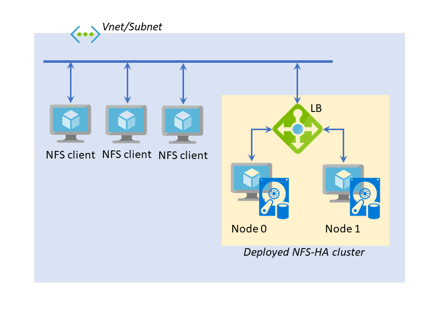

# Deploy a Highly Available NFS Cluster with Ubuntu VMs

  

This template allows you to create a highly available NFS cluster on Azure with 2 Ubuntu VMs. The following diagram shows the architecture of the deployed cluster.

## Usage

There are many parameters this template requires. Some notable and important ones are as follows:

- `subnetId`: This is where the highly available NFS cluster will be deployed. You need to give the Azure resource ID of an already existing Azure subnet where the cluster should be deployed.
- `node0IPAddr` and `node1IPAddr`: The 2 VMs will have to be assigned static IP addresses for the high availability configuration in the deployed VMs. You need to specify those statically assigned IP addresses (that belong to the subnet specified above) as these parameters.
- `lbFrontEndIpAddr`: The NFS service on the cluster will be accessed through this IP address, so you need to specify an IP address here (that belongs to the subnet specified above).
- `nfsClientsIPRange`: The NFS-exported directory (currently fixed to `{lbFrontEndIpAddr}:/drbd/data`) will be available only to the NFS clients from this IP address range (e.g., `10.0.0.0/24`), so you need to provide one here.
- `dataDiskCountPerVM`: The number of data disks in each VM. If this is bigger than one, all the data disks will pool into a RAID-0 (striped) disk array.

Other template parameters are typical VM deployment ones.

## Brief Explanation

As illustrated in the cluster diagram above, the deployed HA-NFS cluster consists of 2 Ubuntu VMs and one Azure load balancer (internal). Each cluster is configured with the following software stack:

- Usual NFS server components (`nfs-kernel-server` on Ubuntu)
- [DRBD](https://docs.linbit.com/) for disk replication between 2 VMs
- [Corosync](https://github.com/corosync/corosync) and [Pacemaker](https://wiki.clusterlabs.org/wiki/Pacemaker) for clustering engine and cluster resource management

The usual highly available clustering on non-cloud environment is achieved by a fixed secondary IP address that is attached to the master node and fails over to the secondary node. However, an IP address fail-over is not straightforward in Azure (and probably other cloud environments as well). Therefore, we use a load balancer (an internal one with a private front-end IP address on the same subnet) to route traffic only to the master node. For that purpose, the probe responder runs only on the master node (on port 61000 as `/bin/nc` for TCP probing) and it also fails over to the secondary with other core services (DRBD, NFS and etc).

Because we have to use a load balancer for the highly availble front-end IP address, we need to make the various NFS-related service ports (e.g., rpdbind, statd, lockd, ...) statically assigned on each VM. In our templates, you'll see that those ports are statically bound to 2000-2005 and the load balancer is configured for the ports as such.

## TO-DO

Currently, [STONITH](https://en.wikipedia.org/wiki/STONITH) is disabled, so thoeretically [split-brain](https://en.wikipedia.org/wiki/Split-brain_(computing)) might occur. Any PRs addressing this issue are very welcome.

We also need to conduct some load testing for a deployed NFS-HA cluster with high workload. We'll perform a load testing study based on the [Moodle-on-Azure project](https://github.com/Azure/Moodle/tree/master/loadtest), which is the motivation for this NFS-HA templated solution.

## Acknowledgements

Matt Kereczman (@kermat on Github) from LINBIT greatly helped with the Pacemaker configuration for NFS fail-over and the Azure LB-based highly available front-end IP address. Thanks to Matt's help, I think this template can be made possible at least a few more weeks earlier than expected.

This tempated solution for highly available NFS was created mostly for the [Moodle-on-Azure](https://github.com/Azure/Moodle). In the process, we came to realize that this might be useful for other Azure Linux customers as well on many other occasions. Therefore, we made the templates as generic as possible for Azure quickstart templates repo publication.