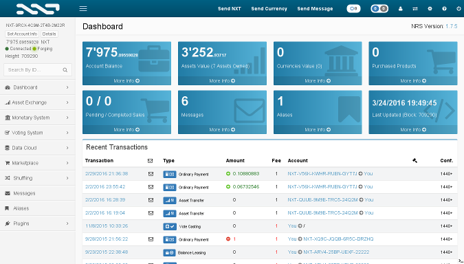

# Nxt blockchain platform

Nxt is an advanced blockchain platform which builds on and improves the basic functionality of pioneering cryptocurrencies such as Bitcoin. Cryptocurrency and financial systems are the first widely used applications of blockchain technology, but the blockchain and its associated technology can be used for much more.

Nxt revolutionises the financial technology, crowdfunding and governance industries by providing not only the groundbreaking Nxt crypto-currency, but also a powerful, modular toolset to build with in any way Nxt users can imagine. Nxt gives users complete freedom to create their own applications.

# Template parameters

When deploying the solution, you need to specify the following template parameters:

* `adminUsername`: Username for the Ubuntu VM.
* `adminPassword`: Password for the Ubuntu VM. Azure requires passwords to have One upper case, one lower case, a special character, and a number.
* `hostname`: A public DNS name for the VM. It must be unique.
* `vmSize`: Size of the VM.
* `limitAPItoLocalhost`: False - public Nxt API and GUI are available from anywhere. True - public Nxt API and GUI are available only from localhost.
* `testnet`: Run Nxt on Testnet. Testnet is useful for testing without any financial risk. Mainnet is required for final deployment. Keep in mind that testnet uses a different API port: `6876`.

# Getting started

* Click on 'Deploy to Azure' icon above.
* Complete the template parameters, choose your resource group, accept the terms and click Create. Please, make sure that options `limitAPItoLocalhost` and `testnet` are set to false.
* Wait about 20 minutes for the VM to spin up.
* Navigate to `http://[vmpublicip]:7876/` to access the Nxt GUI.
* Navitage to `http://[vmpublicip]:7876/test` to access the Nxt API.

# Assistance and Troubleshooting

Please visit following links to learn more:

* [Nxt.org](https://www.nxt.org)
* [Nxt Wiki](https://nxtwiki.org/wiki/Main_Page)
* [Nxt helpdesk](https://nxt.org/helpdesk/)
* [Nxt Slack](https://nxtchat.herokuapp.com/)

