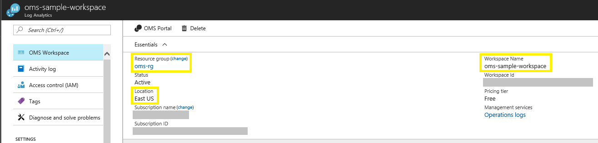
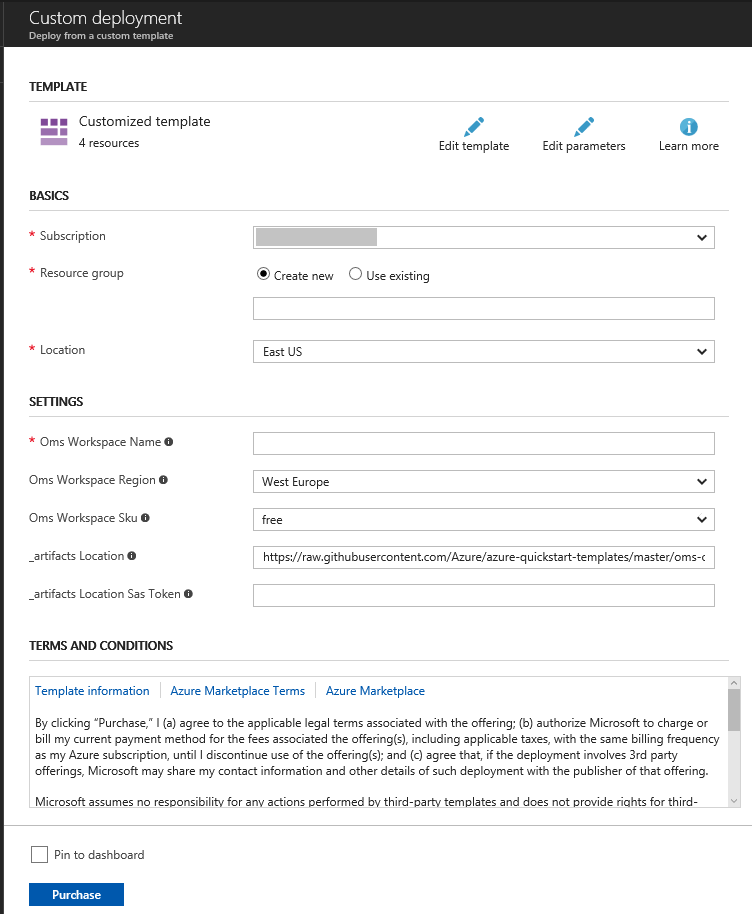
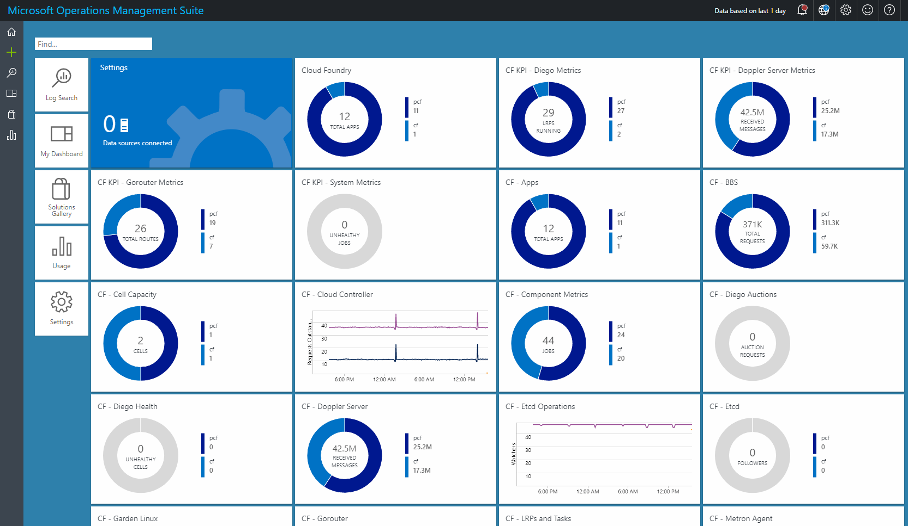
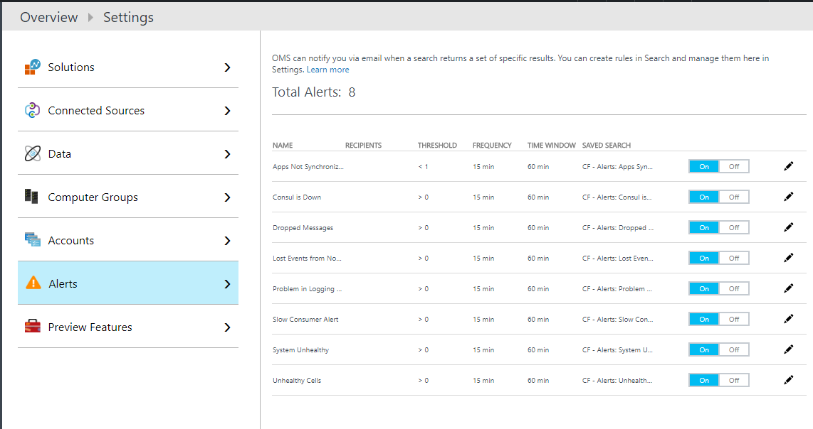
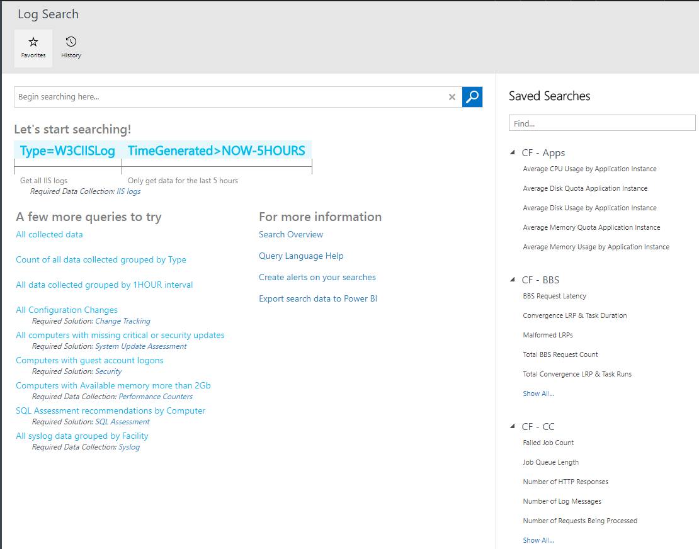

# Azure OMS Log Analytics Solution for Cloud Foundry

 

## Overview

This solution allows you to visualize and monitor the metrics and logs from your Cloud Foundry environments in OMS Log Analytics.

In order to use the workspace created by this template, you must have
1. A Cloud Foundry deployment
1. The [Azure Log Analytics Nozzle](https://github.com/Azure/oms-log-analytics-firehose-nozzle) deployed to your Cloud Foundry environment.

This template can create a new Log Analytics workspace and deploy the following resources into the workspace, or deploy the following resources into an existing Log Analytics workspace.
* all the [OMS views](https://github.com/Azure/oms-log-analytics-firehose-nozzle/tree/master/docs/omsview) for Cloud Foundry metrics and logs
* predefined [alerts](https://github.com/Azure/oms-log-analytics-firehose-nozzle#2-create-alert-rules) for important events from Cloud Foundry environments
* predefined saved searches for major Cloud Foundry metrics and logs

## Installation

Follow these instructions to deploy the template:
1. If you want to use an existing Log Analytics workspace, note the name, location and resource group name of the workspace from [Azure Portal](https://portal.azure.com).
    
1. Click "Deploy to Azure", this will send you to the Azure Portal with some default values for the template parameters. 
    
1. Fill the parameters.
    
	1. **Subscription**: Select the subscription where your existing workspace is located, or where you want to create a new workspace
	1. **Resource group**: Select the resource group where your existing workspace is located, or enter a resource group name for your new workspace
	1. **Location**: Select the region of the resource group
	1. **Oms Workspace Name**: Enter the name of your existing workspace, or enter a name for your new workspace
	1. **Oms Workspace Region**: Select the region where your existing workspace is located, or select a region for your new workspace
	1. **Oms Workspace Sku**: Select the pricing tier of the workspace
1. Once you have customized all the parameters, click *Purchase*.

## Exploring the workspace
Once the template has been deployed successfully, you need to deploy the [Microsoft Azure Log Analytics Nozzle](https://github.com/Azure/oms-log-analytics-firehose-nozzle) to collect Cloud Foundry metrics and logs to the workspace. If the workspace is newly created, it might take several minutes for data to be injected after the nozzle is started.

### Views
You can find the URL of OMS portal `OMSPORTAL` in the outputs of `Microsoft.Template` deployment. Navigate to the OMS portal of the workspace, on the overview page, multipe views should be already imported.
    
Click on each view and more dashboards will be displayed.
    

### Alerts
Go to **Settings** -> **Alerts**, there're 8 predefined alerts. You could edit and customize these alerts.
    

### Saved Searches
Go to **Log Search** -> **Favorites**, on the right side panel, you could find categorized search queries for major Cloud Foundry metrics and logs.
    
	