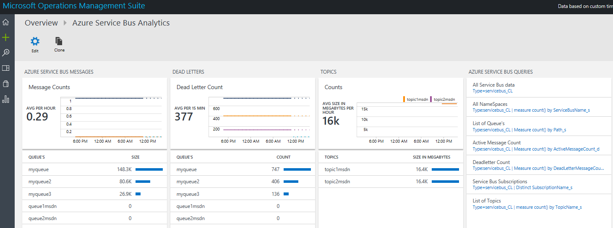
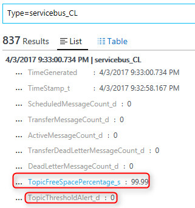
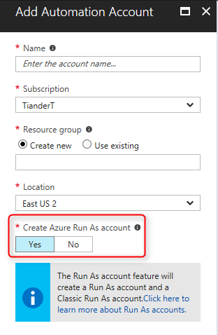
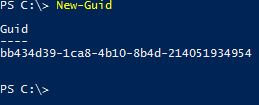

# Azure Service Bus Monitoring

This solution (currently in preview) will allow you to capture your Azure Service Bus metrics and visualize them in Operations Management Suite (Log Analytics). This solution leverages an automation runbook in Azure Automation, the Log Analytics Ingestion API, together with Log Analytics views to present data about all your Azure Service Bus instances in a single Log Analytics workspace. 

**Couple of things to note:**
+ Please scroll down and read the "Re-deploy" section for how to re-deploy in case you need to
+ Using this solution assumes you have read the prerequisites - please read those carefully or your deployment will fail
+ Since we are using ARM PowerShell modules in the Azure Automation runbooks - which have dependencies - it can take a while for the activities to be extracted during deployment of the ARM template, be patient
+ The scheduleIngestion runbook will kick off approx after 10 mins of the deployment and will run only once to create schedules for the servicebusIngestion runbook
+ The scheduleIngestion runbook and its schedule can be removed after deployment, the schedule will be expired
+ When the 6 schedules for the servicebusIngestion runbook have been created, the runbook will run according the schedule - in worse case scenario after 10 mins after the creation of the schedules
+ The first time that the servicebusIngestion runbook runs, it can take up to 30mins for the data to be ingested, during this time you will see the home tile saying "Waiting on initial service bus ingestion"

**Updates in this version (May 2017):**
+ Converted to ARM PowerShell cmdlets - no longer requires a classic Azure Automation RunAs account (still requires SPN RunAs certificate)
+ Added Topic Subscription metrics
+ The ARM template creates runbook schedules for every 10mins (instead of once per hour)
+ Able to handle multiple service bus connection strings (bugfix)
+ Updated Dashboards
+ Home tile waits for the initial ingestion to be completed (instead of showing no data)
+ Updated metric fieldnames which make more sense (instead of Path_s, etc.)

**Updates in this version (April 2017):**
+ Added more fields for Topics
+ Added a free space remaining percentage for Queue and Topic thresholds
+ Before ingestion, added an alert threshold value if Queue and/or Topic threshold is reached, so that you can create an alert based on this value
+ Updated visualization with free space remaining for queues and topics, scheduled messages etc.
 

## Prerequisites

+ Azure Subscription (if you don't have one you can create one [here](https://azure.microsoft.com/en-us/free/))
+ New Azure Automation Account (with a RunAs SPN Account). To create a new Automation Account refer to "How do I get started"  below
+ A PowerShell unique GUID (required for the Azure Automation jobschedule), please run the PowerShell command "New-Guid" to generate one

**Note: The OMS Workspace and Azure Automation Account MUST exist within the same resource group. The Azure Automation Account name needs to be unique.**

## How do I get started?

**Create a new Azure Automation account**: Go the Azure Portal https://portal.azure.com and create an Azure Automation account (do not link it to your OMS workspace).

If you have an existing OMS Log Analytics workspace in a Resource Group, proceed to create the Automation account in this Resource Group. It is recommended that the Azure region is the same as the OMS Log Analytics resource. By default, the Azure portal wizard will create an SPN account as part of this process.

Note: Make sure to create the new Azure Automation Account in the same Azure subscription where your Azure Service Bus instances reside. If you don't have an existing OMS Log Analytics workspace the deployment will create one for you.

**Note: An Azure Automation account needs to exist before deploying this solution, do not link it to your OMS workspace**

Click the button that says **Deploy to Azure**. This will launch the ARM Template you need to configure in the Azure Portal:

**Deployment Settings**

1. Provide the name of the resource group in which your new Azure Automation account resides **so select "Use existing"** . The resource group location will be automatically filled in.

2. Under "Settings" provide the name and the region of an existing OMS workspace. If you don't have an OMS workspace, the template deployment will create one for you.

3. Under "OMS Automation Account Name" provide the Automation Account name (which you've created earlier) and the region where the Automation Account resides in.

4. Provide an unique Job Guid (this will be used to create a runbook schedule). You can generate a unique Job Guid in PowerShell like this:

Accept the "Terms and Conditions" and click on "Purchase"

                               

## Monitoring multiple subscriptions

The solution is designed to monitor Azure Service Bus instances across subscriptions.
To do so, you simply have to deploy this template and provide the workspace Id and the workspace Key for the workspace where you already have deployed the solution.

## Pre-reqs

- **Automation Account with SPN**

Due to specific dependencies related to modules, variables and more, the solution requires that you create additional Azure Automation accounts when scaling the solution to collect data from multiple subscriptions. You must create an Automation Account in the Azure portal with the default settings so that the SPN account will be created.

- **OMS workspace Id and Key**

This template will have parameters that will ask for the WorkspaceID and the WorkspaceKey, so that the runbooks are able to authenticate and ingest data.
You can log in to the OMS classic portal and navigate to Settings --> Connected Sources to find these values

Once you have completed the pre-reqs, you can click on the deploy button below

**Deployment Settings**

1. Provide the name of the resource group in which your Azure Automation account resides (which has access to the additional subscriptions you want to add), **so select "Use existing"** . The resource group location will be automatically filled in.
2. Enter the WorkspaceID and WorkspaceKey for the existing workspace you want this additional subscription service bus data to flow in.
3. Enter the OMS Automation Account Name and its region
4. Enter an unique jobID (use PowerShell's New-Guid command to generate one)
5. Accept the terms and conditions and click on Purchase

 

Once deployed you should start to see data from your additional subscriptions flowing into your workspace.

## Re-deploy this solution
Since the May 2017 release is a major update (the custom log schema has been changed), the recommendation is to remove (from the Azure portal) the OMS solution, the Azure Automation runbooks and their schedules.

If you have deployed the May 2017 update and you would like to re-deploy make sure that you remove the schedules from the following runbooks **before** deploying:
+ scheduleIngestion (1 schedule)
+ servicebusIngestion (6 schedules)

