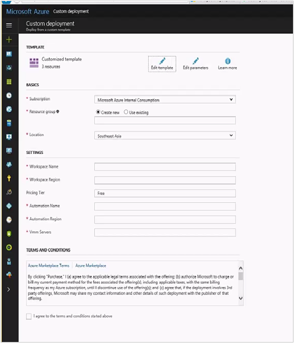
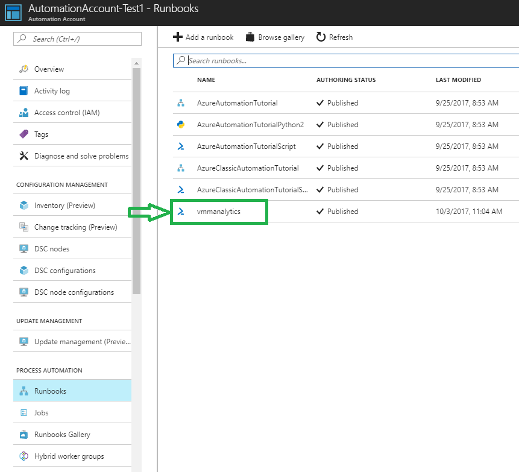
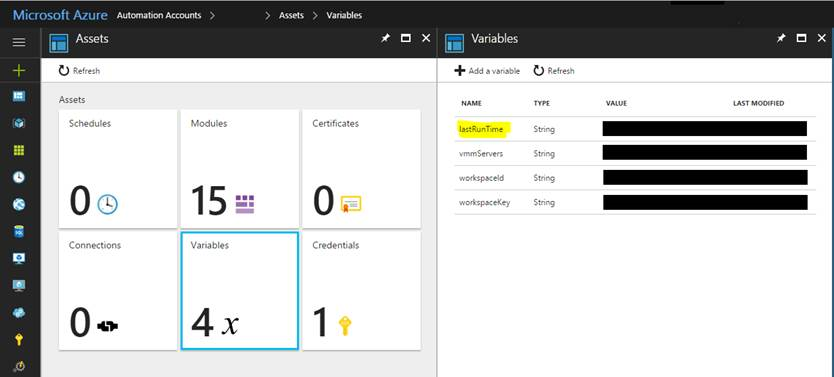
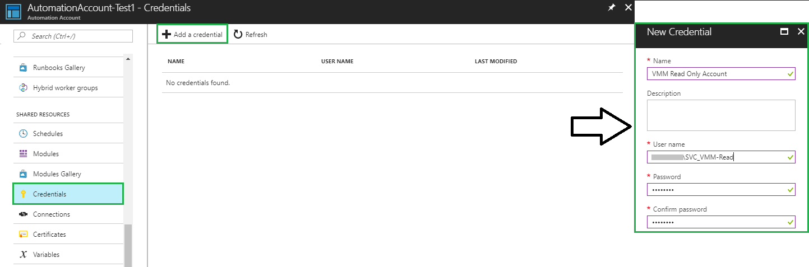
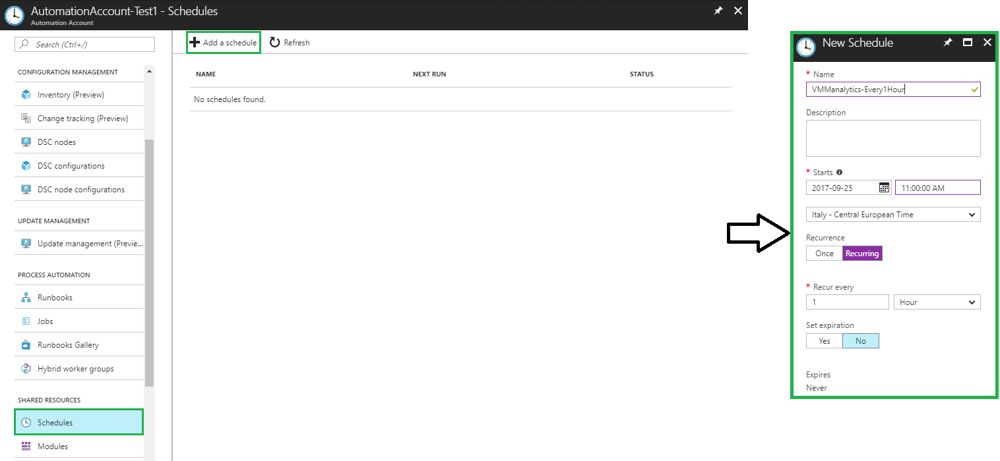
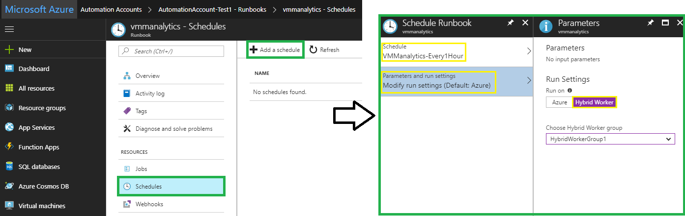
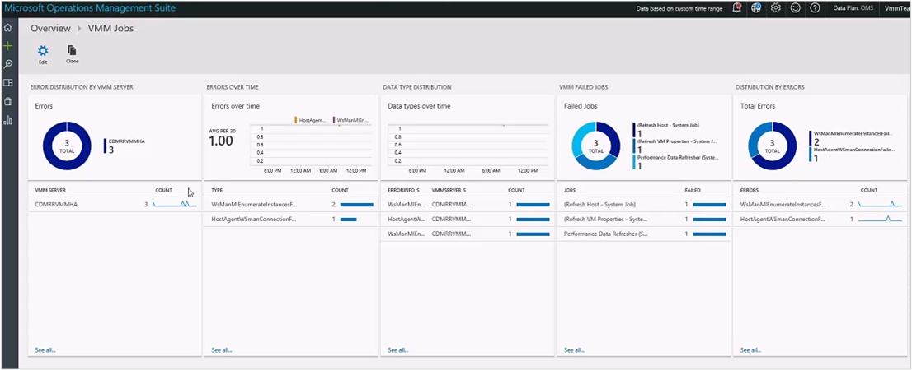
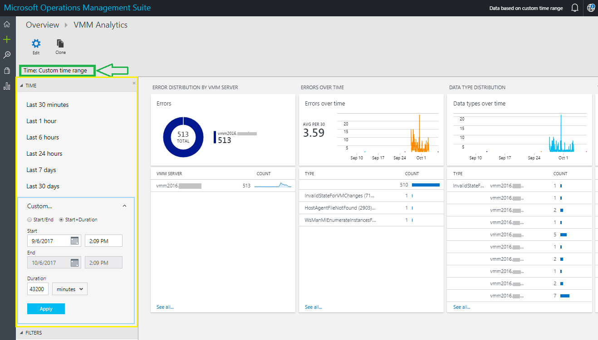

# VMM Analytics

Virtual Machine Manager (VMM) Analytics solution in OMS provides a single view  of the jobs' status across multiple VMM instances that helps you gain insight about the health & performance of these jobs.

Additionally, the VMM jobs data in OMS Log Analytics can be correlated with the data from other OMS solutions for better debugging and auto resolution with Azure automation Runbooks.

This document provides information about how to deploy and configure the VMM Analytics solution.

## Deploy and configure VMM Analytics

>[AZURE.NOTE]

> Before you deploy, ensure you have required Azure subscription, Azure automation account  and the read only credentials to all the VMM servers for which you want to view the job analytics. You must also have the OMS workspace where you want to deploy this solution.

Use the following procedure:

1.	Log on to the OMS space using your Azure subscription details.
2.	Go to the [GitHub location](https://github.com/krnese/AzureDeploy/tree/master/OMS/MSOMS/Solutions/vmm) where the solution is available.
3. Click .

    **Custom deployment** blade appears.

    

4. Provide the details for the following parameters:

   - **Subscription** - Select the resource group. More information about resource groups, see [Resource groups](https://docs.microsoft.com/en-us/azure/azure-resource-manager/resource-group-overview#resource-groups). You can select and existing group or create a new one.
  - **Location** - Select the location of your resource group
  - **Workspace name** - Specify the name of the OMS workspace where you want to deploy this solution.
  - **Workspace region** - Select the region for the selected workspace.
  - **Pricing tier** - Select the pricing tier for your automation account.

    **Note**: For free subscription, you will be offered only 500 minutes of automation.
  - **Automation name** - Specify the name of the Azure automation account.
  - **Automation region** - Select the region where your Azure automation account is located.
  - **VMM Servers** - Type the names of the VMM servers in comma separated format, for which you want to perform the job analytics.

5. Click **Purchase**.

6. Go to your OMS workspace, check for the deployment of the solution **VMM Analytics** in your OMS space. The deployment comes with a Runbook by name **vmmanalytics**, which you use to run the job analytics.

7. After successful deployment, go to the solution,   select **lastRunTime** from  **Assets** > **variables**.  Set the **lastRunTime**
in UTC string format "yyyy-MM-ddTHH:mm:ss.fffffffZ".

    **Example**:

    The UTC timestamp "January 1, 1991 12:00:00 AM" should be added as "1991-01-01T00:00:00.0000000Z.

    The solution syncs the jobs completed after the set time. Default value is Null.

8. Create a runbook worker with **appropriate credentials**, which can read jobs data from your VMM instances. [Learn more](https://docs.microsoft.com/en-us/azure/automation/automation-hybrid-runbook-worker
).

9. Create a schedule for the runbook **vmmanalytics** as per the required sync frequency. This will periodically push the new jobs data from VMM to OMS workspace.

Afterwards you must attach schedule created to the runbook **vmmanalytics** and set which Hybrid Worker use to contact the Virtual Machine Manager instance.

Job analytics will be displayed on Log Analytics based on these schedules.

## View the job analytics
Click **VMM Analytics** solution tile in your OMS workspace to view the job analytics.

You can view failed instances, errors, and queries for the jobs running on the specified VMM server instances.

Here is an example screen:

The dashboard of the solution also allows you to define the time range to filter, more accurately and to suit your needs, the jobs collected from Virtual Machine Manager.

## Contact us
In case of any queries or feedback, [contact us](mailto:vmmanalytics@microsoft.com)

## Related Community Articles
[OMS Log Analytics: How to collect Virtual Machine Manager jobs](http://francescomolfese.it/en/2017/10/oms-log-analytics-come-collezionare-i-job-di-virtual-machine-manager/)