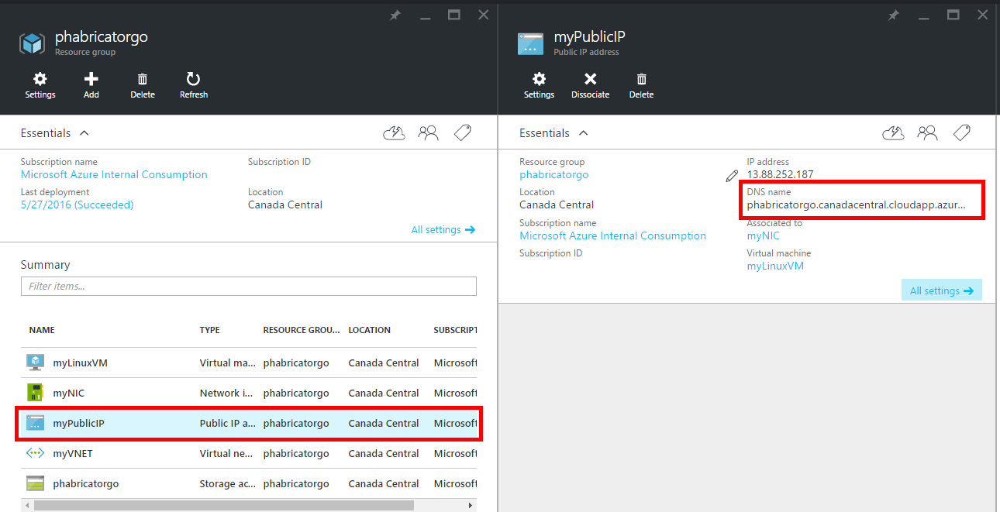

# Install Phabricator on a Ubuntu Virtual Machine using Custom Script Linux Extension

This template deploys [Phabricator](http://phabricator.org/) on a Ubuntu Virtual Machine 16.04.0-LTS.

This template also deploys a Storage Account, Virtual Network, Public IP addresses and a Network Interface.

After the deployment, you should be able to access at phabricator through your DNSNAMEFORPUBLICIP parameter on the port 80 :

Next steps for the configuration of phabricator : https://secure.phabricator.com/book/phabricator/article/configuration_guide/ 
