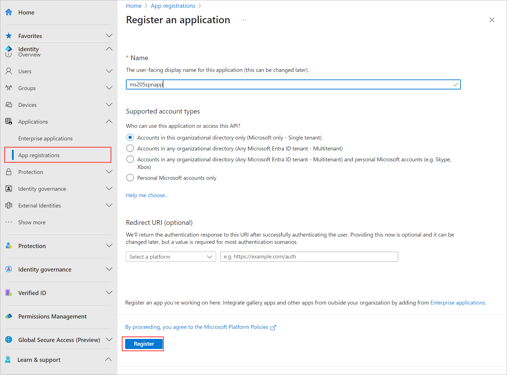
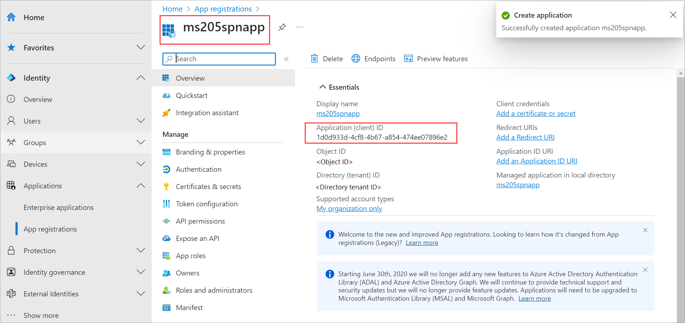
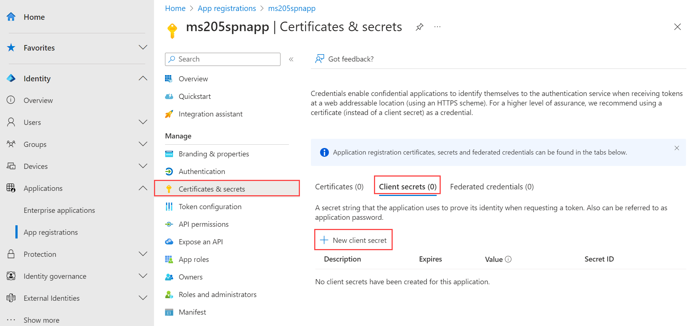
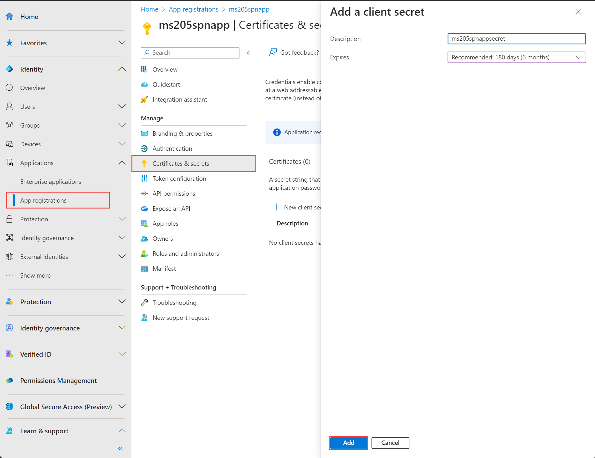
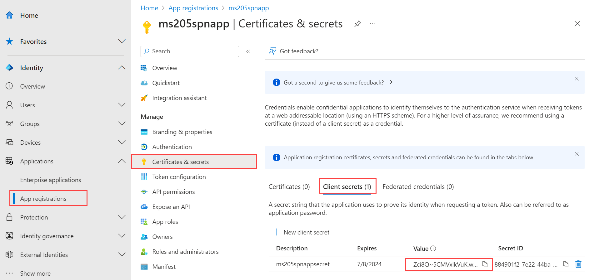

# Creates an Azure Stack HCI 23H2+ cluster using Bicep


   

This article describes how to deploy an Azure Stack HCI 23H2 cluster using a Bicep template. The article first covers the prerequisite steps you must take before deploying the template, then walks through specifying deployment parameter values and deployment execution.

The Bicep template and parameter files for this article are a community contribution template in the [Azure QuickStart Templates GitHub repository](https://github.com/Azure/azure-quickstart-templates/tree/master/quickstarts/microsoft.azurestackhci/create-cluster-with-prereqs). These templates deploy a common pattern but may require changes for some scenarios--for example, if you have less than three network intents.

> [!IMPORTANT]
> Bicep template deployment of Azure Stack HCI, version 23H2 systems is targeted for deployments-at-scale. The intended audience for this deployment are IT Administrators who have experience deploying Azure Stack HCI clusters. We recommend that you deploy a version 23H2 system via the Azure Portal first and then perform subsequent deployments via the Bicep template.

## Prerequisites

### Step 1: Prepare your cluster nodes and Active Directory

- Completion of [Register your servers with Azure Arc and assign deployment permissions](https://learn.microsoft.com/azure-stack/hci/deploy/deployment-arc-register-server-permissions). Make sure that:

  - All the mandatory extensions are installed successfully. The mandatory extensions include: **Azure Edge Lifecycle Manager**, **Azure Edge Device Management**, and **Telemetry and Diagnostics**.
  - All servers are running the same version of OS.
  - All the servers have the same network adapter configuration.

- Completion of [Prepare Active Directory for Azure Stack HCI, version 23H2 deployment](https://learn.microsoft.com/azure-stack/hci/deploy/deployment-prep-active-directory.md)

### Step 2: Create the Arc App Registration and assign permissions

To authenticate your cluster, you need to create a service principal and a corresponding **Client secret**. You must also assign *Azure Resource Bridge Deployment Role* to the service principal at the subscription scope.

#### Create a service principal

To create the necessary service principal, follow the steps in [Create a Microsoft Entra application and service principal that can access resources via Azure portal](https://learn.microsoft.com/entra/identity-platform/howto-create-service-principal-portal). Alternatively, use the PowerShell procedure to [Create an Azure service principal with Azure PowerShell](https://learn.microsoft.com/powershell/azure/create-azure-service-principal-azureps).

The steps are also summarized here:

1. Sign in to the [Microsoft Entra admin center](https://entra.microsoft.com/) as at least a Cloud Application Administrator. Browse to **Identity > Applications > App registrations** then select **New registration**.

1. Provide a **Name** for the application, select a **Supported account type**, and then select **Register**.

    

1. Once the service principal is created, go to the **Overview** page. Copy the **Application (client) ID** for this service principal for use in your Bicep template parameters.

   

#### Create a client secret

1. Go to the service principal that you created and browse to **Certificates & secrets > Client secrets**.
1. Select **+ New client** secret.

    

1. Add a **Description** for the client secret and provide a timeframe when it **Expires**. Select **Add**.

    

1. Copy the **client secret value** for later use in your Bicep template parameters

    > [!Note]
    > For the application client ID, you will need it's secret value. Client secret values can't be viewed except for immediately after creation. Be sure to save this value when created before leaving the page.

    

### Step 3: Register the Microsoft.AzureStackHCI Resource Provider in your subscription

If you haven't deployed an Azure Stack HCI cluster in this subscription previously, [register the Microsoft.AzureStackHCI Resource Provider](https://learn.microsoft.com/azure/azure-resource-manager/management/resource-providers-and-types#register-resource-provider) in your subscription.

### Step 4: Update the deployment parameter file

Create a parameter file with values as described in the following table, using [the sample parameter file](https://github.com/Azure/azure-quickstart-templates/blob/master/quickstarts/microsoft.azurestackhci/create-cluster-with-prereqs/azuredeploy.parameters.json) as a starting place.

Three node switchless deployments must disable storage auto IP assignment and specify storage IPs in the `storageNetworks` parameter. Note that all nodes must have the same NIC names and the same storage VLAN configuration for all storage NICs. See [3 node switchless sample parameter file](https://github.com/Azure/azure-quickstart-templates/blob/master/quickstarts/microsoft.azurestackhci/create-cluster-with-prereqs/azuredeploy.parameters.3nodeswitchlesssample.json).

| Parameter | Description | Default Value | Example Value |  
|--------------------------------|--------------------------------------------|------------------|-----------------------------------------------------|
| `location`                     | The [supported region](https://learn.microsoft.com/azure-stack/hci/concepts/system-requirements-23h2#azure-requirements) where the resources are deployed. | | `eastus`|
| `deploymentMode`               | The mode of the deployment. Must be either `Validate` or `Deploy`. | Validate | `Deploy` |
| `deploymentPrefix`             | The prefix for the Azure resource names in the deployment - used to create globally unique names for Key Vault and Storage Account resources, must be 4-8 characters long and contain only a-z, 0-9 or, -. | | `conthci1` |
| `deploymentUsername`           | The username for the deployment. This is the user created in Active Directory by the preparation script. Specify without a domain. | | `deployUser` |
| `deploymentUserPassword`       | The password for the deployment user. This is for the user created in Active Directory by the preparation script. | | |
| `localAdminUsername`           | The local admin username for the nodes in the deployment.          | | `Administrator` |
| `localAdminPassword`           | The local admin password for the nodes in the deployment.          | | |
| `arbDeploymentAppId`           | The application ID of the precreated App Registration for the Arc Resource Bridge deployment.          | | `5dd54f74-1eb0-46e9-8f00-c7367799c545` |
| `arbDeploymentSPObjectId`      | The service principal object ID of the of the precreated App Registration for the Arc Resource Bridge deployment. To get this objectId property, run `Get-AzADServicePrincipal -ApplicationId <arbDeploymentAppId>` ||`d05337da-2047-441c-8d52-9fc816917325` |
| `arbDeploymentServicePrincipalSecret` | A client secret of the precreated App Registration for the Arc Resource Bridge deployment.          | | `-q28Q~LWB_EXAMPLE_ni.XN3YSLK__hsdR4l2ZSNbMm` |
| `hciResourceProviderObjectId`  | The object ID of the Azure Stack HCI Resource Provider in your tenant. To get this ID, run `Get-AzADServicePrincipal -ApplicationId 1412d89f-b8a8-4111-b4fd-e82905cbd85d` or search for **Azure Stack HCI Resource Provider** in Microsoft Entra and copy the object ID. This value will be unique for each Entra ID tenant   | | `1ade2a15-1da8-4c0b-9f2d-fafc353a9fb1` |
| `clusterName`                  | The name of the Azure Stack HCI cluster - this must be a valid Active Directory computer name and will be the name of your cluster in Azure.       | | `ashci-den01` |
| `clusterNodeNames`             | The names of the cluster node Arc Machine resources as a JSON array.               | | `['hci-node-01','hci-node-02']` |
| `domainFqdn`                   | The domain name of the Active Directory Domain Services.           | | `contoso.com` |
| `domainOUPath`                 | The OU path of the Active Directory Domain Services.               | | `ou=hci01,dc=contoso,dc=com` |
| `softDeleteRetentionDays`      | The number of days to retain soft-deleted items in the Azure Key Vault. | 30 | `30` |
| `logsRetentionInDays`          | The number of days to retain logs. Set to 0 to retain data forever.| 30 | `30` |
| `securityConfiguration`        | The security configuration settings for the cluster. This is a JSON object containing all required settings with true or false values.| *all security options enabled*| *see bicep param declaration* |
| `streamingDataClient`          | Specifies whether to enable metrics data for the HCI cluster.      | true | `false` |
| `isEuropeanUnionLocation`      | Specifies whether the location is in the European Union.           | false | `true`|
| `episodicDataUpload`           | Specifies whether to enable diagnostic data for the HCI cluster.   | true | `false` |
| `storageConnectivitySwitchless`| Set to `true` when deploying a 2 or 3 node cluster in a switchless configuration| false| `true`|
| `storageNetworks`              | An array of JSON objects that define the storage network configuration for the cluster. Each object should contain the adapterName and vlan properties. || `[{adapterName: 'smb0', vlan: '711'},{adapterName: 'smb1', vlan: '712'}]`|
| `computeIntentAdapterNames`    | An array of Network Adapter names present on every cluster node intended for compute traffic|| `['comp0','comp1']`|
| `managementIntentAdapterNames` | An array of Network Adapter names present on every cluster node intended for management traffic|| `['mgmt0','mgmt1']`|
| `startingIPAddress`            |The starting IP address for the Infrastructure Network IP pool. There must be at least 6 IPs between startingIPAddress and endingIPAddress and this pool should not include the node IPs||`192.168.0.10`|
| `endingIPAddress`              |The ending IP address for the Infrastructure Network IP pool. There must be at least 6 IPs between startingIPAddress and endingIPAddress and this pool should not include the node IPs||`192.168.0.19`|
| `subnetMask`                   |The subnet mask for deploying a HCI cluster||`255.255.252.0`|
| `storageConfigurationMode`     | The storage volume configuration mode | Express| `InfraOnly`|
|`enableStorageAutoIp`           | The enable storage auto IP value for deploying an HCI cluster - this should be true for most deployments except when deploying a three-node switchless cluster, in which case storage IPs should be configured in the `storageNetworks` parameter and this value set to false| true| `false`|

## Deploy using Bicep template

Now that the prerequisites and parameter file are complete, you can start the cluster deployment. If you haven't downloaded the template files already, you can find them in the [Azure QuickStart Templates GitHub repository](https://github.com/Azure/azure-quickstart-templates/tree/master/quickstarts/microsoft.azurestackhci/create-cluster-with-prereqs).

When deploying Azure Stack HCI clusters using a Bicep, ARM, or REST API, the deployment goes through a validate phase followed by a deployment phase. To specify the phase of the deployment, use the `deploymentMode` property of the deploymentSettings resource. In this Bicep template, `deploymentMode` has a default value of `Validate`. The following sections demonstrate how to initiate each phase of deployment with Azure CLI or Azure Bicep.

### Validation Phase

# [Azure CLI](#tab/azurecli)

```azurecli
az deployment group create -g rg-myhcicluster -f .\main.bicep -p .\azuredeploy.parameters.contoso.json
```

# [Azure PowerShell](#tab/powershell)

```powershell
New-AzResourceGroupDeployment -Name 'hcicluster' -ResourceGroupName <yourResourceGroup> -TemplateFile .\main.bicep -TemplateParameterFile .\azuredeploy.parameters.json
```

---

### Deployment Phase

Change the `deploymentMode` parameter to `Deploy` to proceed with deployment once validation completes. Once the deployment has started, you can follow the progress in the Portal or by reviewing the C:\CloudDeployment\Logs\CloudDeployment*.log file on the first cluster node.

# [Azure CLI](#tab/azurecli)

```azurecli
az deployment group create -g rg-myhcicluster -f .\main.bicep -p .\azuredeploy.parameters.contoso.json -p deploymentMode=Deploy
```

# [Azure PowerShell](#tab/powershell)

```powershell
New-AzResourceGroupDeployment -Name 'hcicluster' -ResourceGroupName <yourResourceGroup> -TemplateFile .\main.bicep -TemplateParameterFile .\azuredeploy.parameters.json -TemplateParameterObject @{deploymentMode='Deploy'}
```

---

## Next steps

Learn more:

- [About Arc VM management](https://learn.microsoft.com/azure-stack/hci/manage/azure-arc-vm-management-overview)
- About how to [Deploy Azure Arc VMs on Azure Stack HCI](https://learn.microsoft.com/azure-stack/hci/manage/create-arc-virtual-machines).`Tags: ``Tags: ``Tags: ``Tags: ``Tags: ``Tags: ``Tags: `