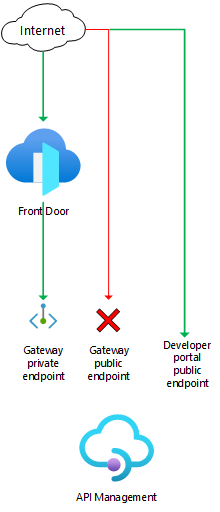

# Front Door Standard/Premium with API Management origin and private endpoint


[](https://portal.azure.com/#create/Microsoft.Template/uri/https%3A%2F%2Fraw.githubusercontent.com%2FAzure%2Fazure-quickstart-templates%2Fmaster%2Fquickstarts%2Fmicrosoft.cdn%2Ffront-door-premium-api-management-private-link%2Fazuredeploy.json)  [](http://armviz.io/#/?load=https%3A%2F%2Fraw.githubusercontent.com%2FAzure%2Fazure-quickstart-templates%2Fmaster%2Fquickstarts%2Fmicrosoft.cdn%2Ffront-door-premium-api-management-private-link%2Fazuredeploy.json)
[](http://armviz.io/#/?load=https%3A%2F%2Fraw.githubusercontent.com%2FAzure%2Fazure-quickstart-templates%2Fmaster%2Fquickstarts%2Fmicrosoft.cdn%2Ffront-door-premium-api-management-private-link%2Fazuredeploy.json)

This template deploys a Front Door Standard/Premium with an API Management origin, using a private endpoint to access the API Management gateway.

## Sample overview and deployed resources

This sample template creates an API Management instance and a Front Door profile, and uses a private endpoint (also known as Private Link) to access the API Management instance. The API Management instance has a public IP address associated with it, but API Management is configured to disallow public network access.

The following resources are deployed as part of the solution:

## API Management
- API Management instance with a sample API.
  - The API Management instance must use a [SKU that supports private endpoints](https://docs.microsoft.com/azure/api-management/private-endpoint).

Note that the API Management instance is deployed twice. The first time, it's deployed with public network access enabled. The second time, it's deployed with public network access disabled. This sequencing is required because API Management instances can't have public network access disabled at creation time, otherwise a deployment error occurs.

### Front Door Standard/Premium
- A Front Door profile.
  - This sample must be deployed using the premium Front Door SKU, since this is required for Private Link integration.
- A Front Door endpoint for the API Management proxy (gateway), which is configured with an origin group, origin, and route to direct traffic to the API Management gateway through Private Link.
- A Front Door endpoint for the API Management developer portal, which is configured with an origin group, origin, and route to direct traffic to the developer portal over the public internet.

The following diagram illustrates the components of this sample.



## Deployment steps

You can click the "deploy to Azure" button at the beginning of this document or follow the instructions for command line deployment using the scripts in the root of this repo.

## Usage

### Connect

Once you have deployed the Azure Resource Manager template, wait a few minutes before you attempt to access your Front Door endpoint to allow time for Front Door to propagate the settings throughout its network. You can then access the Front Door endpoints. The host names are emitted as an output from the deployment.

To access the API proxy URL, get the hostname from the output named `frontDoorEndpointApiManagementProxyHostName`. If you access this in a browser you should see a JSON response as follows:

```
{ "statusCode": 404, "message": "Resource not found" }
```

If you see an error page, wait a few minutes and try again.

You can also attempt to access the API Management gateway directly. The host name is is emitted using the `apiManagementProxyHostName` deployment output. Any connection attempts you make to these host names should receive an error message, since your API Management instance is blocking incoming requests to your API Management instance unless they come through Front Door.

You can access the developer portal by using the hostname specified in the `apiManagementPortalHostName` output value. Note the developer portal must be published before you can access it.

## Notes

- [The API Management support for Private Link is in preview.](https://docs.microsoft.com/azure/api-management/private-endpoint) Some limitations apply.
- The API Management developer portal does not work with Private Link and must be accessed by using its public endpoint.
