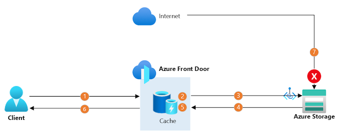

# Front Door Premium with blob origin and Private Link

  

This template deploys a Front Door Premium with an Azure Storage blob container origin, using a private endpoint to access the storage account.

## Architecture

The data flows through the solution are:

1. The client establishes a connection to Azure Front Door by using a custom domain name. The client's connection terminates at a nearby Front Door point of presence (PoP).
1. The Front Door web application firewall (WAF) scans the request. If the WAF determines the request's risk level is too high, it blocks the request and Front Door returns an HTTP 403 error response.
1. If the Front Door PoP's cache contains a valid response for this request, Front Door returns the response immediately.
1. Otherwise, the PoP sends the request to the origin storage account, wherever it is in the world, by using Microsoft's backbone network. The PoP connects to the storage account by using a separate, long-lived, TCP connection. In this scenario, Private Link is used to securely connect to the storage account.
1. The storage account sends a response to the Front Door PoP.
1. When the PoP receives the response, it stores it in its cache for subsequent requests.
1. The PoP returns the response to the client.
1. Any requests directly to the storage account through the internet are blocked by the Azure Storage firewall.

## Sample overview and deployed resources

This sample template creates an Azure Storage blob container and a Front Door profile, and uses a private endpoint (also known as Private Link) to access the storage account.

The following resources are deployed as part of the solution:

### Azure Storage

- Storage account, which is configured not to accept any traffic from the internet.
- Blob container.

### Front Door Premium

- Front Door profile, endpoint, custom domain, origin group, origin, route to direct traffic to the Azure Storage blob container, and security policy to link the endpoint to the WAF policy.
  - This sample must be deployed using the premium Front Door SKU, since this is required for Private Link integration.
- Front Door web application firewall (WAF) policy, which uses the default managed rule set.

## Deployment steps

You can click the "deploy to Azure" button at the beginning of this document or follow the instructions for command line deployment using the scripts in the root of this repo.

## Usage

### Approve custom domain

After you deploy the Azure Resource Manager template, you need to validate your ownership of the custom domain by updating your DNS server. You must create a TXT record with the name specified in the `customDomainValidationDnsTxtRecordName` deployment output, and use the value specified in the `customDomainValidationDnsTxtRecordValue` deployment output. You must the validation before the time specified in the `customDomainValidationExpiry` deployment output.

Front Door validates your domin ownership and updates the status automatically. You can monitor the validation process, or trigger an immediate validation, in the domain configuration in the Azure portal.

Next, you should configure your DNS server with a CNAME record to direct the traffic to Front Door. You must create a CNAME record at the host name you specified in the `customDomainName` deployment parameter, and use the value specified in the `frontDoorEndpointHostName` deployment output.

### Approve private endpoint connection

You need to approve the private endpoint connection to your storage account. This step is necessary because the private endpoint created by Front Door is deployed into a Microsoft-owned Azure subscription, and cross-subscription private endpoint connections require explicit approval. To approve the private endpoint:

1. Open the Azure portal and navigate to the storage account.
2. Click the **Networking** tab, and then click the **Private endpoint connections** tab.
3. Select the private endpoint that is awaiting approval, and click the **Approve** button. This can take a couple of minutes to complete.

After approving the private endpoint, wait a few minutes before you attempt to access your Front Door endpoint to allow time for Front Door to propagate the settings throughout its network.

### Access the storage account

You can then access the Front Door endpoint. The hostname is emitted as an output from the deployment - the output is named `frontDoorEndpointHostName`. You should see a page saying _The specified resource does not exist_. This is returned by Azure Storage because no files have been uploaded to the blob container and therefore there is no content to show yet. If you see a different error page, wait a few minutes and try again.

You can also attempt to access the Azure Storage blob hostname directly. The hostname is also emitted as an output from the deployment - the output is named `blobEndpointHostName`. You should see an error saying _This request is not authorized to perform this operation_ error, since your storage account is configured to not accepts requests that come from the internet.

`Tags: Microsoft.Resources/deployments, Microsoft.Storage/storageAccounts, Microsoft.Storage/storageAccounts/blobServices/containers, Microsoft.Cdn/profiles, Microsoft.Cdn/profiles/afdEndpoints, Microsoft.Cdn/profiles/originGroups, Microsoft.Cdn/profiles/originGroups/origins, Microsoft.Cdn/profiles/afdEndpoints/routes`
