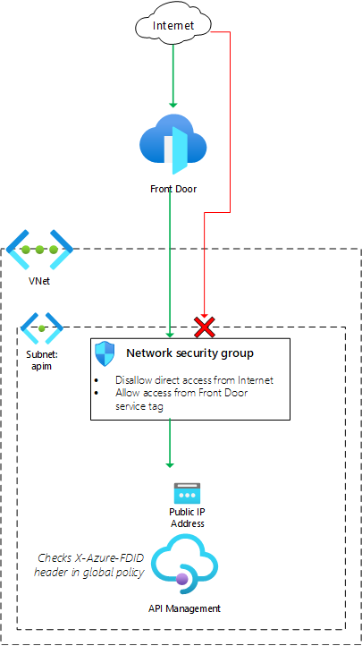

# Front Door Standard/Premium (Preview) with API Management origin


[](https://portal.azure.com/#create/Microsoft.Template/uri/https%3A%2F%2Fraw.githubusercontent.com%2FAzure%2Fazure-quickstart-templates%2Fmaster%2Fquickstarts%2Fmicrosoft.network%2Ffront-door-standard-premium-api-management-external%2Fazuredeploy.json)  [](http://armviz.io/#/?load=https%3A%2F%2Fraw.githubusercontent.com%2FAzure%2Fazure-quickstart-templates%2Fmaster%2Fquickstarts%2Fmicrosoft.network%2Ffront-door-standard-premium-api-management-external%2Fazuredeploy.json)
[](http://armviz.io/#/?load=https%3A%2F%2Fraw.githubusercontent.com%2FAzure%2Fazure-quickstart-templates%2Fmaster%2Fquickstarts%2Fmicrosoft.network%2Ffront-door-standard-premium-api-management-external%2Fazuredeploy.json)

This template deploys a Front Door Standard/Premium (Preview) with an API Management origin, using [external VNet connectivity for the API Management instance](https://docs.microsoft.com/azure/api-management/api-management-using-with-vnet).

## Sample overview and deployed resources

This sample template creates an API Management instance and a Front Door profile. The API Management instance has a public IP address associated with it, but a network security group is used to ensure that incoming connections to your APIs must come through Front Door. An API Management policy is used to verify that the traffic has come specifically from _your_ Front Door instance.

The following resources are deployed as part of the solution:

## Networking
- Virtual network, with one subnet (`ApiManagement`).
- Network security group (NSG) that will block traffic that does not flow through Front Door. It uses the Front Door service tag to identify valid traffic. The NSG also allows the API Management instance to send its own management traffic; [these rules are required for API Management to work correctly](https://docs.microsoft.com/azure/api-management/api-management-using-with-vnet#-common-network-configuration-issues).

## API Management
- API Management instance with a sample API. This must be deployed using either the premium or developer SKU types, since virtual network integration in API Management requires one of these SKUs. The API Management instance is deployed with an external network, which means it has a public IP address. However, the NSG is configured to block access to this public IP address for incoming traffic that hasn't come through Front Door.
- API Management named value, which is used as a configuration store to note the Front Door's ID.
- API Management global policy, which will inspect headers for all incoming API requests and reject the request if the `X-Azure-FDID` header does not match the expected Front Door ID as set in the named value.

### Front Door Standard/Premium (Preview)
- A Front Door profile with two endpoints - one for the API Management proxy, and another for the developer portal. Each endpoint is configured with an origin group, origin, and route to direct traffic to the API Management gateway.
  - Note that you can use either the standard or premium Front Door SKU for this sample. By default, the standard SKU is used.

The following diagram illustrates the components of this sample.



## Deployment steps

You can click the "deploy to Azure" button at the beginning of this document or follow the instructions for command line deployment using the scripts in the root of this repo.

## Usage

### Connect

Once you have deployed the Azure Resource Manager template, wait a few minutes before you attempt to access your Front Door endpoint to allow time for Front Door to propagate the settings throughout its network. You can then access the Front Door endpoints. The host names are emitted as an output from the deployment.

To access the API proxy URL, get the hostname from the output named `frontDoorEndpointApiManagementProxyHostName`. If you access this in a browser you should see a JSON response as follows:

```
{ "statusCode": 404, "message": "Resource not found" }
```

If you see an error page, wait a few minutes and try again.

The developer portal will not be accessible unless you configure custom domain names in both API Management and Front Door. This is due to the way the API Management developer portal is designed.

You can also attempt to access the API Management instance directly. The host names are also emitted as an output from the deployment - the outputs are named `apiManagementProxyHostName` and `apiManagementPortalHostName`. Any connection attempts you make to these host names should time out, since your network security group is blocking incoming requests to your API Management instance unless they come through Front Door.

## Notes

- Front Door Standard/Premium is currently in preview.
- Front Door Standard/Premium is not currently available in the US Government regions.
- The API Management developer portal will not be able to used correctly unless you add a custom domain name. This needs to be added to both the API Management instance and to the Front Door endpoint.
