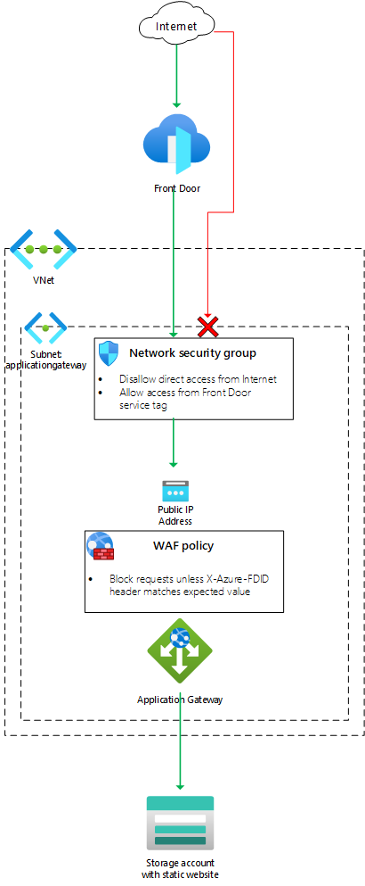

# Front Door Standard/Premium (Preview) with Application Gateway origin

  

This template deploys a Front Door Standard/Premium (Preview) with an Application Gateway origin, using the Application Gateway's public endpoint.

## Sample overview and deployed resources

This sample template creates an Application Gateway instance and a Front Door profile. To keep the sample simple, the Application Gateway instance is configured to direct traffic to a static website configured as a backend, but this could be [any backend supported by Application Gateway](https://docs.microsoft.com/azure/application-gateway/application-gateway-components#backend-pools). The Application Gateway instance has a public IP address associated with it, but a network security group is used to ensure that incoming connections to your system must come through Front Door. The Application Gateway WAF is used to verify that the traffic has come specifically from your Front Door instance.

The following resources are deployed as part of the solution:

## Networking
- Virtual network, with one subnet (`ApplicationGateway`).
- Network security group (NSG) that will block traffic that does not flow through Front Door. It uses the Front Door service tag to identify valid traffic.

## Application Gateway
- WAF policy. This includes a mandatory managed ruleset, and a custom rule to inspect the `X-Azure-FDID` header and confirm it matches the value of the Front Door profile's ID.
- Application Gateway instance, deployed using the `WAF_v2` SKU. This is required to be able to inspect the `X-Azure-FDID` header.

### Front Door Standard/Premium (Preview)
- Front Door profile, endpoint, origin group, origin, and route to direct traffic to the Application Gateway instance.
  - Note that you can use either the standard or premium Front Door SKU for this sample. By default, the standard SKU is used.

The following diagram illustrates the components of this sample.

## Deployment steps

You can click the "deploy to Azure" button at the beginning of this document or follow the instructions for command line deployment using the scripts in the root of this repo.

## Usage

### Connect

Once you have deployed the Azure Resource Manager template, wait a few minutes before you attempt to access your Front Door endpoint to allow time for Front Door to propagate the settings throughout its network.

You can then access the Front Door endpoint. The hostname is emitted as an output from the deployment - the output is named `frontDoorEndpointHostName`. You should see a page saying _Welcome_. If you see a different error page, wait a few minutes and try again.

You can also attempt to access the Application Gateway hostname directly. The hostname is also emitted as an output from the deployment - the output is named `applicationGatewayHostName`. Any connection attempts you make to this hostname should time out, since your network security group is blocking incoming requests to your Application Gateway instance unless they come through Front Door.

## Notes

- Front Door Standard/Premium is currently in preview.
- Front Door Standard/Premium is not currently available in the US Government regions.
- For simplicity, this sample does not follow best practices around end-to-end HTTPS. The sample is configured as follows:
  - Front Door requires HTTPS connections to the Front Door endpoint, and HTTP connections are automatically redirected to HTTPS.
  - When Front Door sends requests to Application Gateway, it does so using HTTP and not HTTPS. This is to avoid configuring TLS certificates on Application Gateway.
  - When Application Gateway sends requests to the backend, it also does so using HTTP.
  - **You should configure your environment to use HTTPS for all connections before using this sample in a production environment.**
- This sample uses a WAF policy for Application Gateway. WAF policies for Application Gateway require that a managed rule set is applied, so the OWASP version 3.1 rule set is applied.
