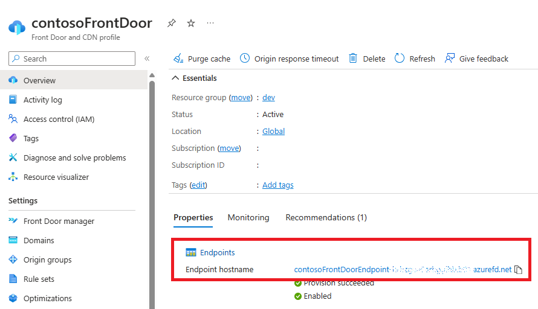
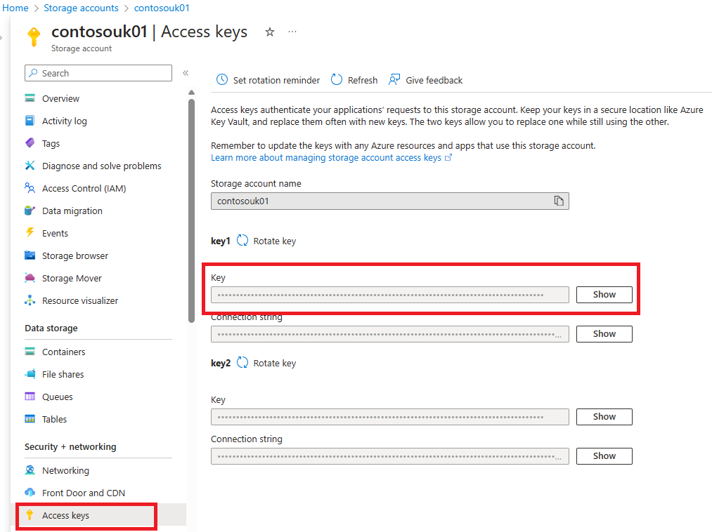

# Front Door with blob origins for blobs upload


This template creates a Front Door with origins, routes and ruleSets, and an Azure Storage accounts with blob containers. Front Door sends traffic to the storage accounts when uploading files.

## Architecture


### Dataflow

Data flows through the scenario as follows:

1. The client app will call a web-based API and retrieve a list of multiple upload locations. For each file that the client uploads, the API generates a list of possible upload locations, with one in each of the existing storage accounts. Each URL contains a Shared Access Signature, ensuring that the URL can only be used to upload to the designated blob URL.
2. The client app attempts to upload a blob using first URL from the list returned by API. The client establishes a secure connection to Azure Front Door by using a custom domain name and custom TLS certificate.
3. The Front Door web application firewall (WAF) scans the request. If the WAF determines the request's risk level is too high, it blocks the request and Front Door returns an HTTP 403 error response. Otherwise the request is routed to the desired storage account.
4. File is uploaded into Azure Storage account. If this request fails, the client app will have to try to upload to an alternative storage account using next URL from the list returned by API.
5. The client app notifies API that the file was uploaded
6. API puts an item on Service Bus queue for further processing of uploaded file. 

## Sample overview and deployed resources

This sample template creates an Azure Front Door profile with endpoint using *main.bicep* script.  
Azure Storage blob container and a Front Door origin with route and ruleSet are created using *storageAndorigin.bicep* script.

The following resources are deployed as part of the solution:

### Front Door Standard or Premium

- Front Door profile, endpoint, origin group, origin, route to direct traffic to the Azure Storage blob containers, rule set to rewrite URLs, and security policy to link the endpoint to the WAF policy.
- Front Door web application firewall (WAF) policy, which uses the default managed rule set. (This requires Front Door Premium sku).

### Azure Storage

- Storage account.
- Blob container.

## Deployment steps

Execute *main.bicep* to deploy Front Door profile and endpoint. The script is expecting input for profile name and endpoint name:

`az deployment group create --resource-group dev --template-file .\main.bicep`

`Please provide string value for 'profileName' (? for help): contosoFrontDoor`

`Please provide string value for 'endpointName' (? for help): contosoFrontDoorEndpoint`

`Please provide string value for 'skuName' (? for help):` 

 `[1] Standard_AzureFrontDoor`

 `[2] Premium_AzureFrontDoor`

`Please enter a choice [Default choice(1)]: 2`

Execute *storageAndorigin.bicep* to deploy storage account and origin group configurations. The script is expecting input for Front Door profile name and endpoint name (use the same values as you used for running *main.bicep*). You must also supply location in which storage account will be deployed:

`az deployment group create --resource-group dev --template-file .\storageAndorigin.bicep`
`Please provide string value for 'location' (? for help): uksouth`
`Please provide string value for 'storageAccountName' (? for help): contosouk01`
`Please provide string value for 'storageBlobContainerName' (? for help): uploadcontainer`
`Please provide string value for 'frontDoorName' (? for help): contosoFrontDoor`
`Please provide string value for 'endpointName' (? for help): contosoFrontDoorEndpoint`
`Please provide string value for 'originGroupName' (? for help): contosoUK01`

To see full list of available location names use this command: `az account list-locations -o table`

To provision more storage accounts and origin groups, run *storageAndorigin.bicep* again

## Usage

### Upload blobs into the storage account

#### Identify Front Door hostname

First, identity the hostname of the Front Door endpoint. You can then access the Front Door endpoint. The hostname is emitted as an output from the deployment - the output is named `frontDoorEndpointHostName`.  You can also locate it via Azure portal:

Go to "Overview", "Properties", "Endpoints":



#### Retrieve storage account access key

Next, retrieve storage account access key. Access key will allow to generate Shared Access Signatures for uploading the files into blob container.

This can be done via Azure portal by going into "Security + networking: Access Keys" : 



#### Upload blob into container through Front Door URL

To upload files to Azure Blob storage the URL is contracted as the following:

https://contosoFrontDoorEndpoint-XXXXXX.azurefd.net/**contosoUK01**/**[blob name]**

Note, that the URL doesn't contain name of the container in it. It is due to Front Door configuration which routes requests to desired container.

The following C# code can be used on backend / API to generate SAS signatures for uploading a file into blob container.

Replace the FrontDoorName, ShardName, AccountName, AccountKey and container name with the parameters you provided when executing  *storageAndorigin.bicep* :

```c#
// the server side

var storageAccounts = new[] {
    new {
        FrontDoorName = "https://contosoFrontDoorEndpoint-XXXXXX.azurefd.net/",
        ShardName = "contosoUK01",
        AccountName = "contosoUK01",
        AccountKey = "00000000000000000000000000000000000000000000000000000000000000000000000000000000000000==",
        ContainerName = "uploadcontainer"
    }
};


IEnumerable<(Uri BlobUri, string SharedAccessSignature)> serverAPIgetUploadAddresses(string blobName, string userId)
{
    var locations = storageAccounts.Select(x =>
    {
        Uri blobUri = new($"https://{x.FrontDoorName}/{x.ShardName}/{blobName}");

    var sas = new BlobSasBuilder(
        permissions: BlobSasPermissions.Write | BlobSasPermissions.Create,
        expiresOn: DateTimeOffset.UtcNow.AddHours(1))
    {
        BlobContainerName = x.ContainerName,
        BlobName = blobName,
        Resource = "b",
    }.ToSasQueryParameters(sharedKeyCredential: new StorageSharedKeyCredential(
            accountName: x.AccountName,
            accountKey: x.AccountKey))
        .ToString();

    return (blobUri, sas);
}).ToArray();
// Here we derive a shard key from the user ID.
//
// So some users will get the sequence
// [ 0, 1, 2, 3, 4, 5, 6, 7, 8, 9 ], while others get
// [ 3, 4, 5, 6, 7, 8, 9, 0, 1, 2 ] or
// [ 4, 5, 6, 7, 8, 9, 0, 1, 2, 3 ].
//
// This way we can distribute the load across all storage accounts.
//
var startShard = userId.GetHashCode() % storageAccounts.Length;
return locations.Skip(startShard).Concat(locations.Take(startShard));
}
```

After client recieves upload URLs from backend, it can start trying to upload blob. If the first attempt fails to upload, the client will attempt to upload the file using the next URL provided by backend API:

```c#
// the client side

var blobNameToUpload = "testblob.txt";
var userId = "user1";

foreach (var (blobUri, sharedAccessSignature) in serverAPIgetUploadAddresses(blobNameToUpload, userId))
{
    Console.WriteLine($"{blobUri}?{sharedAccessSignature}");
    try
    {
        var blobClient = new BlobClient(blobUri, credential: new AzureSasCredential(sharedAccessSignature));
        using Stream fs = new MemoryStream(Encoding.UTF8.GetBytes("Hello"));
        blobClient.Upload(fs);
       
        break; // Now that we successfully uploaded, we can break off the loop and ignore the rest of the locations
    }
    catch (Exception ex)
    {
        Console.Error.WriteLine($"Upload to {blobUri}?{sharedAccessSignature} failed, trying the next one...");
        Console.Error.WriteLine(ex.Message);
    }
}
`Tags: `