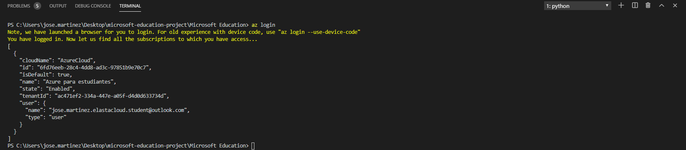
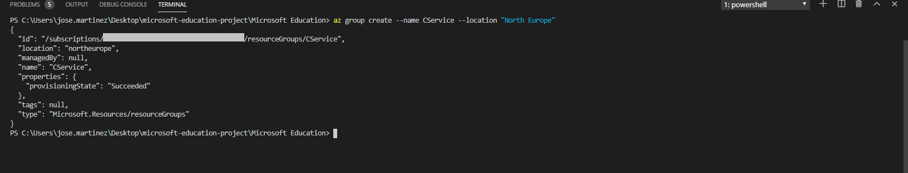
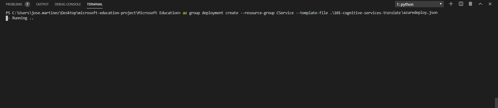
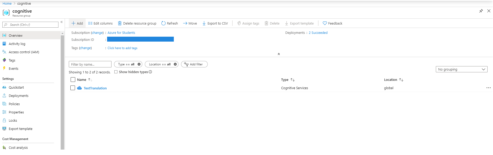
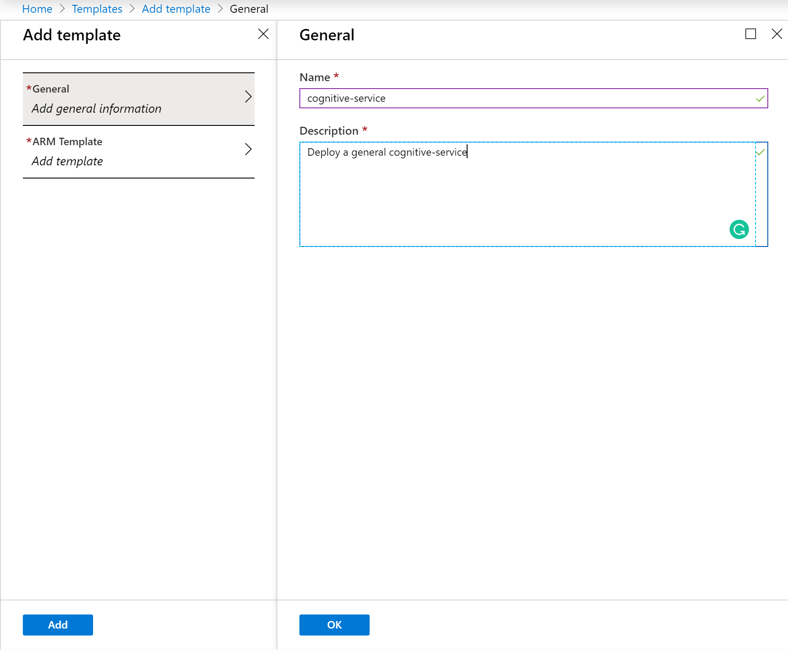
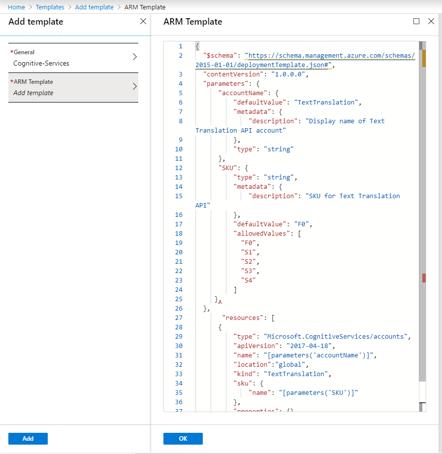
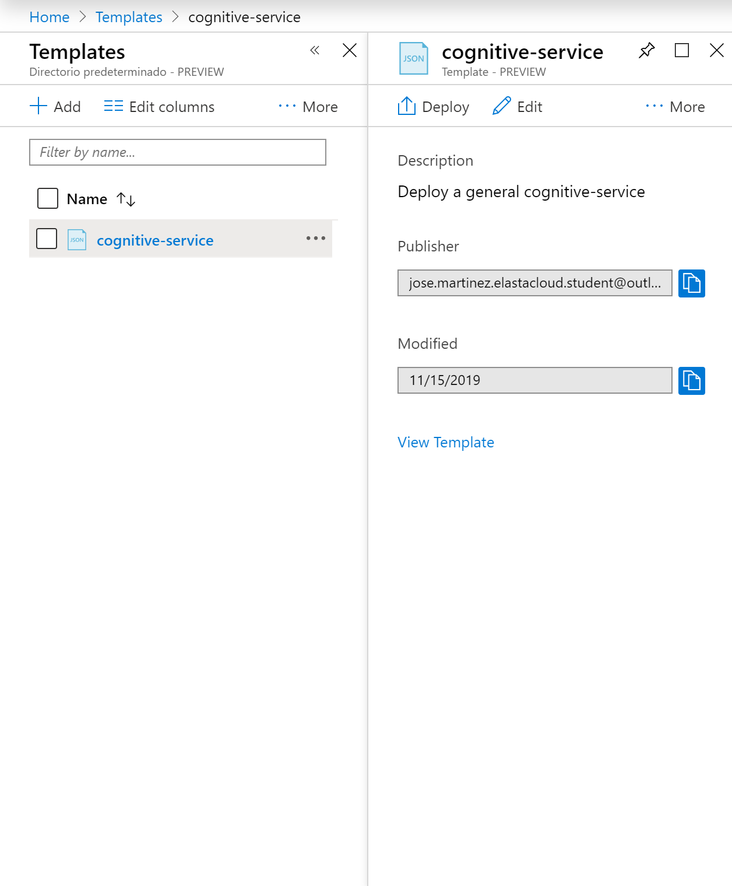
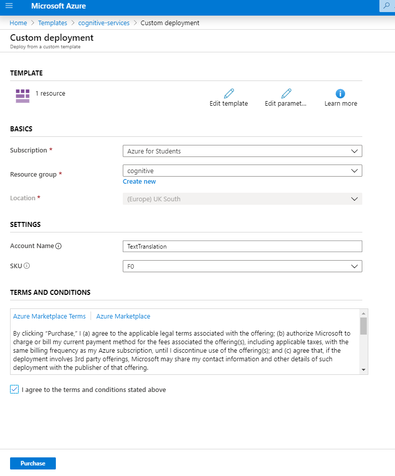

# Azure AI Translator service

The purpose of this ARM Template is **deploy an Azure AI Translator resource**.

Let's understand a bit better how all this work.

## Overview
Azure AI services help developers and organizations rapidly create intelligent, cutting-edge, market-ready, and responsible applications with out-of-the-box and prebuilt and customizable APIs and models. Example applications include natural language processing for conversations, search, monitoring, translation, speech, vision, and decision-making.

## Pre Deployment Steps

Before processing to the deployment of the template, we need to perform the following steps.

### The template

Don't let the size of the template scare you. The structure is very intuitive and once that you get the gist of it, you will see how easier your life will be regarding deploying resources to Azure.

Those are the parameters on the template. Some of them are already with the values, the ones that you need to inform are **aiServicesName** and the **SKU** in case that need a powerful service.

Parameter         | Suggested value     | Description
:--------------- |:-------------      |:---------------------
**aiServicesName** |*location*-*name*-*environment* i.e.:  uks-name-tst  | A globally unique name for the Azure AI Translator resource. There is a 35 character limit to this field.
**location**| The default location | Select the geographic location for your resource group.
**Resource group**| Your resource group name |  That is the resource group that you need to deploy your resources.
**sku**| S0  |  Sku is an identifier for the product that we need. F0 is for the most basic characteristics.

## Deployment

There are a few ways to deploy this template.
You can use [PowerShell](https://learn.microsoft.com/azure/azure-resource-manager/resource-group-template-deploy), [Azure CLI](https://learn.microsoft.com/azure/azure-resource-manager/resource-group-template-deploy-cli), [Azure Portal](https://learn.microsoft.com/azure/azure-resource-manager/resource-group-template-deploy-portal) or your favorite SDK.

For Azure CLI I'm using the Visual Code with Azure CLI extensions, if you like, you can find more information [here](https://code.visualstudio.com/docs/azure/extensions). But bare in mind that you don't need to use the Visual Code, you can stick with the old good always present **Command Line** on Windows or any **bash terminal**

### Using Azure CLI with Visual Code

Type on the terminal window: **az login**

You will be redirected to the Azure Portal where you can insert your credentials and log in.

After logged in, you will see your credentials on the terminal.

To set the right subscription, type following command:

#### az account set --subscription "your subscription id"

### Resource group

Now you need a resource group for our deployment. If you haven't yet created a resource group, you can do it now. If you are new on Azure and wonder what is a resource group? A resource group is a container that holds related resources for an Azure solution. The resource group includes those resources that you want to manage as a group. Simply saying, it's like a folder that contains files. Simple as that.

To create a resource group, you need a name and a location for your resource group.

For a list of locations, type: **az account list-locations**

To create the resource group, type the command:

#### az group create --name "resource-group" --location "your location"

Super simple, right? Now that we have our resource group created, let's deploy the Azure AI Translator resource.

Go grab a cup of coffee, have some fresh air. Before you come back you will have your resource.

Let's check the resource on the [Azure Portal](https://portal.azure.com).

On the portal, go to resource groups. In this blade, you can see the resource group that you created.

Click on the resource group and there it's the resources

Congratulations! You have deployed the template successfully.

### Using the Portal

At the Portal, in All Services look for **Templates**, you can favourite this service.

Click in **Add** to add your template:

On General, type the name and the description for your template, and click on [ok].

On ARM Template, replace the content of the template with your template, and click on [OK] and then on [Add].

Click on the refresh button and you will find your template. Click on it and then click in [Deploy].

On the screen Custom Deployment, inform the values for the parameters, by now you must be already familiar with.

Select [Agree] and click on [Purchase].

As you can see, it's deploying.

After a couple of minutes your Azure AI services resource is deployed.

Go to the resource. Repeat the test that you have done before.

Pretty easy to create resources on Azure, right? But if you love automation, just select the button below and it will automatically deploy the VM through the Azure portal.

### How to delete your resources

You pay for the resources that you use. So, if you're not using the Azure AI services, you can delete the resource in the portal to avoid unnecessary charges. You can even delete the resource group you have created to delete all resources in the group.

1. In the Azure portal, expand the menu on the left side to open the menu of services, and choose resource groups to display the list of your resource groups.
2. Locate the resource group containing the resource to be deleted.
3. If you want to delete the entire resource group, select the resource group name. On the next page, Select Delete resource group, and confirm.
4. If you want to delete only the Azure AI services resource, select the resource group to see all the resources within it. On the next page, select the resource that you want to delete, select the ellipsis menu for that row, and select Delete.
