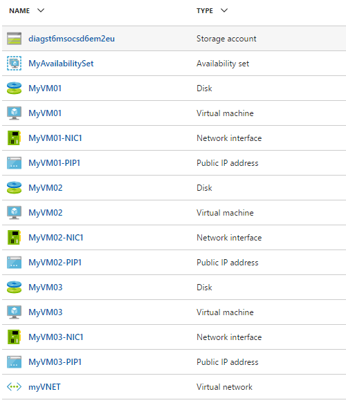

# Multi VM Template with Managed Disk 

This template will provision N number of virtual machines with your choice in a single VNET. Every VM will be provisioned with a Network Interface and a Public IP resource. All the VMs will be provisioned in a single Availability Set. A single storage account will be provisioned to store the diagnostic information.
If you provision 3 VM’s with this template, your resources will look like below in the resource group.

`Tags: Managed Disks, Azure VMs, Copy Index, Microsoft.Network/networkSecurityGroups, Microsoft.Network/virtualNetworks, Microsoft.Storage/storageAccounts, Microsoft.Compute/availabilitySets, Microsoft.Compute/virtualMachines, Microsoft.Network/networkInterfaces, Microsoft.Network/publicIPAddresses`

