# JupyterHub Server Linux Ubuntu 18.04-LTS Classroom Deployment

The purpose of this ARM Template is to deploy a **Jupyter Server using an Ubuntu Virtual Machine** inserting a few parameters.

## The Template

Don't let the size of the template scares you. The structure is very intuitive and once that you get the gist of it, you will see how easier your life will be regarding deploying resources to Azure.

Those are the parameters on the template, most of them are already with the values, the ones that you need to inform are: **adminUsername**, **adminPassword**, **resourceGroup** and select between **CPU or GPU based virtual machine**. All the other parameters will be already informed.

Don't worry about changing anything on the file, either on the portal or using Azure CLI, you need to inform just the following parameters.

- *adminUsername:* Usernames can be a maximum of 20 characters and cannot end in a period (".").

- *adminPassword:* Password requirements between 12 to 72 characters and have lower and upper characters, a digit and a special character (Regex match [\W_])

- *resourceGroup:* The Resource Group that will have your deployment. We go in detail in the next section.

- *Location:* this is the Azure region where you want all your resources to be (e.g. WestEurope, you can check all the available regions here)

- *Virtual Machine Name:* the name for your virtual machine

- *Virtual Machine Size:* this will be determined by the workload. You can check the list of available VM sizes here

- *Admin UserName:* this will be the root user and is needed for the management of your TLJH

- *Admin password:* choose a secure password for your root user

- *OS Disk Type:* you have the options Standard HDD (LRS), Standard SSD and Premium SSD (for more details see the docs)

- *Data Disk Size:* the size of your Data disk size (for more details visit the docs)

Let's rock with the Deployment.  

## Deployment

There are a few ways to deploy your template.
You can use [PowerShell](https://docs.microsoft.com/en-us/azure/azure-resource-manager/resource-group-template-deploy), [Azure CLI](https://docs.microsoft.com/en-us/azure/azure-resource-manager/resource-group-template-deploy-cli), [Azure Portal](https://docs.microsoft.com/en-us/azure/azure-resource-manager/resource-group-template-deploy-portal) or your favorite SDK.

For this task, we going to deploy using Visual Code and the portal and a little surprise for you at the end. :D

For Azure CLI I choose to use the Visual Code with Azure CLI extensions, if you like, you can find more information [here](https://code.visualstudio.com/docs/azure/extensions). But bare in mind that you don't need to use the Visual Code, you can stick with the old good always present **Command Line** on Windows or any **bash terminal**.

### Using Azure CLI with Visual Code

type on the terminal window: **az login**

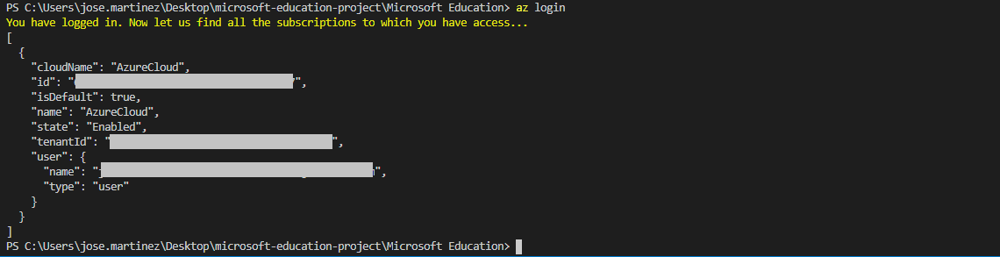

You will be redirected to the Azure Portal where you can insert your credentials and log in.

After logged in, you will see your credentials on the terminal.

To set the right subscription, type following command:

#### az account set --subscription "your subscription id"

### Resource Group

Now you need a Resource Group for our deployment. If you haven't yet created a Resource Group, you can do it now. If you are new on Azure and wonder what is a Resource Group? Bare with me! A Resource Group is a container that holds related resources for an Azure solution. The resource group includes those resources that you want to manage as a group. Simply saying, it's like a folder that contains files. Simple as that.

To create a Resource Group, you need a name and a location for your Resource Group.

For a list of locations, type: **az account list-locations**

To create the Resource group, type the command:

#### az group create --name "resource-group" --location "your location"

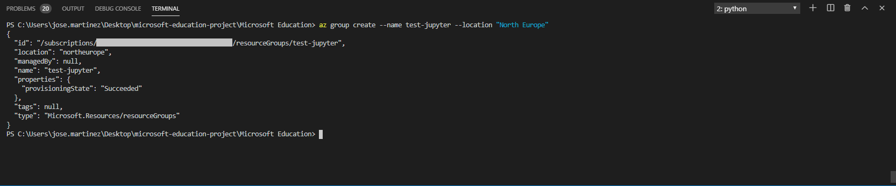

Super simple, right? Now that you have your **Resource Group** created, let's deploy the Virtual Machine.

#### az group deployment create --resource-group "resource-group" --template-file "path file"

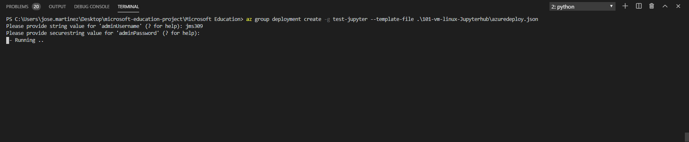

As you can see, it's running. Go grab a cup of coffee, have some fresh air and I'm sure that before you come back you will have your Virtual Machine ready.

And there we go, the deployment is succeeded:

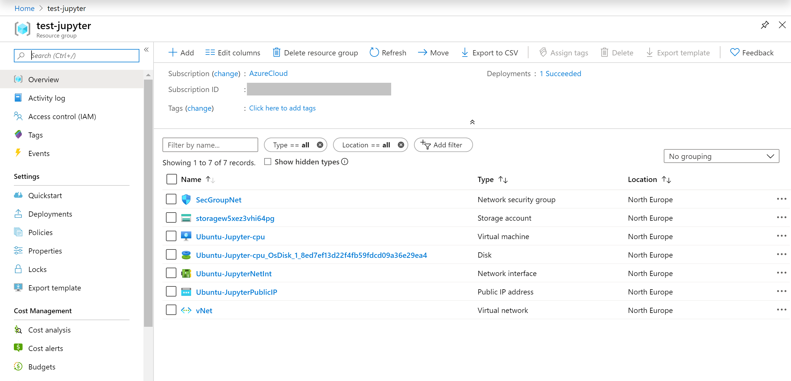

### Using the Portal

At the Portal, in All Services look for **Templates**, you can favourite this service.

Click in **Add** to add your template. On General, type a name and a description for your template, and click on [OK].

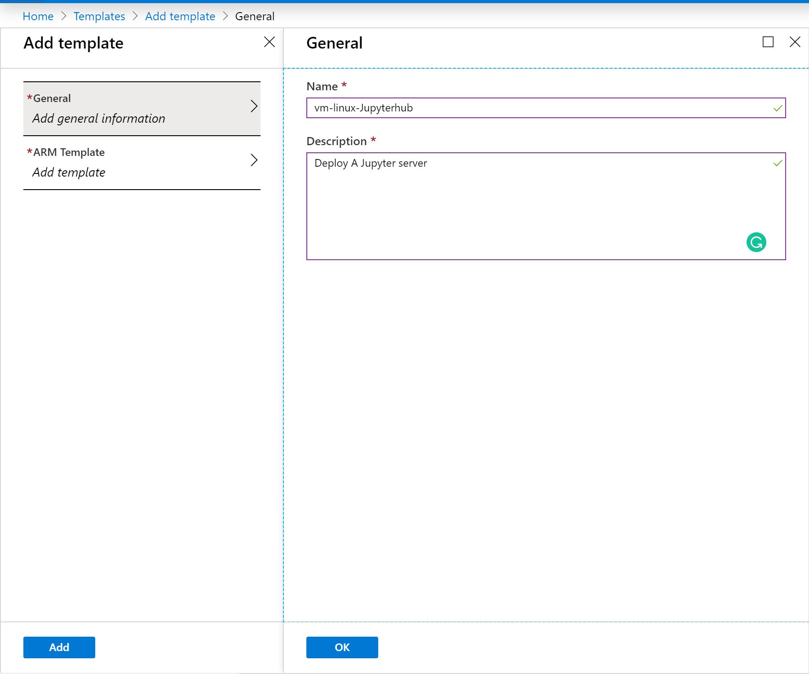

On ARM Template, replace the contents of the template with your template, and click on [OK].

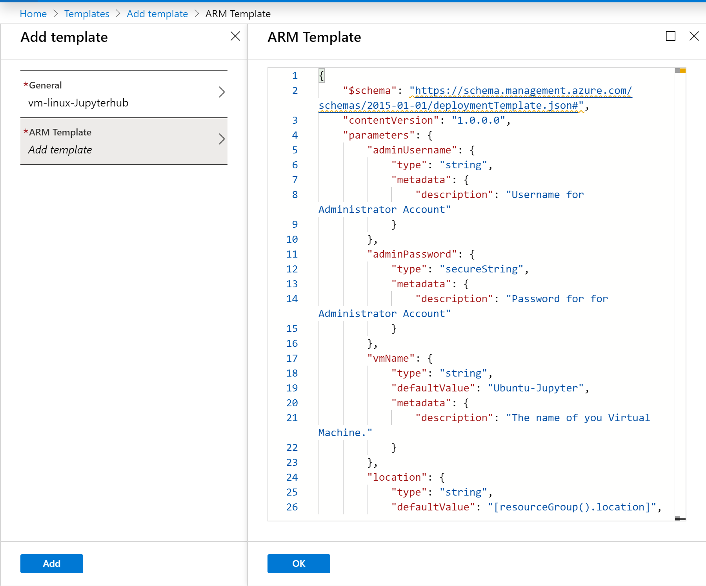

Click on the refresh button and there is your template:

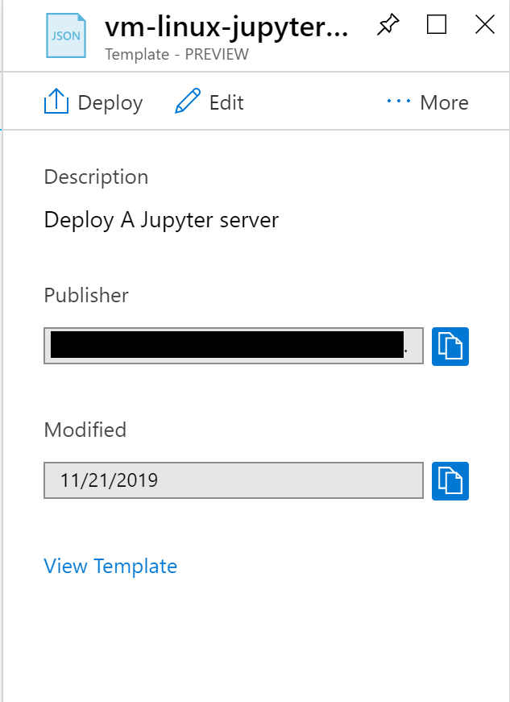

Open the template and click in [Deploy]

On the screen Custom Deployment, insert the information that you must be already familiar with.

Select [I agree] and click on [Purchase].

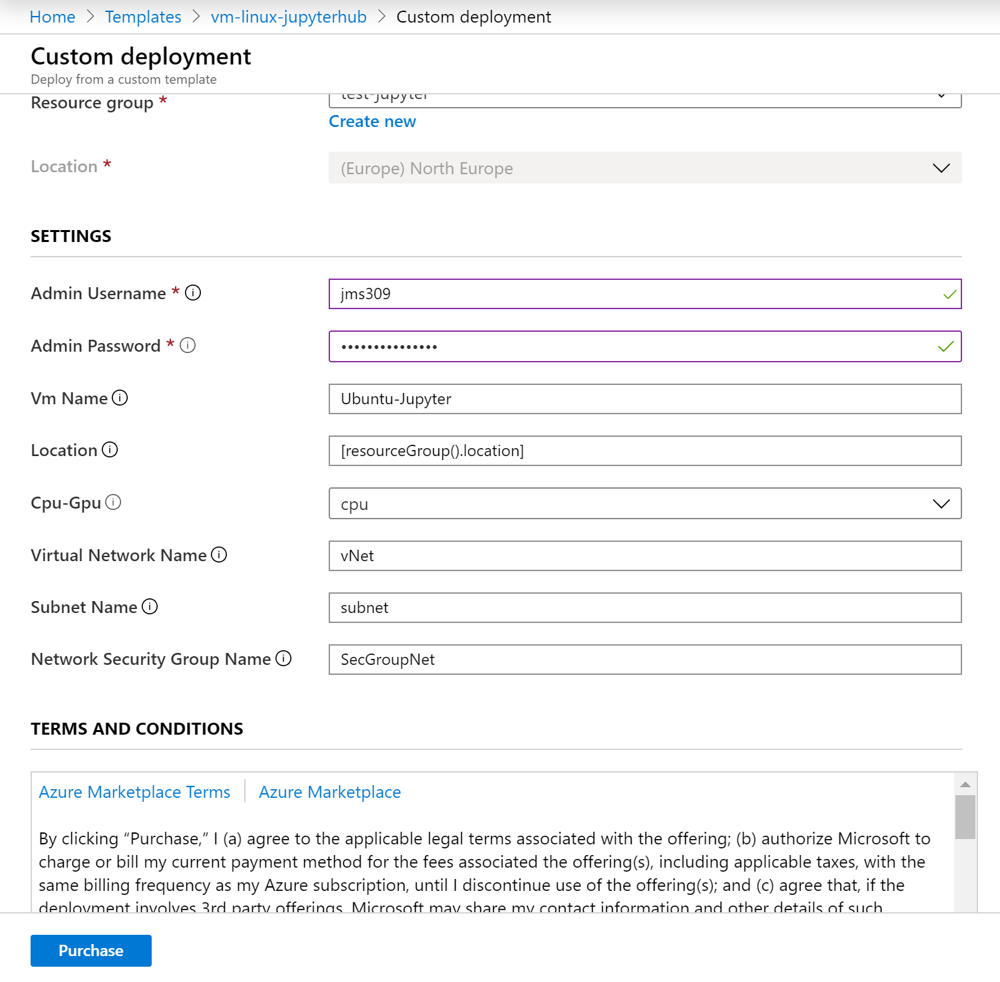

And voilà, you have your new VM deployed.

**p.s.: Pretty easy to create resources on Azure, right? But if you are the sort of IT guy that always loves automation, here is the surprise. Just click on the button below and it will automatically deploy the VM through the  Azure Portal.**

#### Important disclaimer: Azure charges you for the resources you are using, and you don't want to finish all your credits immediately, right? So, for not running out of credit, don't forget to stop the VM at the portal or even delete the Resource Group you create to avoid any unnecessary charges

## Usage

Before start using the Jupyter Server, you will need to think about how many users will connect to the VM.

The virtual machine can be scaled up depending on your subscription to a larger machine if you need it.

It is recommended 1 GB of memory per user if you are using a CPU based VM and 2 GB of memory per user if you are using a GPU based virtual machine.

i.e. if you want a CPU based VM to be used by 8 users, you will need a VM with 8 GB of memory.

### Connect

To connect with our JupyterHub, you will need to copy the Public IP address of your virtual machine, and trying to access it with a browser.

Note that accessing the JupyterHub will fail until the installation is complete, so if you just created it, be patient.

When the installation is complete, it should give you a JupyterHub login page:

Login using the admin username you typed at the time of creating the virtual machine and the password.

### Post Deployment Steps

To set up our connection via HTTPS, you will need to type some commands into the Linux Shell Script of the virtual machine.
Let's go to the resource, and enter on the **Run command** section.

Now, click on the [RunShellScript] button. You will need to introduce the next commands to configure the HTTPS.

**sudo tljh-config set https.enabled true**
**sudo tljh-config set https.letsencrypt.email <you@example.com>**
**sudo tljh-config add-item https.letsencrypt.domains <domain.PublicIP>**
**sudo tljh-config reload proxy**

Where **you@example.com** is your email address and **domain.PublicIP** is the domain where your hub will be running.
Here is an example of how it should look like:

After that, let's press the [Run] button. If we visit our **public IP** where our Jupyter-Hub is been running, we will see something like that:

### Adding more users

Let's add a few users who can log in! First, open the control panel by clicking the control panel button on the top right:

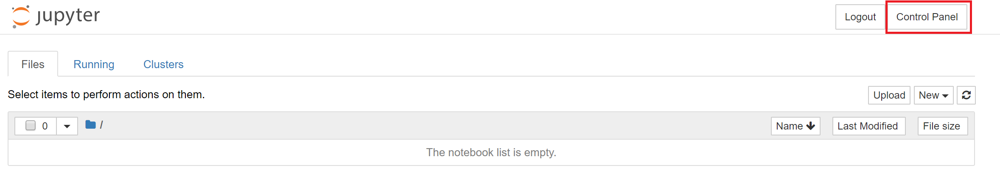

Now, in the control panel, open de **Admin** link in the top left:

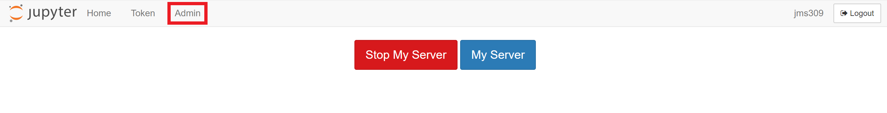

Click the **Add users** button and type the username of the users. They will be able to set their password when they log in for the first time.

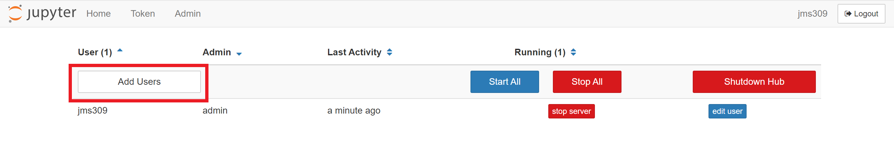

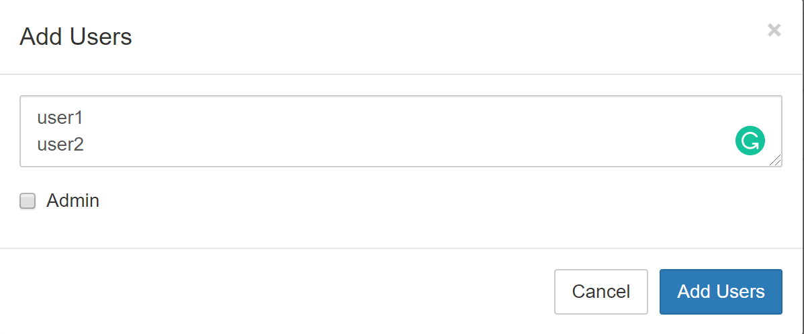

### Installing packages for all users

The **User Environment** is a conda environment that is shared by all users in the JupyterHub. Libraries installed in this environment are immediately available to all users. Admin users can install packages in this environment with **sudo -E**.

With a user admin, open a **Terminal** in the Jupyter Notebook.

Let's install gdal from conda-forge with the next command:

**sudo -E conda install -c conda-forge gdal**

Now, let's install there with pip:

**sudo -E pip install there**

Now, these two packages are available to all users in JupyterHub.

### How to remove your resources

#### Using the portal

On the portal, open your Resource Group, if you will not use the service or VM anymore, you can just click on the [Delete] Button.

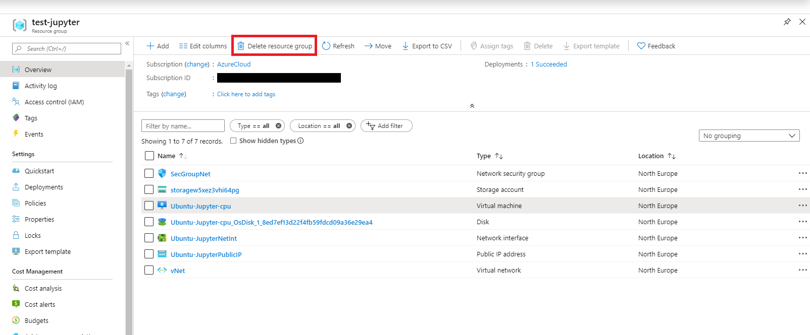

You can also just stop the service or the Virtual Machine in case you need the resource. Open the resource and click on Stop.

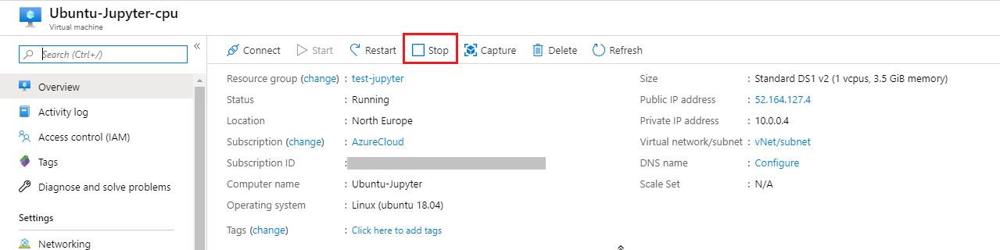

Just refresh your screen and you are good to go.
