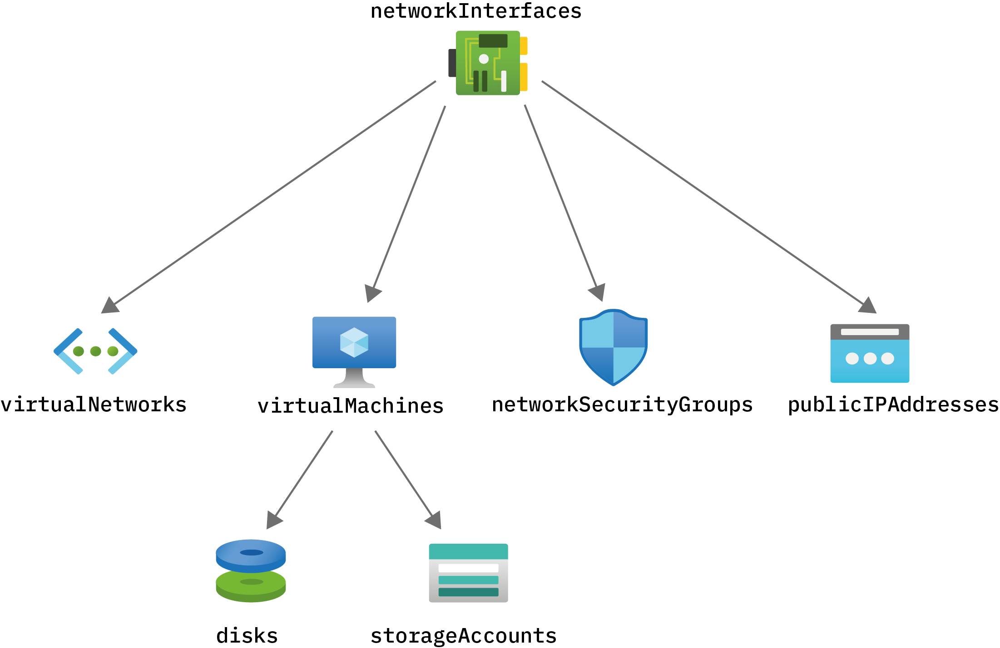
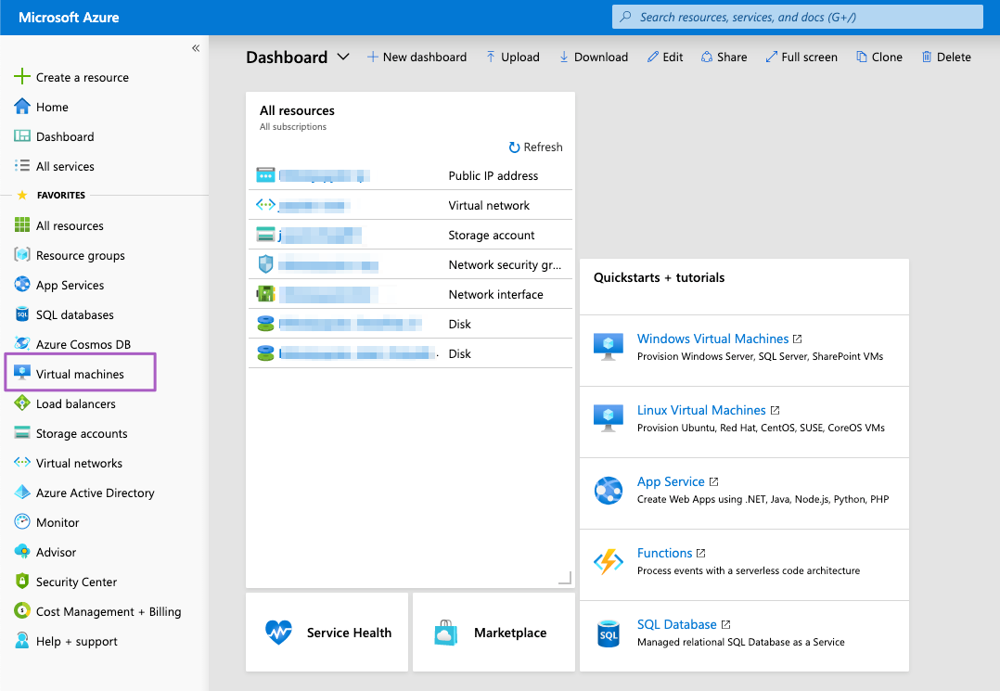
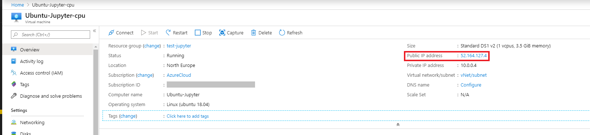
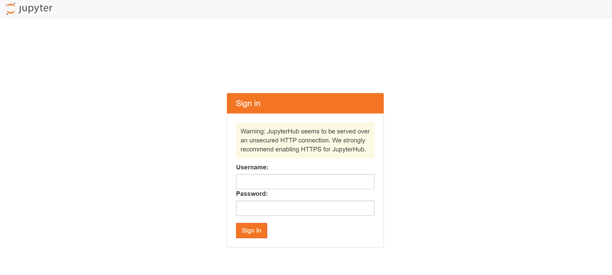
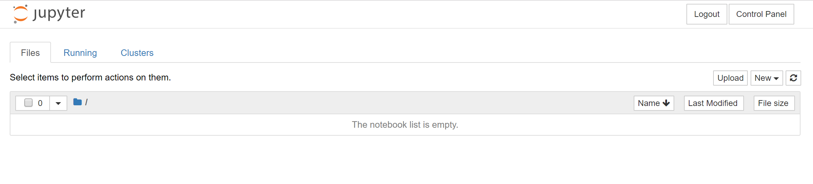
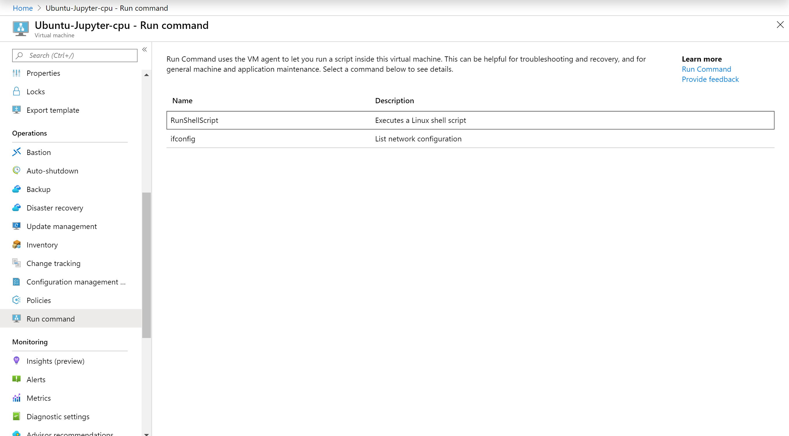
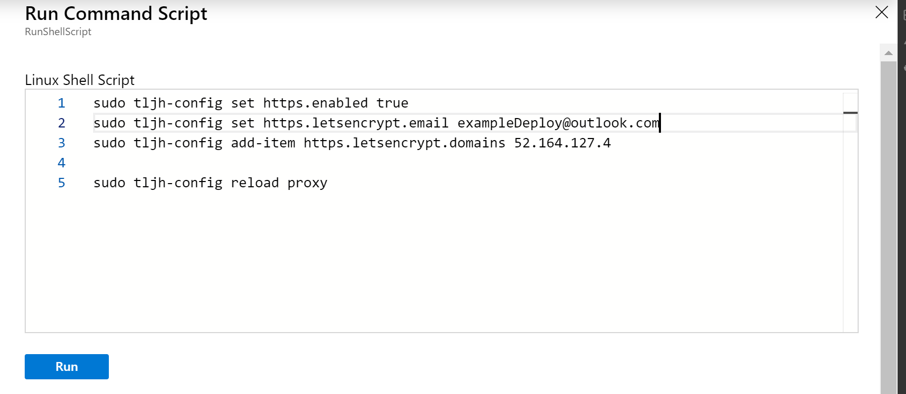
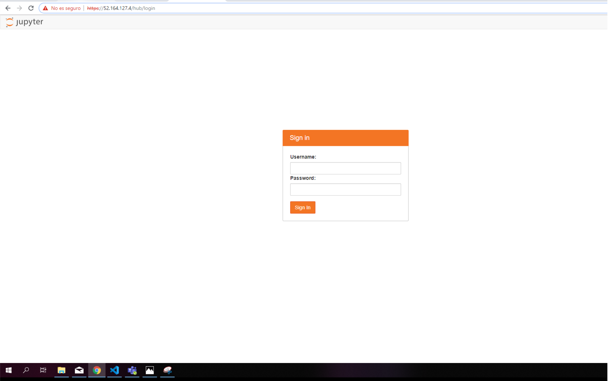

# JupyterHub Classroom Server Linux Ubuntu 18.04-LTS


[](https://portal.azure.com/#create/Microsoft.Template/uri/https%3A%2F%2Fraw.githubusercontent.com%2FAzure%2Fazure-quickstart-templates%2Fmaster%2Fquickstarts%2Fmicrosoft.compute%2Fvm-linux-jupyterhub%2Fazuredeploy.json)  
[](https://portal.azure.us/#create/Microsoft.Template/uri/https%3A%2F%2Fraw.githubusercontent.com%2FAzure%2Fazure-quickstart-templates%2Fmaster%2Fquickstarts%2Fmicrosoft.compute%2Fvm-linux-jupyterhub%2Fazuredeploy.json)

[](http://armviz.io/#/?load=https%3A%2F%2Fraw.githubusercontent.com%2FAzure%2Fazure-quickstart-templates%2Fmaster%2Fquickstarts%2Fmicrosoft.compute%2Fvm-linux-jupyterhub%2Fazuredeploy.json)


This template deploys a **Jupyter Server** using a Ubuntu Linux VM. This will deploy a CPU or GPU based VM in the resource group location and will return the admin user name, Virtual Network Name, Network Security Group Name and FQDN.  

If you are new to Azure virtual machines, see:

- [Azure Virtual Machines](https://azure.microsoft.com/services/virtual-machines/).
- [Azure Linux Virtual Machines documentation](https://docs.microsoft.com/azure/virtual-machines/linux/)
- [Template reference](https://docs.microsoft.com/azure/templates/microsoft.compute/allversions)
- [Quickstart templates](https://azure.microsoft.com/resources/templates/?resourceType=Microsoft.Compute&pageNumber=1&sort=Popular)
- [Microsoft learn](https://docs.microsoft.com/en-us/learn/modules/interactive-deep-learning/)

If you are new to template deployment, see:

[Azure Resource Manager documentation](https://docs.microsoft.com/azure/azure-resource-manager/)

## Usage

By default, the template allows network traffic through HTTP and https, do not modify the network and security group rules.

The deployment will take around 10 minutes - first, all your resources will be deployed, and then THLJ will be installed on your VM.

Before start using the Jupyter Server, you will need to think about how many users will connect to the VM.

The virtual machine can be scaled up depending on your subscription to a larger machine if you need it.

It is recommended 1 GB of memory per user if you are using a CPU based VM and 2 GB of memory per user if you are using a GPU based virtual machine.

- [Estimate Memory / CPU / Disk needed](https://the-littlest-jupyterhub.readthedocs.io/en/latest/howto/admin/resource-estimation.html)

- [Azure VM sizes](https://docs.microsoft.com/azure/virtual-machines/linux/sizes-general)

- [Azure VMs disks](https://docs.microsoft.com/azure/virtual-machines/windows/disks-types)

The template supports the following VM Sizes which have been optimized for multi-user experiences.

### CPU Machines

- "CPU-8GB": "Standard_F4s_v2"
- "CPU-14GB": "Standard_DS3_v2"
- "CPU-16GB": "Standard_D4s_v3"
- "CPU-28GB": "Standard_DS4_v2"
- "CPU-32GB": "Standard_F4s_v2"
- "CPU-64GB": "Standard_D16s_v3"
- "CPU-112GB": "Standard_DS14-4_v2"
- "CPU-128GB": "Standard_E16s_v3"
- "CPU-256Gb": "Standard_E32_v3"
- "CPU-432Gb":"Standard E64_v3"

### GPU Machines

- "GPU-56GB": "Standard_NC6_Promo"
- "GPU-112GB":"Standard_NV12"
- "GPU-224GB":"Standard_NV24"

i.e. if you want a CPU based VM to be used by 80 users, you will need a VM with 100 GB of memory.

For more details on [Azure Compute Sizes](https://docs.microsoft.com/azure/virtual-machines/linux/sizes-compute)

### Storage Support 

It is recommended that you store all data on the external storage provided to the Virtual Machine, you can setup a external disk of the following size.

- 1024
- 2048
- 4096
- 8192
- 16384
- 32767

### Architecture of the Deployment

All the resources associated to the Jupyter Deployment are grouped in the same region defined for your Resource group.



### Connect

To check your new Virtual Machine Expand the left-hand panel by clicking on the “>>” button on the top left corner of your dashboard. Find the Virtual Machines tab and click on it.



To connect with our JupyterHub, you will need to copy the Public IP address of your virtual machine, and trying to access it with a browser.



Note that accessing the JupyterHub will fail until the installation is complete, so if you just created it, be patient you should see disk and network activity as the services are installed.

When the installation is complete, it should give you a JupyterHub login page:



If your still having issues connecting you can run the following command to reinstall the latest version of JupyterHub  replace <admin-user-name> with your admin user name.

```
sudo apt install python3 python3-dev git curl

curl https://raw.githubusercontent.com/jupyterhub/the-littlest-jupyterhub/master/bootstrap/bootstrap.py | sudo -E python3 - --admin <admin-user-name>
```

Login using the admin username you typed at the time of creating the virtual machine and the password.



### Post Deployment Steps

To set up our connection via HTTPS, you will need to type some commands into the Linux Shell Script of the virtual machine.
Let's go to the resource, and enter on the **Run command** section.



Now, click on the [RunShellScript] button. You will need to introduce the next commands to configure the HTTPS.

**sudo tljh-config set https.enabled true**
**sudo tljh-config set https.letsencrypt.email <you@example.com>**
**sudo tljh-config add-item https.letsencrypt.domains <domain.PublicIP>**
**sudo tljh-config reload proxy**

Where **you@example.com** is your email address and **domain.PublicIP** is the domain where your hub will be running.
Here is an example of how it should look like:



After that, let's press the [Run] button. If we visit our **public IP** where our Jupyter-Hub is been running, we will see something like that:



## Setting up Storage and sharing notebooks

- [Distributing materials to users with nbgitpuller](https://the-littlest-jupyterhub.readthedocs.io/en/latest/howto/content/nbgitpuller.html)

- [Adding data to the JupyterHub](https://the-littlest-jupyterhub.readthedocs.io/en/latest/howto/content/add-data.html)

- [Share data with your users](https://the-littlest-jupyterhub.readthedocs.io/en/latest/howto/env/server-resources.html)

## Adding users to the Jupyterhub

- [Add / Remove admin users](https://the-littlest-jupyterhub.readthedocs.io/en/latest/howto/admin/admin-users.html)

- [Authenticate any user with a single shared password](https://the-littlest-jupyterhub.readthedocs.io/en/latest/howto/auth/dummy.html)

- [Authenticate using GitHub Usernames](https://the-littlest-jupyterhub.readthedocs.io/en/latest/howto/auth/github.html)

- [Let users choose a password when they first log in](https://the-littlest-jupyterhub.readthedocs.io/en/latest/howto/auth/firstuse.html)

- [Let users sign up with a username and password](https://the-littlest-jupyterhub.readthedocs.io/en/latest/howto/auth/nativeauth.html)

## Configuring Environments

[Install conda, pip or apt packages](https://the-littlest-jupyterhub.readthedocs.io/en/latest/howto/env/user-environment.html)

[Change default User Interface for users] (https://the-littlest-jupyterhub.readthedocs.io/en/latest/howto/env/notebook-interfaces.html)

[Configure resources available to users](https://the-littlest-jupyterhub.readthedocs.io/en/latest/howto/env/server-resources.html)

## System Maintenance

- [Resize the resources available to your JupyterHub](https://the-littlest-jupyterhub.readthedocs.io/en/latest/howto/admin/resize.html)

- [Check your memory usage](https://the-littlest-jupyterhub.readthedocs.io/en/latest/howto/admin/nbresuse.html)

- [Enabling Jupyter Notebook extensions](https://the-littlest-jupyterhub.readthedocs.io/en/latest/howto/admin/enable-extensions.html)

### Additional Resources

- [Azure Resource Manger templates docs](https://docs.microsoft.com/azure/azure-resource-manager/template-deployment-overview)

- [The Littlest JupyterHub docs](https://the-littlest-jupyterhub.readthedocs.io/en/latest/index.html)

- [VM available regions](https://azure.microsoft.com/global-infrastructure/services/?products=virtual-machines)

`Tags: Azure4Student, virtual machine, Linux, Ubuntu Server, Intermediate, Jupyter`


