# Virus attack on Virtual Machines Scenario

   
 
 

# Table of Contents
1. [Objectives](#objectives)
2. [Overview](#overview)
3. [Pre-requisites](#prerequisites)
4. [Perform Attack](#attack)
5. [Respond/Mitigate](#mitigate)
6. [Detect Attack](#detect)
7. [Configuration validation](#config)
8. [References](#references)

<a name="objectives">
# Objective of the POC 
This playbook demonstrates a mock virus attack against an unprotected VM resource using a benign test virus file designed to trigger antimalware tools.  After enabling the configuration to protect the VM, the attack will be reattempted to show the protection against virus attack.

<a name="overview">
# Overview

It showcases the following use cases:

1. Perform Virus attack on a Virtual Machine --> 

    * VM without Endpoint Protection

2. Perform Virus attack on a Virtual Machine --> 

    * VM with Endpoint Protection

# Important Notes <a name="notes">
Although the deployment takes 10-15mins, the log aggregation by Log Analytics take a few hours to get configured in the backend. You may not see attack/mitigation logs for detection and prevention events during the aggregation time window.   
Subsequently logs will take 10-15 mins to reflect in Log Analtyics.

Also note, the PowerShell experience in Azure Cloud Shell now runs PowerShell Core 6 in a Linux environment. With this change, there may be some differences in the [PowerShell experience in Cloud Shell](https://docs.microsoft.com/en-us/azure/cloud-shell/cloud-shell-windows-users) compared to what is expected in a Windows PowerShell experience.

<a name="prerequisites">
# Prerequisites

Access to an Azure subscription to deploy following resources 

1. Virtual Machine
2. Log Analytics workspace (Monitoring)

<a name="attack">
# Perform Attack 

## Attack on VM without an Endpoint Protection

1. Go to Azure Portal --> Select Resource Groups services --> Select Resource Group - "prefix-virus-attack-on-vm-workload"

2. Select VM with name 'vm-without-ep'.

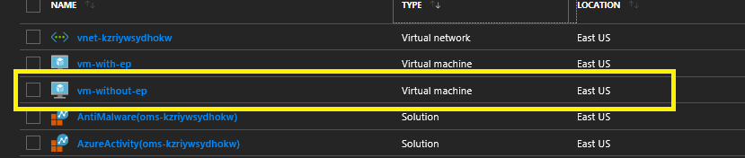

3. On Properties Page --> Click Connect to Download RDP file --> Save and Open RDP file.
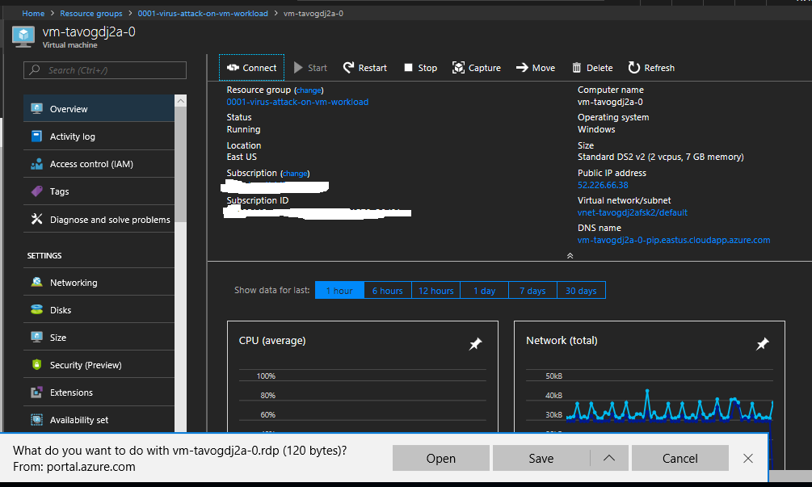

4. Enter login details (The VM login username and password is in deployment powershell output)

5. Open Server Manager and Disable Internet Explorer Enhanced Security Configuration.

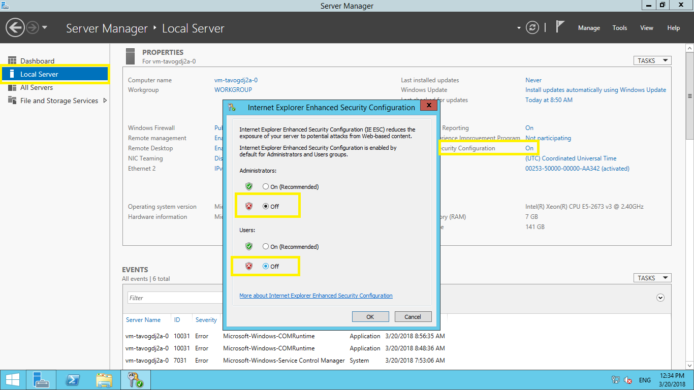

6. Open Internet Explorer and Download (https://secure.eicar.org/eicar.com.txt)

7. If IE blocks downloading, Go to View Downloads --> Right Click on File and Select Download Unsafe File.

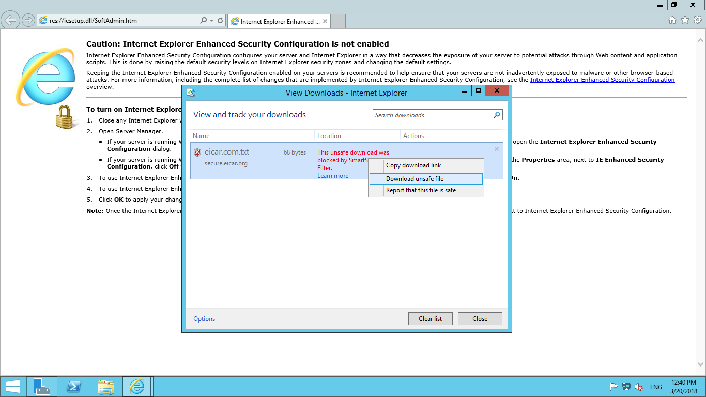

8. You will notice that Virus file gets downloads successfully on VM indicating attack was successful.

<a name="mitigate">
# Mitigate

Azure Security Center gives you recommendations and also allows you to perform remediation steps from the console itself.

1. Go to Home > Security Center - Overview > Compute > Endpoint protection issues > Endpoint Protection not installed on Azure VMs

2. You will notice your VM with name "vm-without-ep" is listed with various other VMs which does not have endpoint protection installed.

3. Select your VM with name "vm-without-ep" and Click on Install on VM. This will install endpoint protection on the VM
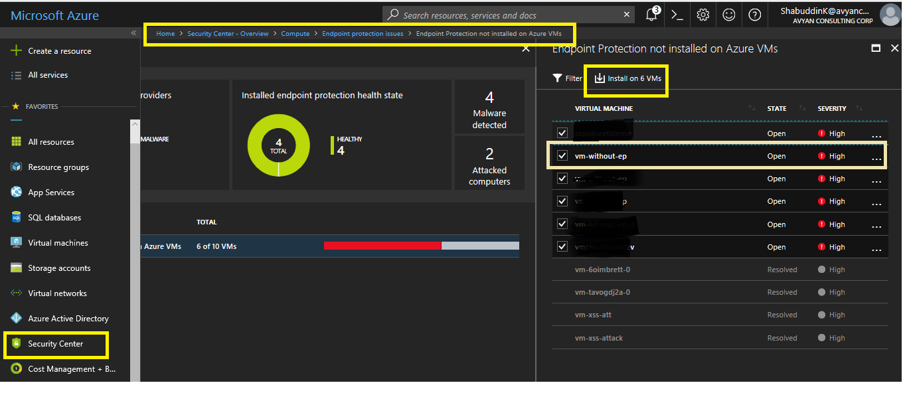

<a name="detect">
# Attack & Detection

The Anti-malware Extension (Endpoint Protection) might take 5-10 mins to get installed on a VM. Hence, you will use another VM with name "vm-with-ep" which already has the Anti-malware extension installed further for our Demo using loginid and pwd (The VM login username and password is in deployment powershell output)

To perform an attack, open Internet Explorer and download a smaple EICAR file from [https://secure.eicar.org/eicar.com.txt](https://secure.eicar.org/eicar.com.txt).

However, this time when you try to download EICAR virus file, it will be immediately detected and will be quarantined by endpoint protection.

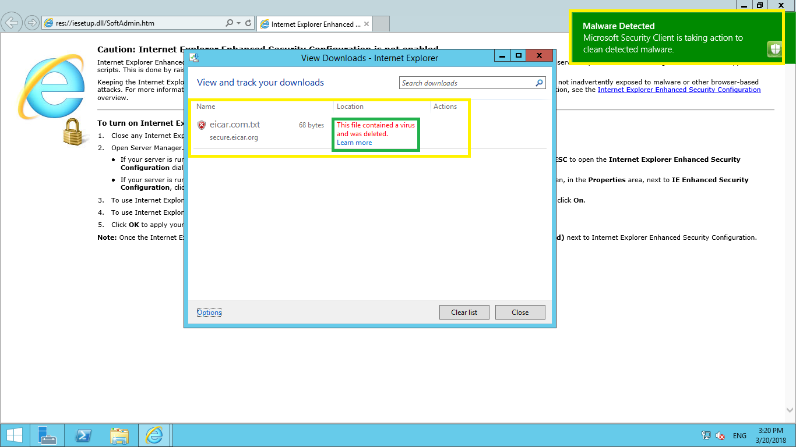

## Detection using Endpoint protection client

When you try to access SCEP, you will get a restricted access error. 

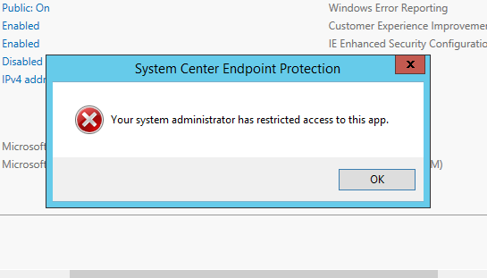

To access the endpoint protection client, you need to clean SCEP Policy on the Windows workstation or server.

1. Open **Powershell**

1. Go to **C:\\Program Files\\Microsoft Security Client\\**

   `cd "C:\Program Files\Microsoft Security Client"`

1. then run 

   `.\ConfigSecurityPolicy.exe .\CleanUpPolicy.xml`

1. Now, Go to Start --> Type **System Center Endpoint Protection** --> Go to **History** tab on SCEP Client window.

1. You will notice Eicar Test Virus file under Quarantined items.

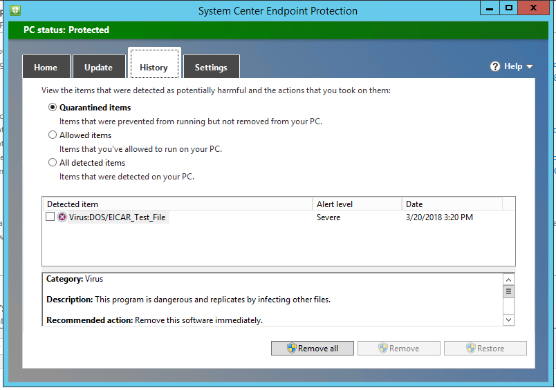

## Detection using centralised Log Analytics.

1. Go to **Azure Portal** --> navigate to resource group **<case no>-virus-attack-on-vm**
    
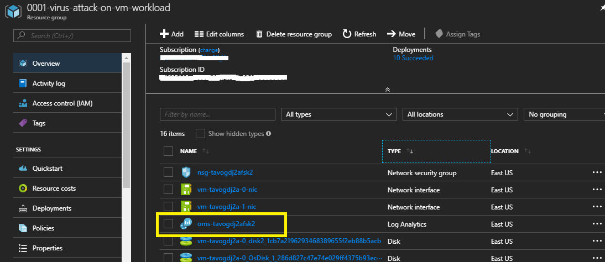

1. Go to **Log analytics** --> Click on **Log Search** --> Type query `search "eicar"`

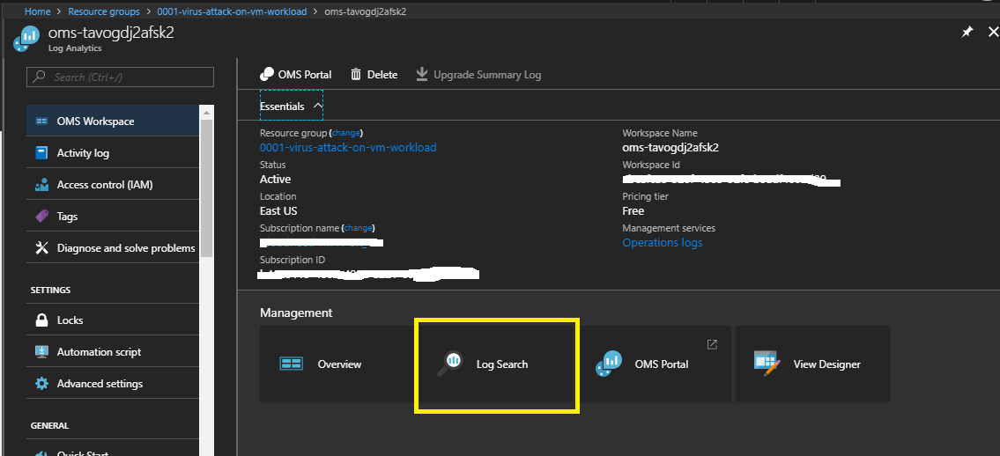

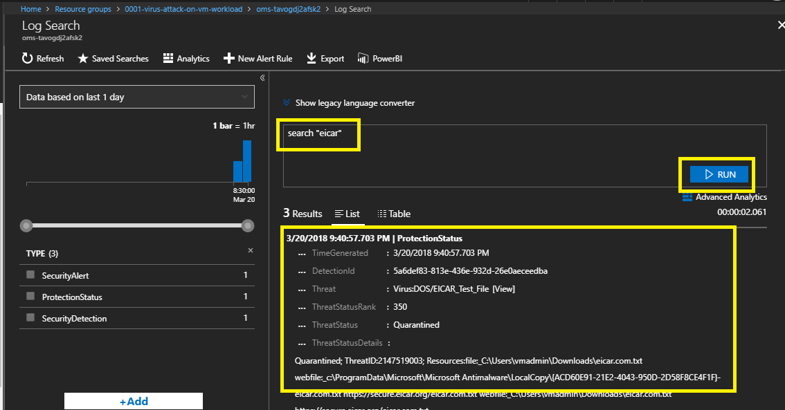

You will notice events related to Quarantined items. It might take few minutes for Log Analytics to display logs from your virtual machine, so if you don't get any search results, please try again after a few minutes.

<a name="config">
## Configuration Validation

* You can validate the specific configurations like Enabling Antivirus, Adding Antimalware Extension , Auto-updates on your VM. These are covered as various controls along with Audit and Remediation procedure in Cloudneeti

* Cloudneeti is available on the Azure marketplace. Try out the free test drive at https://aka.ms/Cloudneeti.

<a name="references">
# References

* http://www.eicar.org/
* https://docs.microsoft.com/en-us/azure/security/azure-security-antimalware
* https://docs.microsoft.com/en-us/azure/operations-management-suite/operations-management-suite-overview

## Disclaimer & Acknowledgements 

Avyan Consulting Corp conceptualized and developed the software in guidance and consultations with Microsoft Azure Security Engineering teams.
 
AVYAN MAKE NO WARRANTIES, EXPRESS, IMPLIED, OR STATUTORY, AS TO THE INFORMATION IN THIS DOCUMENT. This document is provided “as-is.” Information and views expressed in this document, including URL and other Internet website references, may change without notice. Customers reading this document bear the risk of using it. This document does not provide customers with any legal rights to any intellectual property in any AVYAN or MICROSOFT product or solutions. Customers may copy and use this document for internal reference purposes.
 
### Note:
*	Certain recommendations in this solution may result in increased data, network, or compute resource usage in Azure. The solution may increase a customer’s Azure license or subscription costs.
*	The solution in this document is intended as reference samples and must not be used as-is for production purposes. Recommending that the customer’s consult with their internal SOC / Operations teams for using specific or all parts of the solutions.
*	All customer names, transaction records, and any related data on this page are fictitious, created for the purpose of this architecture, and provided for illustration only. No real association or connection is intended, and none should be inferred. 

