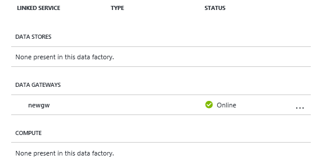
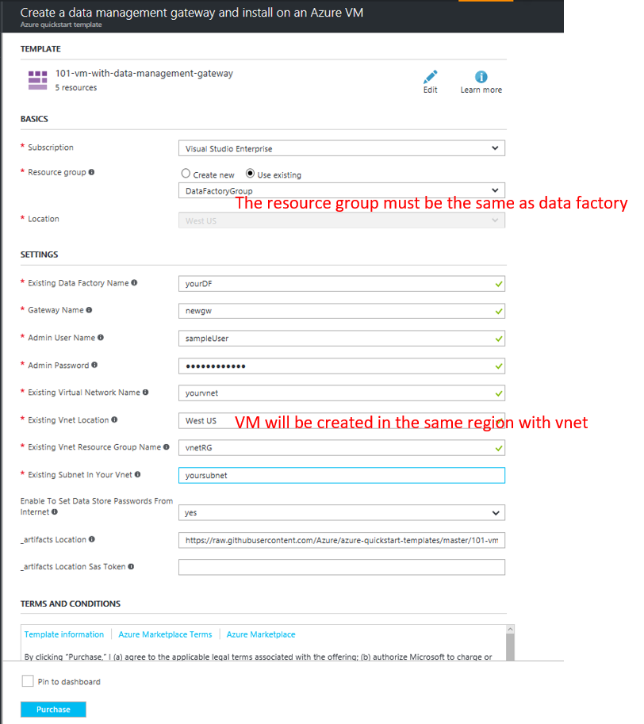

# Create a data management gateway and make it workable in azure VM


Before deploying the template you must have the following

1. **Data Factory.** The gateway is created in the data factory. If you don't have a data factory,  see the [Create data factory](https://docs.microsoft.com/en-us/azure/data-factory/data-factory-move-data-between-onprem-and-cloud#create-data-factory) for steps to create one.
2. **Virtual Network.** The virtual machine will join this VNET. If you don't have one, use this tutorial, see [Create virtual network](https://docs.microsoft.com/en-us/azure/virtual-network/virtual-networks-create-vnet-arm-pportal#create-a-virtual-network) to create one.

[](https://portal.azure.com/#create/Microsoft.Template/uri/https%3A%2F%2Fraw.githubusercontent.com%2FAzure%2Fazure-quickstart-templates%2Fmaster%2Fquickstarts%2Fmicrosoft.compute%2Fvm-with-data-management-gateway%2Fazuredeploy.json)  
[](https://portal.azure.us/#create/Microsoft.Template/uri/https%3A%2F%2Fraw.githubusercontent.com%2FAzure%2Fazure-quickstart-templates%2Fmaster%2Fquickstarts%2Fmicrosoft.compute%2Fvm-with-data-management-gateway%2Fazuredeploy.json)
[](http://armviz.io/#/?load=https%3A%2F%2Fraw.githubusercontent.com%2FAzure%2Fazure-quickstart-templates%2Fmaster%2Fquickstarts%2Fmicrosoft.compute%2Fvm-with-data-management-gateway%2Fazuredeploy.json)
    

    

When you deploy this Azure Resource Template, you will create a logical gateway in your data factory and the following resources
- Azure Virtual Machine 
- Azure Storage Account (for boot diagnostic)
- Public IP Address
- Network Interface
- Network Sercurity Group

This template can help you create a gateway and make it workable in azure VM. The VM must join in an exsiting VNET. You will see the new gateway is online after successful deployment.



```
NOTE

This template must be deployed in the same resource group with data factory.
```

## Sample




