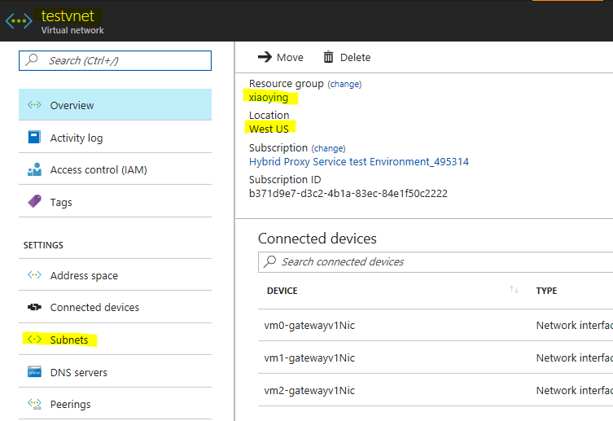

# Self-host Integration Runtime on Azure VMs

Before deploying the template you must have the following

1. **Data Factory.** The integration runtime is created in the data factory. If you don't have a data factory,  see the [Create data factory](https://docs.microsoft.com/azure/data-factory/data-factory-move-data-between-onprem-and-cloud#create-data-factory) for steps to create one.
2. **Virtual Network.** The virtual machine will join this VNET. If you don't have one, use this tutorial, see [Create virtual network](https://docs.microsoft.com/azure/virtual-network/virtual-networks-create-vnet-arm-pportal#create-a-virtual-network) to create one.

  

When you deploy this Azure Resource Template, you will create a logical selfhost IR in your data factory and the following resources

- Azure Virtual Machine
- Azure Storage (for VM system image and boot diagnostic)
- Public IP Address
- Network Interface
- Network Security Group

This template can help you create self-hosted IR and make it workable in azure VMs. The VM must join in an existing VNET.

The below picture can help you find how to get .

`Tags: Microsoft.Resources/deployments, Microsoft.Network/networkSecurityGroups, Microsoft.Storage/storageAccounts, Microsoft.Compute/virtualMachines/extensions, CustomScriptExtension, Microsoft.DataFactory/dataFactories/gateways, Microsoft.DataFactory/factories/integrationruntimes, SelfHosted, Microsoft.Network/publicIPAddresses, Microsoft.Network/networkInterfaces, Microsoft.Compute/virtualMachines, Microsoft.Network/virtualNetworks, Microsoft.DataFactory/datafactories`
