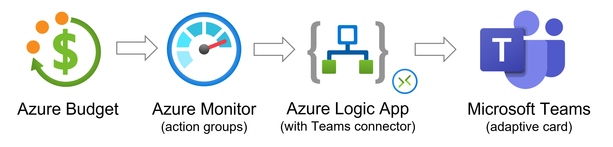
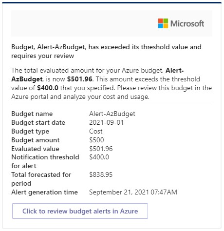
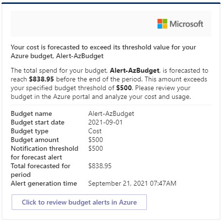
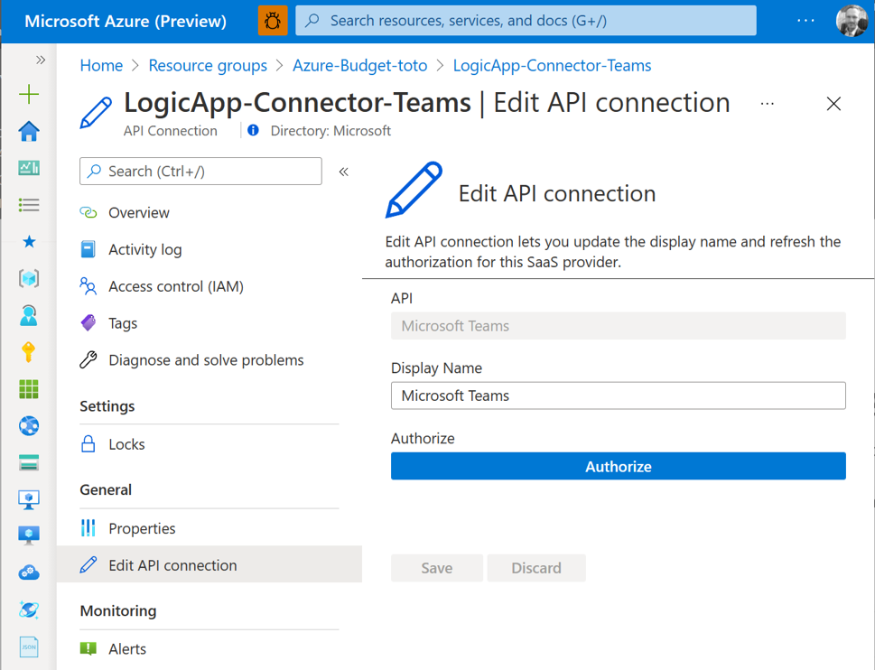

# Azure Budget Alerts in Microsoft Teams

## What it is

This Azure template deploys and configures budget alerts at the subscription level and notifies the user in Microsoft Teams via an adaptive card when a budget threshold is met.

Note : Cost and usage data is typically available within 8-24 hours and budgets are evaluated against these costs every 24 hours. Check [Create and manage Azure budgets](https://docs.microsoft.com/en-us/azure/cost-management-billing/costs/tutorial-acm-create-budgets) if you need more details on budgets and alerts configuration for Azure.

## Solution overview

### High Level Design
<br>



- The solution enables 2 Azure Budget alerts at the Azure subscription level
  - Alert #1 is triggered when **actual costs reach 80%** of the total monthly budget threshold
  - Alert #2 is triggered when **forecasted costs reach 100%** of the total monthly threshold

- The budget alert triggers an action groups that in turns triggers an HTTP Azure Logic App

- The Azure Logic App then in turns creates an adaptive cards and pushes the notification to the user into Microsoft Teams

Here is what the adaptive cards in Microsoft Teams look like

<p align="center"><b>Azure Budget Alert (actual costs) - Teams Adaptive Card</b></p>
<p align="center">
    
</p>

<p align="center"><b>Azure Budget Alert (forecasted costs) - Teams Adaptive Card</b></p>
<p align="center">
    
</p>

Note : the Azure ARM template deploys resource at the subscription and resource group level - This is why you'll be asked to enter the resource group name and location twice in the Azure Portal wizard. Make sure you enter the same values.

## How to deploy the solution

Input parameters :

| Parameter | Description |
| :------------- | :---------- | 
| rgName |  Azure resource group name  | 
| rgLocation | Azure resource group location |
| resourcePrefix | Prefix to your Azure resourcecs names |
| azureBudget | Your Azure monthly budget (in USD) |
| recipient | e-mail address (UPN) of the user that will receive the notification in Microsoft Teams |
| startDay | First day of the current month (format : YYYY/MM/01) |

### Option 1 - via the Azure portal
<br>

[](https://portal.azure.com/#create/Microsoft.Template/uri/https%3A%2F%2Fraw.githubusercontent.com%2FAzure%2FAzureBudgetAlert-in-Teams%2Fmain%2Fdeployment%2Fazuredeploy.json)


### Option 2 - via PowerShell
<br>

```powershell
$RGname="RESOURCE_GROUP_NAME"
$region="AZURE_REGION"
$params = @{
    rgName = $RGname
    rgLocation = $region
    recipient = "USER_EMAIL_ADDRESS_IN_TEAMS"
    resourcePrefix = "AZURE_RESOURCE_PREFIX"
}
$deployName=("deploy-" + (Get-date -Format "yymmdd-hhmmss"))

New-AzResourceGroup -Name $RGName -Location $region
New-AzDeployment -Name $deployName -Location $region -TemplateFile ./azuredeploy.json -TemplateParameterObject $params
```

Note : you can find this script in this repository under ./deployment/deploy.ps1

### Once the deployment is over.... authorize your Teams connection
- Connect to the [Azure portal](https://portal.azure.com)
- Go to the "API Connection" deployed in your resourge group
- Select "Edit API connection"
- Click on "Authorize" and provide your Azure AD credential
- Click on "Save"

<br>
<p align="center">
    
</p>

## Contributing

This project welcomes contributions and suggestions.  Most contributions require you to agree to a
Contributor License Agreement (CLA) declaring that you have the right to, and actually do, grant us
the rights to use your contribution. For details, visit https://cla.opensource.microsoft.com.

When you submit a pull request, a CLA bot will automatically determine whether you need to provide
a CLA and decorate the PR appropriately (e.g., status check, comment). Simply follow the instructions
provided by the bot. You will only need to do this once across all repos using our CLA.

This project has adopted the [Microsoft Open Source Code of Conduct](https://opensource.microsoft.com/codeofconduct/).
For more information see the [Code of Conduct FAQ](https://opensource.microsoft.com/codeofconduct/faq/) or
contact [opencode@microsoft.com](mailto:opencode@microsoft.com) with any additional questions or comments.


## Trademarks

This project may contain trademarks or logos for projects, products, or services. Authorized use of Microsoft
trademarks or logos is subject to and must follow
[Microsoft's Trademark & Brand Guidelines](https://www.microsoft.com/en-us/legal/intellectualproperty/trademarks/usage/general).
Use of Microsoft trademarks or logos in modified versions of this project must not cause confusion or imply Microsoft sponsorship.
Any use of third-party trademarks or logos are subject to those third-party's policies.