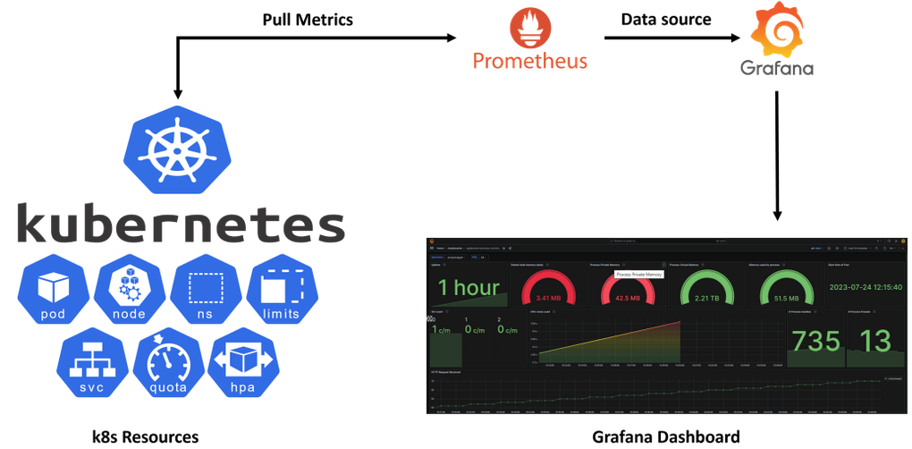
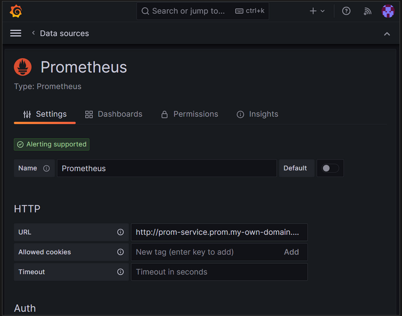
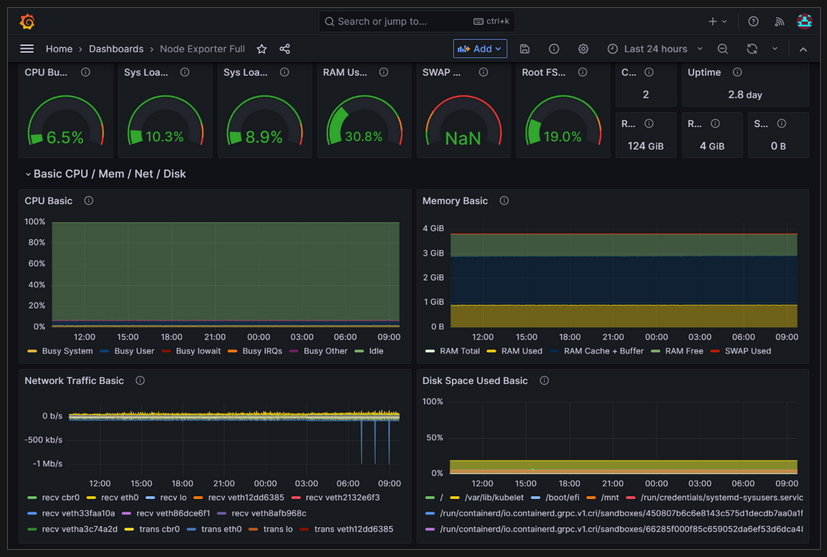

# Create AKS with Prometheus and Grafana with private link

## Overview

This will create an Azure grafana, AKS and install Prometheus, an open-source monitoring and alerting toolkit, on an Azure Kubernetes Service (AKS) cluster. Then you use Azure Managed Grafana's managed private endpoint to connect to this Prometheus server and display the Prometheus data in a Grafana dashboard.

## Description

A popular way of installing Prometheus is through the [**prometheus-operator**](https://prometheus-operator.dev/), which provides Kubernetes native deployment and management of [**Prometheus**](https://prometheus.io/) and related monitoring components. this will use [**kube-prometheus-stack**](https://github.com/prometheus-community/helm-charts/tree/main/charts/kube-prometheus-stack). Helm charts to deploy the prometheus-operator. Azure [**Private Link**](https://learn.microsoft.com/en-us/azure/private-link/private-link-service-overview) service enables the consumption of your Kubernetes service through private link across different Azure virtual networks. AKS has a [**native integration with Azure Private Link Service**](https://cloud-provider-azure.sigs.k8s.io/topics/pls-integration/) and helps you annotate a Kubernetes service object to create a corresponding private link service within Azure.

## Architecture

The architecture of this solution will be similar to the picture below:

> [!NOTE]
> Prometheus monitoring workloads and services will be created in the kubernetes cluster under the monitoring namespace. This will also deploy a PLS service with an internal load balancer for private access from grafana.

For more information on **Azure Kubernetes Monitoring with Prometheus and Grafana** see article [**Connect to a self-hosted Prometheus service on an AKS cluster using a managed private endpoint**](https://learn.microsoft.com/en-us/azure/managed-grafana/tutorial-mpe-oss-prometheus)

### Deployed Resources

The following resource types will be created as part of this template deployment:

- [**Microsoft.Network/virtualNetworks**](https://learn.microsoft.com/en-us/azure/virtual-network/virtual-networks-overview)
- [**Microsoft.Network/virtualNetworks/subnets**](https://learn.microsoft.com/en-us/azure/virtual-network/virtual-networks-overview)
- [**Microsoft.Authorization/roleAssignments**](https://learn.microsoft.com/en-us/azure/role-based-access-control/role-assignments)
- [**Microsoft.ContainerService/managedClusters**](https://learn.microsoft.com/en-us/azure/aks/what-is-aks)
- [**Microsoft.ManagedIdentity/userAssignedIdentities**](https://learn.microsoft.com/en-us/entra/identity/managed-identities-azure-resources/overview)
- [**Microsoft.Resources/deploymentScripts**](https://learn.microsoft.com/en-us/azure/azure-resource-manager/bicep/deployment-script-bicep?tabs=CLI)
- [**Microsoft.Dashboard/grafana**](https://learn.microsoft.com/en-us/azure/managed-grafana/overview)
- [**Microsoft.Network/privateDnsZones**](https://learn.microsoft.com/en-us/azure/dns/private-dns-privatednszone)
- [**Microsoft.Network/privateDnsZones/virtualNetworkLinks**](https://learn.microsoft.com/en-us/azure/dns/private-dns-virtual-network-links)
- [**Microsoft.Network/privateEndpoints**](https://learn.microsoft.com/en-us/azure/private-link/private-endpoint-overview)
- [**Microsoft.Network/privateEndpoints/privateDnsZoneGroups**](https://learn.microsoft.com/en-us/azure/private-link/private-endpoint-overview)
- [**Microsoft.Dashboard/grafana/managedPrivateEndpoints**](https://learn.microsoft.com/en-us/azure/private-link/manage-private-endpoint?tabs=manage-private-link-powershell)

### Deployment steps
Run az cli command from the root of the microsoft.containerservice directory.

### Post deployment grafana configuration
Add the Prometheus data source to Grafana from your Grafana portal. For more information, go to [**Add a data source**](https://learn.microsoft.com/en-us/azure/managed-grafana/how-to-data-source-plugins-managed-identity#add-a-data-source). Use Prometheus URL provided when creating grafana managed private endpoint 'bicep attribute: **privateLinkServiceUrl**' my example is http://test-prom.promedemo.com.com:9090

To leverage your self-hosted Prometheus data source, try using the Node Exporter Full dashboard, ID 1860. For more guidelines, go to Import a dashboard from Grafana Labs.
You can also create a many dashboard as you want and leverage on predefined dashboard IDs in [**Grafana dashboad**](https://grafana.com/grafana/dashboards/).

`Tags: network, virtual network, subnet, role assignments, kubernetes cluster, user assigned identity, deployment script, private dns zone, private dns zone vnet links, private endpoint, private endpoint zone group, managed private endpoint, Microsoft.Network/virtualNetworks, Microsoft.Network/virtualNetworks/subnets, Microsoft.Authorization/roleAssignments, Microsoft.ContainerService/managedClusters, Microsoft.ManagedIdentity/userAssignedIdentities, Microsoft.Resources/deploymentScripts, Microsoft.Dashboard/grafana, Microsoft.Network/privateDnsZones, Microsoft.Network/privateDnsZones/virtualNetworkLinks, Microsoft.Network/privateEndpoints, Microsoft.Network/privateEndpoints/privateDnsZoneGroups, Microsoft.Dashboard/grafana/managedPrivateEndpoints`
