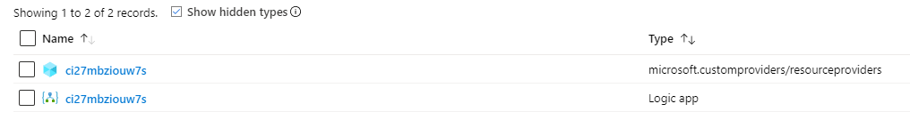
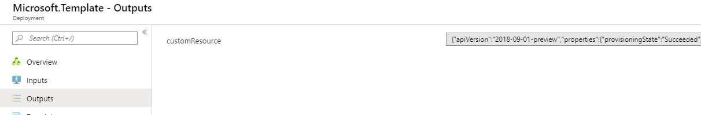
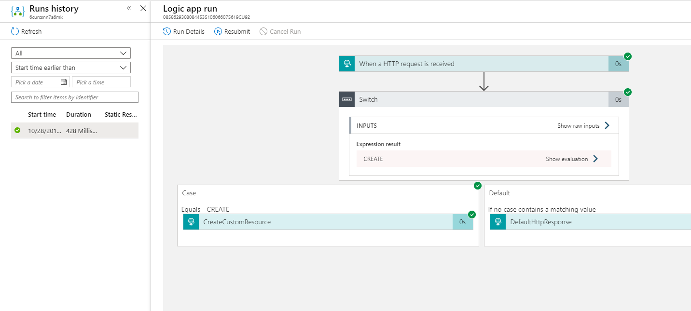

# Extend Existing Azure Resources with Custom Providers


    


    
[](https://portal.azure.com/#create/Microsoft.Template/uri/https%3A%2F%2Fraw.githubusercontent.com%2FAzure%2Fazure-quickstart-templates%2Fmaster%2Fquickstarts%2Fmicrosoft.customproviders%2Fcustom-rp-existing-resource-deployments%2Fazuredeploy.json)  [](http://armviz.io/#/?load=https%3A%2F%2Fraw.githubusercontent.com%2FAzure%2Fazure-quickstart-templates%2Fmaster%2Fquickstarts%2Fmicrosoft.customproviders%2Fcustom-rp-existing-resource-deployments%2Fazuredeploy.json)

This sample Azure Resource Manager template deploys a custom resource provider to Azure that extends the Azure Resource Manager API. This sample shows how to extend existing resources that are outside the resource group where the custom provider instance lives. In this sample, the custom resource provider is powered by an Azure Logic App, but any public API endpoint can be used.

The custom resource provider is a hidden Azure resource so to confirm that the custom resource provider has been deployed you will have to check the box that says *Show hidden types* in the Azure portal Overview page for the resource group.



## Details on the custom resource provider created

This sample deployment creates the following apis on the resource.

1) An Azure Resource Manager extended API called "associations".

### Associations

"associations" is a special API extension contained within the custom resource provider. The "associations" API must be named "associations" and marked as "Extension". Once, these prerequisites are met the "associations" API can be used to extend existing resources in Azure. This extension can exist outside the resource group that contains the custom provider instance. This extension is defined in the following part of the ARM template under the "resourceProviders" resource:

```json
"resourceTypes": [
    {
        "name": "associations",
        "mode": "Secure",
        "routingType": "Webhook,Cache,Extension",
        "endpoint": "[[listCallbackURL(concat(resourceId('Microsoft.Logic/workflows', parameters('logicAppName')), '/triggers/CustomProviderWebhook'), '2017-07-01').value]"
    }
]
```

| Property | Required | Description |
|---|---|---|
| name | *yes* | The name is the new "resourceType" extension that is added to the Azure Resource Manager API. For resource onboarding and cross resource group extension, the name must be "associations". This creates new APIs in Azure off any resource type. Example: {existingResourceId}/providers/Microsoft.CustomProviders/**associations**/{associationName} |
| mode | *no* | Hides the **endpoint** property on reads if set to "Secure". |
| routingType | *no* | Determines the HTTP structure and strategy for HTTP requests to the **endpoint**. The property is structured as flags. The "Webhook" flag changes all requests to *POST*. The "Cache" flag allows the custom provider to store request responses and automatically return them on subsequent *GET* requests. The "Extension" flag allows this type to extend existing resources outside the resource group of the custom provider. The name must be set to "associations" to use the "Extension" flag. |
| endpoint | *yes* | The public HTTP endpoint that handles all incoming reuqests. |

In the above template, we can see that the "associations" API has been defined as a "Webhook,Cache,Extension" resource which means that it is backed by a Webhook API endpoint. In this sample, we set the callback URL for the Azure Logic App to handle the incoming request and provide a response. Because we defined the "Cache" flag, the endpoint only needs to handle the PUT and DELETE calls, while the GET calls will automatically be handled by the custom provider. In addition, we specify the "Extension" flag, which combined with the name "associations" allows the new functionality to target existing resource groups and resources. In the above case, the following calls will be added to the Azure Resource Manager API:

```
(PUT|GET|DELETE) {existingResourceId}/providers/Microsoft.CustomProviders/associations/{associationName}?api-version=2018-09-01-preview
```

The Azure Resource Manager template also utilizes the new Azure extension to create an instance of the "associations". If the "customResourceProviderId" is provided then a new custom provider instance and logic app will not be created:

```json
{
    "type": "Microsoft.CustomProviders/associations",
    "apiVersion": "2018-09-01-preview",
    "name": "[parameters('associationName')]",
    "location": "global",
    "properties": {
        "targetResourceId": "[if(empty(parameters('customResourceProviderId')), reference('customProviderInfrastructureTemplate').outputs.customProviderResourceId.value, parameters('customResourceProviderId'))]",
        "myCustomInputProperty": "myCustomInputValue",
        "myCustomInputObject": {
            "Property1": "Value1"
        }
    }
}
```

| Property | Required | Description |
|---|---|---|
| targetResourceId | *yes* | The "targetResourceId" property is the resource id of the custom provider or managed application (that contains a custom provider). In order to create an association, write access to the "targetResourceId" is required. |

The "Microsoft.CustomProviders/associations" is an extension API and can exist on any resource type. In this sample, the "associations" resource on a resource group. In order to create a new "associations" resource a valid "targetResourceId" that points to an existing custom provider must be provided. In addition, write access to the "targetResourceId" is also required.

If the "customResourceProviderId" template parameter is not provided, the deployment should look like:


When providing the "customResourceProviderId", the template will consist of:


The outputs section of the template deployment also will display the created resource, which can be accessed through the *reference* template function.


In addition, you can navigate to the deployed Azure Logic App resource in the template resource group and check the *run history* tab to see the HTTP calls.


Additional "associations" can be created through deploying another Azure Resource Manager Template or directly interfacing with the Azure REST API.


